# File Workshop V1.0 面向制造业的企业级文件管理系统开发设计文档

> **文档编号：** FH-DD-V1.0  
> **文档版本：** V1.0  
> **文档状态：** 产品需求冻结、总体架构冻结、详细设计基线  
> **发布日期：** 2026-08-04  
> **适用范围：** File Workshop V1.0 的设计、开发、测试、部署、运维与验收  
> **主要读者：** 项目负责人、编码 Agent、代码审查模型、测试人员、部署与运维人员  
> **实现原则：** 文档优先、边界优先、权限优先、审计优先、数据安全优先

---

## 文档使用规则

1. 本文档是 File Workshop V1.0 的业务与总体架构基线；数据库结构和技术选型分别以本文档明确引用的独立说明为准。历史聊天记录和旧版分章草稿仅作为讨论材料，不得直接作为编码依据。
2. 本文档中的“必须”“禁止”“不得”属于强制约束；“建议”“默认”属于可配置或可替换实现。
3. V1.0 不再新增业务领域。新增业务需求进入 V1.x 或 V2 候选池。
4. 数据库表名、字段名、API 路径和代码标识使用英文；产品概念、模块名称和正文使用简体中文。
5. 本文档不维护建表 SQL 或数据库表结构；数据库逻辑模型、约束、索引和 Migration 要求统一由独立数据库设计说明维护。
6. 技术组件允许替换，但替换后必须保持本文档规定的业务语义、安全边界、审计要求和故障行为。
7. Codex 或其他 Agent 可以修改本文件，但涉及产品边界、核心领域不变量、权限语义、审计语义和数据一致性的修改，必须作为架构变更单独审查。
8. 所有实现应优先通过自动化测试证明正确性，不以“代码能够运行”替代权限、安全、一致性和恢复验证。

---

# 目录

1. 项目概述  
2. 产品边界与架构原则  
3. 术语、角色与核心概念  
4. 需求基线与典型场景  
5. 总体架构设计  
6. 系统模块设计  
7. 组织与空间模型  
8. 权限、管理委派与访问控制  
9. 文件领域模型  
10. 文件上传、下载与存储设计  
11. 版本、锁、回收站与生命周期  
12. 文件共享设计  
13. 搜索与索引设计  
14. WebDAV 兼容层设计  
15. 审计系统设计  
16. AI、RAG 与 Agent 集成设计  
17. 安全设计  
18. API 总体规范与接口清单  
19. 前端交互设计  
20. SMB 迁移设计  
21. 部署与高可用设计  
22. 备份与灾难恢复  
23. 可观测性与运维设计  
24. 性能基线与容量规划  
25. 测试体系  
26. 开发流程、CI/CD 与代码规范  
27. 验收标准  
28. 发布、变更与兼容性管理  
29. V1.0 冻结声明与后续边界  
附录 A：权限动作矩阵  
附录 B：审计事件目录  
附录 C：核心状态枚举  
附录 D：错误码规范  
附录 E：架构决策记录索引

---

# 第1章 项目概述

## 1.1 项目背景

制造企业长期依赖 Windows Server、Samba、NAS 等提供 SMB 文件共享。其优势是使用习惯成熟、桌面软件兼容性较好、员工学习成本低；但随着企业规模、组织层级、文件数量和合规要求增长，传统共享盘逐渐暴露出以下问题：

- 权限依赖目录和服务器本地配置，长期维护后容易失控；
- 文件被复制到多个目录，难以确定哪个版本有效；
- 缺乏统一的版本历史、文件锁、回收恢复和生命周期管理；
- 搜索能力弱，员工往往依赖记忆路径或询问同事；
- 部门、工厂、制造中心和班组等复杂组织难以映射为可治理的文件空间；
- 内部共享通常依赖复制、聊天工具、邮件或 U 盘，文件来源不统一；
- 系统管理员具备较大技术权限，但访问和操作缺少不可篡改的全量审计；
- SMB 服务难以直接为 Web、移动端、REST API、AI Agent 和企业应用提供统一能力；
- 单机文件服务器故障、误删除、勒索软件和备份失效可能导致重大业务风险；
- 大文件、海量小文件和多人编辑场景缺少统一的工程治理。

File Workshop 的建设目标是以现代 Web、对象存储、统一权限、强审计、高可用和本地 AI 能力升级企业文件基础设施，而不是在文件系统中复制 MES、ERP、PLM、OA 等业务系统。

## 1.2 项目名称与定位

**项目名称：** File Workshop  
**中文定位：** 面向制造企业的企业级文件管理系统  
**架构定位：** 企业文件基础设施（Enterprise File Infrastructure）

File Workshop 管理的是企业文件及其全生命周期。工艺卡、排班表、CAD 图纸、PLC 程序、质量记录、设备手册、Office 文档等在 File Workshop 中统一视为文件资源；系统不负责这些文件所承载的生产、排班、工艺或质量业务。

## 1.3 建设目标

File Workshop V1.0 必须实现以下目标：

1. 建立统一的个人、组织和企业公共文件空间；
2. 支持无限层级、企业自定义的制造业组织树；
3. 支持用户多组织关系和组织空间管理权的递归委派；
4. 建立 Web、REST API、WebDAV、搜索和 Agent 共用的访问控制体系；
5. 支持大文件分片、断点续传和对象存储直传；
6. 建立稳定文件标识、不可变版本、文件锁、回收站和生命周期机制；
7. 支持用户、组织和空间范围的内部共享，并坚持引用优于复制；
8. 建立权限感知的元数据搜索、全文搜索和可选语义搜索；
9. 对所有安全相关行为强制留痕，审计记录不可通过业务系统修改或删除；
10. 支持 Lite、Standard、HA 三档部署；
11. 将高可用与备份、灾难恢复明确分离；
12. 支持从 SMB 共享盘迁移目录、文件、时间戳、权限映射和增量变化；
13. 支持可插拔的本地 AI、RAG 和 Document Agent；
14. 确保 AI、搜索和 WebDAV 均不能绕过用户权限。

## 1.4 项目成功标准

项目成功不以页面数量或中间件数量衡量，而以以下结果衡量：

- 企业能够将现有 SMB 目录可靠迁移到 File Workshop；
- 员工能够在 Web 或兼容客户端中找到、打开、修改和共享文件；
- 文件具有唯一身份、清晰版本和可恢复历史；
- 用户无法通过 API、WebDAV、搜索或 Agent 访问无权资源；
- 系统管理员可以完成全局运维与审计，但其全部文件访问均留下特权访问记录；
- 单个应用节点故障不导致 HA 部署整体不可用；
- 数据库和对象存储能够执行真实备份、恢复和完整性核验；
- AI 未部署或故障时，文件核心业务仍正常运行；
- 关键业务、权限、安全、性能和故障场景均具备自动化或可重复测试。

## 1.5 文档与实现关系

本文档定义“做什么、为什么这样做、必须满足什么约束”。具体算法、索引参数、分片大小、线程数、缓存时长等属于实现配置，应在不改变业务语义的前提下通过测试调整。

数据库结构已独立为 `docs/File-Workshop-V1.0-数据库设计说明.md`。PostgreSQL 表、字段、类型、约束、索引、事务、分区和 Migration 以该文档为唯一权威来源；本文档不再重复维护数据库表结构。

---

# 第2章 产品边界与架构原则

## 2.1 V1.0 包含范围

| 领域 | V1.0 能力 |
|---|---|
| 身份与用户 | 登录、会话、用户状态、密码策略、用户资料 |
| 组织 | 无限层级组织树、用户多组织关系、主组织 |
| 空间 | 个人空间、组织空间、公共空间 |
| 管理委派 | 组织空间管理员、作用域、向下递归委派 |
| 文件 | 文件夹、文件、稳定 ID、移动、重命名、复制引用 |
| 传输 | 分片上传、断点续传、直传对象存储、Range 下载 |
| 版本 | 不可变版本、恢复为新版本、版本备注 |
| 并发 | 文件级租约锁、乐观并发校验 |
| 权限 | 默认拒绝、显式允许、继承、断开继承、共享权限 |
| 共享 | 用户、组织、空间共享；内部链接；引用优于复制 |
| 回收与生命周期 | 回收站、恢复、永久清理、保留与归档策略 |
| 预览 | PDF、图片、文本、Markdown、Office 可选集成 |
| 搜索 | 文件名、元数据、全文、权限过滤、可选语义检索 |
| WebDAV | 兼容访问、方法映射、锁和审计 |
| 审计 | 全量安全审计、特权访问、不可修改、关键事件完整性链 |
| 迁移 | SMB 扫描、初次迁移、增量同步、切换和校验 |
| AI | 本地模型优先、文档解析、RAG、Agent、Action 协议 |
| 运维 | 指标、日志、追踪、告警、健康检查 |
| 部署 | Lite、Standard、HA |
| 可靠性 | 高可用、备份、恢复、RPO/RTO、故障演练 |

## 2.2 明确不包含范围

V1.0 不实现以下业务：

- MES、ERP、PLM、OA；
- BOM、工艺路线、生产排程、考勤排班；
- 设备台账、质量业务、采购业务、财务业务；
- 项目任务、里程碑、甘特图和项目流程；
- BPM、审批流、电子签章；
- 即时通讯和通用聊天；
- 自研 Office 编辑器；
- 自研大模型和自研通用 Agent 平台；
- 公有云多租户 SaaS 计费体系；
- 原生 SMB 服务端协议替代。

上述系统可以通过 API、WebDAV、内部分享链接或后续连接器使用 File Workshop 的文件能力。

## 2.3 核心架构原则

### 2.3.1 文件为核心

文件及其版本是核心资源。组织、权限、搜索、审计、AI 和共享均围绕文件生命周期服务。

### 2.3.2 资源空间驱动

文件必须存在于空间中。组织用于映射企业结构，空间用于承载文件。组织关系不自动等于文件权限。

### 2.3.3 元数据与二进制分离

PostgreSQL 保存业务元数据；对象存储保存文件内容；搜索引擎保存可重建索引；AI 索引与业务元数据分离。

### 2.3.4 模块化单体优先

V1.0 采用模块化单体作为默认形态：

- 一个后端部署单元；
- 一个 PostgreSQL 数据库实例或高可用集群；
- 模块拥有清晰的逻辑表边界和接口；
- 禁止跨模块随意修改数据；
- 通过应用服务编排跨模块流程；
- 通过事务外盒和后台任务处理异步工作。

只有在容量、组织或发布独立性证明有必要时，才拆分服务。不得为了“企业级”提前引入不必要的分布式事务。

### 2.3.5 控制面与数据面分离

应用后端负责认证、权限、上传会话和元数据事务；大型文件数据优先在客户端与对象存储之间传输，避免应用节点成为带宽和内存瓶颈。

### 2.3.6 统一认证、资源授权和审计

网关负责身份验证、限流、路由和请求追踪；资源级权限必须由应用层调用权限模块判断。所有入口使用同一身份、权限和审计语义。

### 2.3.7 默认拒绝与最小权限

无明确权限即拒绝。V1.0 文件 ACL 采用“显式允许 + 默认拒绝”，不提供显式 DENY，以避免复杂冲突。需要排除继承时使用“断开继承后重新授权”。

### 2.3.8 管理权与普通文件权限分离

系统角色仅有 `USER` 和 `SYSTEM_ADMIN`。组织空间管理员不是系统角色，而是可限定作用域、可向下委派的管理授权。管理委派与普通文件 ACL 分开建模。

### 2.3.9 强审计

所有安全相关动作必须留痕。高风险操作必须在业务成功前形成持久审计意图；审计记录不可通过业务 API 更新或删除。系统管理员访问任何非本人文件均作为特权访问单独记录。

### 2.3.10 AI 可选且受控

AI 不是核心依赖。AI 只能通过受控 Tool/API 获取文件，必须继承当前用户身份、权限和审计上下文。默认使用企业本地模型，外部 API 默认关闭。

### 2.3.11 HA 不等于备份

高可用解决节点故障和服务连续性；备份与灾难恢复解决误删除、逻辑损坏、勒索软件和机房灾难。二者必须分别设计、测试和验收。

### 2.3.12 引用优于复制

内部共享到用户、组织或公共空间时，默认创建对原 Document 的受控引用，而不是复制文件内容。只有用户显式执行“复制为新文件”时才创建新 Document。

---

# 第3章 术语、角色与核心概念

## 3.1 术语表

| 术语 | 含义 |
|---|---|
| 用户（User） | 使用 File Workshop 的企业员工或系统账号 |
| 系统管理员（System Administrator） | 平台级角色，负责全局治理、运维和审计 |
| 组织（Organization） | 集团、中心、工厂、部门、车间、班组等通用树节点 |
| 用户组织关系（User Organization Membership） | 用户与一个或多个组织之间的成员关系 |
| 空间（Space） | 文件资源的一级逻辑容器 |
| 个人空间（Personal Space） | 由单个用户拥有的私有工作空间 |
| 组织空间（Organization Space） | 与一个组织节点绑定的共享空间 |
| 公共空间（Public Space） | 面向企业公共资料的空间 |
| 管理委派（Admin Delegation） | 对指定组织空间或组织子树授予管理能力 |
| 文件夹（Folder） | 空间内部的层级容器 |
| 文件（Document） | 具有稳定 ID、名称、位置、权限和版本链的逻辑文件 |
| 文件版本（Document Version） | 某次不可变文件内容 |
| 存储对象（Storage Object） | 对象存储中的二进制对象及其校验信息 |
| 上传会话（Upload Session） | 一次可恢复分片上传的状态实体 |
| 文件锁（Document Lock） | 用于并发编辑的文件级租约锁 |
| 授权记录（Permission Grant） | 对用户或组织授予资源动作的显式允许记录 |
| 共享（Share） | 创建者将资源在限定目标、权限和期限内提供访问 |
| 审计事件（Audit Event） | 对安全或业务关键行为的不可变记录 |
| 事务外盒（Transactional Outbox） | 与业务事务同库提交、后续可靠投递的事件记录 |
| Agent Action | Agent 返回给前端的结构化界面操作指令 |

## 3.2 系统角色

### 普通用户

面向技术员、工程师、文员、班组人员、品质人员、设备人员及其他员工。普通用户可以使用个人空间和被授权的组织、公共或共享资源。

### 系统管理员

系统管理员负责：

- 用户、组织、空间和平台配置；
- 全局管理委派；
- 存储、搜索、AI 和运维配置；
- 全系统审计查询与安全调查；
- 备份、恢复和高可用治理；
- 必要时访问全系统文件。

系统管理员的文件查看、预览、下载、恢复、强制解锁和永久删除均必须记录为特权访问。系统管理员不能通过业务系统修改或删除审计日志。

## 3.3 管理身份不是系统角色

“工厂管理员”“部门管理员”“空间管理员”均不是固定系统角色。它们是对普通用户授予的管理委派，可以限定：

- 管理哪个组织空间；
- 是否包含后代组织；
- 是否允许继续向下委派；
- 具备哪些管理能力；
- 生效和失效时间。

## 3.4 核心关系

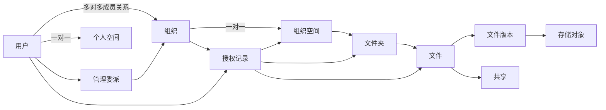

## 3.5 核心不变量

1. 每个文件必须属于一个空间和一个文件夹；
2. Document ID 在移动、重命名和共享后保持不变；
3. 文件内容只能通过新版本改变，历史版本不可修改；
4. 一个用户最多有一个主组织，但可以属于多个组织；
5. 一个组织对应一个组织空间；
6. 组织成员关系不自动产生文件权限，权限必须由显式授权或共享产生；
7. 管理委派不能授予超出授权者自身作用域和能力的权限；
8. 文件 ACL 与管理委派分开建模；
9. V1.0 不支持显式 DENY；无 ALLOW 即拒绝；
10. 权限撤销和共享撤销必须立即通过最终授权校验生效；
11. 搜索索引和 AI 索引可以最终一致，但返回结果前必须再次授权；
12. 审计记录只追加，不更新、不删除；
13. AI、WebDAV、搜索和预览不得直接访问对象存储绕过应用权限；
14. AI 故障、搜索故障和预览故障不得阻止核心文件上传、下载和权限管理；
15. 永久删除必须满足保留策略、权限、审计和存储垃圾回收条件。

---

# 第4章 需求基线与典型场景

## 4.1 普通用户能力

普通用户根据权限可执行：

- 登录、退出和维护个人资料；
- 管理个人空间；
- 浏览授权空间、文件夹和文件；
- 上传、下载、预览、移动、重命名和删除文件；
- 创建文件夹；
- 查看和恢复历史版本；
- 获取和释放文件锁；
- 搜索文件；
- 创建内部共享；
- 查看“共享给我的”“最近访问”“收藏”；
- 使用权限感知的文档问答和 Agent；
- 查看与本人相关的操作记录。

## 4.2 组织空间管理员能力

通过管理委派获得的管理员可以在授权范围内：

- 管理组织空间目录和文件；
- 管理空间成员的文件访问授权；
- 查看本作用域内的空间审计；
- 恢复空间回收站内容；
- 强制解除本作用域文件锁；
- 创建下级组织空间管理员；
- 撤销下级组织空间管理员；
- 配置空间容量、共享策略和生命周期策略；
- 执行或批准组织重组后的空间迁移。

其不能：

- 管理授权范围外的组织或空间；
- 给他人授予比自身更大的作用域或能力；
- 授予 `SYSTEM_ADMIN`；
- 修改全局安全和审计策略；
- 查看员工个人空间，除非获得单独的文件授权；
- 删除或修改审计记录。

## 4.3 系统管理员能力

系统管理员可以进行全局治理和全系统文件访问，但其资源访问必须强审计。系统管理员拥有审计查询能力，不拥有审计修改能力。

## 4.4 典型组织场景

### 小型工厂

```text
XX工厂
├── 生产部
│   ├── A班
│   └── B班
├── 工艺部
└── 技术部
```

系统管理员可将“XX工厂”的管理委派授予工厂文员，并允许其向生产部、工艺部、技术部和班组继续委派管理员。

### 中大型制造企业

```text
XX集团
├── 基板制造中心
│   ├── SMT生产部
│   ├── SMT工艺部
│   ├── SMT设备部
│   └── 品质部
└── 总装制造工厂
    ├── 总装生产部
    ├── 总装工艺部
    ├── 总装设备部
    └── 品质部
```

一个经理可以同时管理 SMT 生产部和 SMT 工艺部：系统为其分别创建两条管理委派，或从共同上级授予子树管理权。行政职位名称不参与权限计算。

## 4.5 典型文件共享场景

技术员上传 `PLC程序_V3.zip` 后，可以：

- 共享给设备部组织；
- 共享给指定工程师；
- 共享到工厂公共空间并显示为引用；
- 设置预览、下载或编辑权限；
- 设置过期时间；
- 撤销共享。

共享不会复制原文件，文件新版本仍由同一 Document 表示。

## 4.6 典型管理员特权访问场景

系统管理员因恢复工单需要访问员工个人空间时，系统必须：

1. 要求填写访问原因或关联工单；
2. 进行二次确认；
3. 记录 `ADMIN_PRIVILEGED_ACCESS`；
4. 记录目标用户、空间、文件、版本、IP、设备、Request ID 和结果；
5. 禁止管理员删除该记录。

## 4.7 典型大文件场景

用户上传 10 GB 仿真文件时：

1. 应用创建上传会话；
2. 客户端获取分片上传凭证；
3. 客户端直传对象存储；
4. 系统校验分片和内容完整性；
5. 完成元数据事务；
6. 异步执行病毒扫描、预览、搜索和 AI 处理；
7. 任一异步能力失败不影响原文件可用性。

## 4.8 典型搜索与 Agent 场景

用户输入：“找到上周王工修改的最新 PLC 程序”。

Agent 调用 File Workshop 搜索工具，File Workshop 使用当前用户身份和权限过滤结果，返回 Document ID。Agent 返回结构化 Action，前端展开目录、高亮文件并打开预览。Agent 不返回需要用户复制粘贴的服务器路径。


# 第5章 总体架构设计

## 5.1 架构形态

V1.0 默认采用模块化单体后端、独立前端和可替换基础设施组件。模块化单体并不等于无边界的大型代码仓库；每个模块拥有明确职责、数据表所有权、应用接口和测试边界。

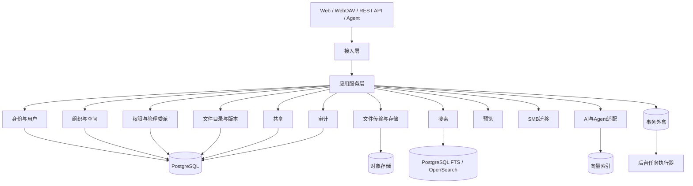

## 5.2 接入层职责

接入层包括：

- Web REST API；
- 管理端 API；
- WebDAV 协议适配器；
- Agent Tool/MCP 适配器；
- 对象存储回调接口；
- 健康检查与指标接口。

接入层负责：

- Token、Session 或 WebDAV 凭据验证；
- 请求格式与参数校验；
- 接口级限流；
- Request ID 和 Trace Context 注入；
- 粗粒度路由权限；
- 将请求转换为应用命令或查询。

接入层不得完成文件、目录、版本、共享和管理委派的最终资源授权。

## 5.3 应用服务层职责

应用服务层负责跨领域流程编排，例如：

- 创建上传会话；
- 完成上传并创建文件或版本；
- 删除文件并写入回收站；
- 创建共享并生成目标空间引用；
- 移动组织并重新校验管理委派；
- 系统管理员特权访问；
- Agent 执行文件操作。

应用服务负责确定事务边界，并在同一业务事务中提交：

- 领域数据变更；
- 必须持久化的审计意图；
- 事务外盒事件。

## 5.4 领域层职责

领域层封装业务实体、值对象、状态机和不变量。领域层不得依赖：

- HTTP；
- 前端框架；
- PostgreSQL 驱动；
- Redis SDK；
- AWS SDK for Go v2；
- OpenSearch SDK；
- Dify 或具体模型 SDK。

## 5.5 基础设施层职责

基础设施层实现领域和应用层定义的接口，包括：

- PostgreSQL 仓储；
- Redis 缓存、限流与租约辅助；
- S3 Compatible API + SeaweedFS 默认实现；
- 搜索索引；
- 消息投递；
- 文件解析、病毒扫描与预览；
- 本地模型和 Agent 平台适配；
- 邮件或企业通知适配。

对象存储访问链路统一为：

```text
File Workshop
↓
Object Storage Interface
↓
S3 Compatible API
↓
SeaweedFS（默认实现，可替换）
```

业务模块、权限模块、预览、搜索、WebDAV 和 AI 工具不得绕过 Object Storage Interface 访问对象存储，也不得把 SeaweedFS 内部结构写入数据库或 API。

## 5.6 控制流与文件数据流

### 控制流

以下流程中的“对象存储”表示 S3 Compatible API，默认由 SeaweedFS S3 Gateway 提供。应用只负责控制面、权限、审计和元数据事务；文件二进制走对象存储数据面。

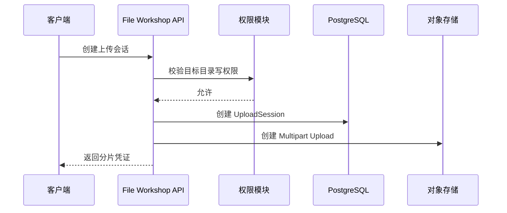

### 数据流

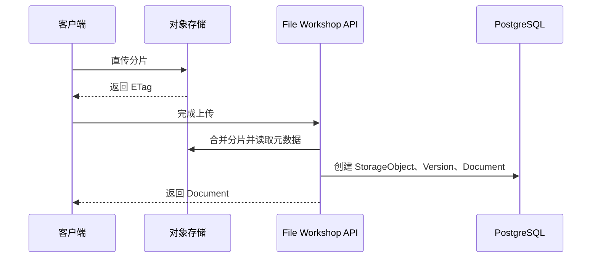

只有小文件、WebDAV 兼容流或安全代理场景可以经应用节点中转；大型文件默认直传对象存储。

## 5.7 数据一致性策略

### 强一致数据

以下数据必须在单个 PostgreSQL 事务内保持一致：

- 文件与当前版本指针；
- 文件版本与存储对象引用；
- 删除状态与回收站记录；
- 权限授权与管理委派；
- 共享及其目标引用；
- 关键操作的审计意图；
- 业务事件的事务外盒记录。

### 最终一致数据

以下数据允许最终一致：

- 全文搜索索引；
- AI 向量索引；
- 缩略图与预览；
- 容量统计缓存；
- 最近访问列表；
- 推荐和相关文件；
- 普通通知。

## 5.8 事务外盒

业务事务不得直接依赖消息队列可用性。应用在 PostgreSQL 中写入 `outbox_events`，后台执行器负责可靠投递。消费者必须幂等。

典型事件：

- `DOCUMENT_CREATED`
- `DOCUMENT_VERSION_CREATED`
- `DOCUMENT_MOVED`
- `DOCUMENT_DELETED`
- `PERMISSION_CHANGED`
- `SHARE_CHANGED`
- `ORGANIZATION_MOVED`
- `AUDIT_ARCHIVE_REQUIRED`

## 5.9 缓存原则

Redis 仅用于：

- 会话与短期 Token 状态；
- 限流；
- 权限计算缓存；
- 分布式租约辅助；
- 幂等结果短期缓存；
- 热点目录和配置缓存。

Redis 不得作为文件、权限、审计或上传会话的唯一事实来源。Redis 故障时，系统可以降级变慢，但不得丢失核心数据。

## 5.10 搜索组件分级

- Lite：PostgreSQL 全文搜索、模糊匹配和元数据查询；
- Standard：可选独立 OpenSearch；
- HA：OpenSearch 集群或等价企业搜索组件；
- AI 向量索引独立于业务搜索索引，可使用 pgvector 或独立向量库。

## 5.11 部署档位

| 档位 | 目标 | 典型组件 |
|---|---|---|
| Lite | 小型工厂、演示、开发 | 单应用、PostgreSQL、Redis、单机对象存储 |
| Standard | 中型工厂 | 负载均衡、2 个应用节点、数据库备份、冗余对象存储 |
| HA | 中大型企业或集团 | 应用集群、PostgreSQL HA、Redis HA、分布式对象存储、搜索集群 |

详细部署见第21章。

## 5.12 架构约束

1. V1.0 不拆分为微服务；
2. 共享 PostgreSQL 实例，但模块拥有逻辑表边界；
3. 不允许接入层直接操作存储对象；
4. 不允许对象存储凭证授予超出单次操作所需范围；
5. 不允许搜索或 AI 索引成为权限事实来源；
6. 不允许消息队列故障阻断核心元数据事务；
7. 不允许预览、AI 和搜索故障阻断核心文件服务；
8. 不允许系统管理员通过绕过应用层的方式进行日常文件访问。

---

# 第6章 系统模块设计

## 6.1 模块分类

| 分类 | 模块 |
|---|---|
| 核心领域模块 | 用户管理、组织与空间、权限与管理委派、文件目录、版本与并发、共享、回收与生命周期 |
| 应用能力模块 | 身份认证、文件传输、搜索、审计、预览、SMB 迁移 |
| 接入适配模块 | Web API、WebDAV、Agent Tool/MCP |
| 可选增强模块 | AI/RAG、独立搜索引擎、通知 |
| 运维支撑模块 | 配置、任务调度、健康检查、指标、日志与追踪 |

## 6.2 身份认证模块

职责：

- 登录、退出、会话和 Token；
- 密码哈希与密码策略；
- 登录失败锁定；
- Refresh Token 轮换；
- 认证事件审计；
- 为 LDAP、OIDC、AD 预留适配接口。

不负责用户文件权限。认证结果只提供用户身份和会话上下文。

## 6.3 用户管理模块

职责：

- 用户资料和账号状态；
- 系统角色 `USER`、`SYSTEM_ADMIN`；
- 用户启用、禁用、锁定和逻辑删除；
- 用户组织关系；
- 个人空间初始化；
- 用户离职交接任务；
- 用户收藏和最近访问偏好。

用户逻辑删除不得级联删除文件、版本、授权、共享和审计。

## 6.4 组织与空间模块

职责：

- 无限层级组织树；
- 组织创建、移动、停用和归档；
- 用户与组织多对多成员关系；
- 个人、组织和公共空间；
- 空间容量、状态和配置；
- 组织重组计划。

不负责文件访问权限计算和管理委派规则。

## 6.5 权限与管理委派模块

职责：

- 文件资源授权记录；
- 权限继承与断开继承；
- 有效权限计算；
- 批量权限过滤；
- 管理委派；
- 向下递归委派校验；
- 管理员作用域和能力上限；
- 权限缓存和失效；
- 最终授权复核。

该模块是唯一资源授权判定入口。

## 6.6 文件目录模块

职责：

- 文件夹树；
- Document 稳定身份；
- 文件名和路径规则；
- 创建、移动、重命名；
- 当前版本指针；
- 目录列表；
- 空间容量增量；
- 文件和文件夹的逻辑状态。

## 6.7 文件传输与存储模块

职责：

- 上传会话；
- 分片凭证；
- 分片状态；
- 对象存储直传；
- 上传完成校验；
- 下载短期凭证；
- Range 下载；
- 存储对象；
- 孤儿对象扫描和垃圾回收；
- 存储后端抽象。

## 6.8 版本与并发模块

职责：

- 创建不可变版本；
- 版本列表和版本恢复；
- 文件级租约锁；
- 锁心跳、超时和强制解锁；
- 乐观并发条件；
- 同时写入冲突处理。

## 6.9 共享模块

职责：

- 用户、组织和目标空间共享；
- 内部分享链接；
- 共享权限和有效期；
- 共享目标引用；
- 撤销和失效；
- 共享访问审计；
- 外部链接能力默认关闭。

## 6.10 回收与生命周期模块

职责：

- 文件和文件夹进入回收站；
- 原位置恢复；
- 恢复冲突处理；
- 永久清理；
- 保留、归档和冷存储策略；
- 资料保全或管理员冻结；
- 清理任务和审计。

## 6.11 搜索模块

职责：

- 元数据搜索；
- 全文索引；
- 权限安全过滤；
- `page`、`pageSize` 分页；
- 索引任务与补偿；
- 最终授权复核；
- 可选语义检索。

## 6.12 审计模块

职责：

- 统一事件模型；
- 普通和高风险事件分级；
- 只追加持久化；
- 管理员特权访问；
- Hash Chain 或批次签名；
- 归档、校验和告警；
- 审计查询与导出；
- 审计 API 自身审计。

## 6.13 预览模块

职责：

- 文件类型识别；
- PDF、图片、文本和 Markdown 预览；
- Office 预览/编辑适配；
- 缩略图；
- 预览缓存；
- 预览失败重试；
- CAD 预览接口预留。

预览模块只读取经授权的指定版本，不修改原文件。

## 6.14 WebDAV兼容模块

职责：

- WebDAV 方法映射；
- 路径解析；
- 文件锁映射；
- 客户端兼容处理；
- 统一授权和审计；
- 大文件限制提示。

WebDAV 是接入适配器，不拥有独立文件、权限或版本数据。

## 6.15 SMB迁移模块

职责：

- SMB 目录扫描；
- 文件和目录元数据提取；
- 用户和 ACL 映射；
- 初次迁移；
- 增量扫描；
- 失败重试；
- 切换与核验；
- 迁移报告。

## 6.16 AI与Agent集成模块

职责：

- 模型适配；
- 文档解析、OCR 和切块；
- Embedding 和 RAG；
- Agent Gateway；
- Tool/MCP；
- Agent Action；
- 模型、Workflow 和 Prompt 配置；
- AI 任务审计和资源限制。

不直接处理数据库和对象存储凭证。

## 6.17 后台任务模块

职责：

- 事务外盒投递；
- 索引更新；
- AI 处理；
- 病毒扫描；
- 预览生成；
- 生命周期清理；
- 审计归档；
- 失败重试、队列延迟摘要、健康摘要、失败原因聚合、过期租约恢复、受控取消、人工死信、跳过、批量运维和死信。

## 6.18 模块依赖规则

1. 接入适配器只能调用应用服务；
2. 应用服务可以协调多个领域模块；
3. 领域模块不得调用接入适配器；
4. 基础设施实现依赖领域接口，领域不得依赖具体 SDK；
5. 跨模块数据写入必须通过模块接口；
6. 查询可以使用受控只读投影，但不得绕过权限；
7. 审计由应用流程统一产生，领域事件可以补充上下文；
8. 禁止模块互相递归调用导致循环依赖。

---

# 第7章 组织与空间模型

## 7.1 组织模型目标

组织模型必须适配不同制造企业，而不是强迫企业采用固定“公司—部门”结构。系统只维护通用树节点，不预设集团、工厂、部门、车间和班组的层级顺序。

## 7.2 组织树

组织采用邻接表作为权威父子关系，并可维护物化路径或闭包表用于高效子树查询。权威关系仍是 `parent_id`。

组织节点状态：

- `ACTIVE`：正常使用；
- `DISABLED`：禁止新增成员和文件，但保留访问；
- `ARCHIVED`：只读归档；
- `DELETED`：逻辑删除，正常查询不可见。

## 7.3 用户与组织关系

用户与组织为多对多关系。关系类型仅描述成员归属，不表达文件管理能力。

| 关系类型 | 说明 |
|---|---|
| PRIMARY | 用户的正式主组织；每个用户最多一条 |
| MEMBER | 用户同时属于的其他正式组织 |

“经理兼管两个部门”由两条管理委派表达，不需要把 `MANAGER` 写入组织成员关系。用户也可以同时是两个组织的 MEMBER，但其文件管理能力仍由管理委派或普通权限授权决定。

## 7.4 空间类型

| 类型 | 所有者 | 数量约束 |
|---|---|---|
| PERSONAL | 用户 | 每个有效用户一个 |
| ORGANIZATION | 组织 | 每个有效组织一个 |
| PUBLIC | 企业实例 | V1.0 默认一个，可配置多个命名公共空间但不引入新业务语义 |

## 7.5 组织与组织空间

创建组织时默认创建其组织空间。组织空间拥有独立稳定 ID；组织移动不会改变空间 ID，也不会移动空间内文件。

组织空间默认不因用户成员关系自动开放。系统可以在创建空间时由模板生成一条对组织主体的默认授权，例如“组织成员只读”或“组织成员读写”，但该授权必须以显式 `permission_grants` 记录存在。

## 7.6 个人空间

个人空间默认只有本人拥有完整文件操作权限。组织空间管理员无权查看成员个人空间。系统管理员可以访问，但必须使用特权访问流程和强审计。

用户离职后，个人空间进入冻结状态，等待以下处置：

- 转交指定接收人；
- 迁移指定文件到组织空间；
- 归档；
- 按策略保留；
- 经授权永久清理。

## 7.7 公共空间

公共空间用于企业制度、模板、通知、排班文件和其他公共资料。公共空间不等于“任何人可写”。默认可读范围和写入管理员通过显式授权配置。

## 7.8 组织移动

移动组织节点前必须完成影响分析：

- 是否会改变管理委派的子树范围；
- 是否会改变组织主体授权的成员集合；
- 是否会引发搜索安全 Token 更新；
- 是否存在进行中的迁移、上传或生命周期任务；
- 是否需要重新确认新上级管理员的管理范围。

组织移动本身不移动组织空间文件。移动事务完成后，权限缓存立即失效，搜索和 AI 安全索引异步刷新；所有返回结果仍需最终授权复核。

## 7.9 组织合并与拆分

V1.0 不提供“一键自动合并/拆分”。系统提供受控重组流程：

1. 创建目标组织；
2. 指定成员迁移计划；
3. 指定管理委派迁移计划；
4. 迁移或重新绑定组织空间；
5. 重新生成授权；
6. 校验文件和搜索可见性；
7. 停用或归档旧组织；
8. 生成完整审计报告。

## 7.10 组织删除约束

存在以下任一条件时不得删除：

- 活跃子组织；
- 活跃用户关系；
- 未处置的组织空间；
- 有效管理委派；
- 未完成迁移任务；
- 关联空间内存在未处置的活动资料保全。

组织只允许逻辑删除，审计引用永久保留。

## 7.11 空间容量

空间记录配额和使用量。`used_bytes` 是便于展示的缓存值，权威容量以活动版本引用的存储对象计算结果为准。后台任务定期核对并修正。

## 7.12 组织与空间不变量

1. 组织树无环；
2. 同一父节点下组织名称或编码按企业配置唯一；
3. 每个用户最多一个 PRIMARY；
4. 每个组织恰有一个组织空间；
5. 每个有效用户恰有一个个人空间；
6. 文件只能属于空间；
7. 组织成员关系不直接产生权限；
8. 组织移动不改变空间和 Document ID；
9. 组织删除不级联物理删除文件；
10. 所有组织变更均产生审计事件。

---

# 第8章 权限、管理委派与访问控制

## 8.1 设计拆分

权限体系拆分为三个不同概念：

1. **系统角色**：`USER`、`SYSTEM_ADMIN`；
2. **管理委派**：管理某个组织空间或组织子树；
3. **文件资源授权**：对空间、文件夹或文件执行具体操作。

三者不得混为一张万能角色表。

## 8.2 访问主体

普通文件授权支持：

- `USER`：单个用户；
- `ORGANIZATION`：一个组织的当前成员集合。

管理委派只授予 `USER`。系统管理员由用户表中的系统角色识别。

## 8.3 资源层级

```text
Space
└── Folder
    └── Folder
        └── Document
            └── Version
```

Version 默认继承 Document 的读取权限；不单独维护写权限。版本恢复和下载历史版本使用 Document 的 `MANAGE_VERSION`、`DOWNLOAD` 等动作校验。

## 8.4 权限动作

核心动作见附录 A。V1.0 至少包括：

- `LIST`
- `READ_METADATA`
- `PREVIEW`
- `DOWNLOAD`
- `UPLOAD`
- `CREATE_FOLDER`
- `WRITE_CONTENT`
- `RENAME`
- `MOVE`
- `DELETE`
- `RESTORE`
- `SHARE`
- `LOCK`
- `MANAGE_VERSION`
- `MANAGE_PERMISSION`

## 8.5 授权记录

普通文件权限由 `permission_grants` 表达：

```text
主体 + 资源 + 动作集合 + 是否向下继承 + 生效时间 + 失效时间
```

V1.0 只保存 ALLOW，不保存 DENY。若某个子目录不应继承父级权限，则在该目录设置 `inheritance_mode = BREAK`，然后重新授予允许权限。

## 8.6 权限继承

### 继承规则

- Space 授权可继承到全部 Folder 和 Document；
- Folder 授权可继承到其子 Folder 和 Document；
- Document 授权只作用于该 Document；
- 直接作用于资源的授权和继承授权取并集；
- 未匹配到任何允许权限时拒绝；
- 断开继承只阻断祖先 ACL，不阻断系统管理员和有效管理委派。

### 不使用显式 DENY 的原因

显式 DENY 会与直接用户授权、组织授权、共享和继承形成复杂冲突。V1.0 采用“默认拒绝 + 允许授权 + 断开继承”获得可预测语义。

## 8.7 管理委派模型

管理委派包含：

- 被授权用户；
- 目标组织；
- 作用域；
- 能力集合；
- 是否允许继续委派；
- 生效和失效时间；
- 授权者；
- 状态。

作用域：

| 作用域 | 含义 |
|---|---|
| SELF | 仅目标组织及其组织空间 |
| SUBTREE | 目标组织及全部后代组织空间 |

默认管理能力：

- `MANAGE_SPACE_CONTENT`
- `MANAGE_SPACE_PERMISSION`
- `MANAGE_SPACE_MEMBERS`
- `MANAGE_SPACE_RECYCLE_BIN`
- `FORCE_UNLOCK`
- `VIEW_SPACE_AUDIT`
- `DELEGATE_ADMIN`

能力可按委派记录缩减。

## 8.8 递归委派规则

授权者创建下级管理委派时必须同时满足：

1. 目标组织处于授权者作用域内；
2. 新委派的能力是授权者能力集合的子集；
3. 新委派的作用域不超过授权者作用域；
4. 授权者拥有 `DELEGATE_ADMIN`；
5. 不能授予 `SYSTEM_ADMIN`；
6. 不能把自身范围扩大到上级或平级组织；
7. 不能修改创建自身委派的上级委派；
8. 委派链上的任一上级失效时，下级委派自动变为无效；
9. 每次委派和撤销均必须强审计。

## 8.9 管理委派与文件访问

有效管理委派隐含其管理范围内的文件管理能力。管理员访问文件时，权限结果标记来源为 `ADMIN_DELEGATION`，并写入管理员访问审计。组织空间管理员不能通过委派访问用户个人空间。

## 8.10 系统管理员特权

`SYSTEM_ADMIN` 在权限计算中拥有全局管理能力，但以下行为必须走特权访问流程：

- 查看、预览或下载他人个人空间文件；
- 查看、预览或下载未通过普通 ACL 授权的组织文件；
- 强制解锁；
- 永久删除；
- 恢复任意文件；
- 修改全局授权或管理委派；
- 访问审计和安全配置。

特权访问应要求原因，必要时要求二次验证。

## 8.11 共享权限

共享是独立访问来源，不写入普通 ACL。共享只允许授予：

- `READ_METADATA`
- `PREVIEW`
- `DOWNLOAD`
- `WRITE_CONTENT`（可选且默认关闭）

共享不能授予 `DELETE`、`MANAGE_PERMISSION`、`MANAGE_VERSION` 或管理员能力。

## 8.12 权限计算流程

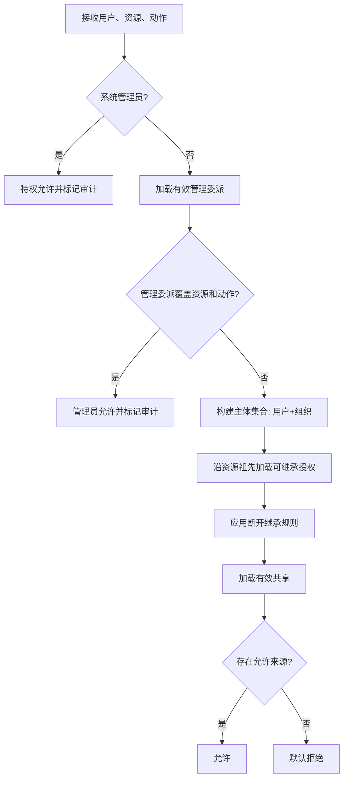

## 8.13 权限缓存

缓存键至少包含：

- 用户 ID；
- 资源 ID；
- 动作；
- 用户组织关系版本；
- ACL 版本；
- 管理委派版本；
- 共享版本。

组织、授权、委派或共享变化时必须更新版本并失效相关缓存。权限缓存失效不能导致越权；缓存缺失时回源计算。

## 8.14 搜索安全过滤

搜索阶段使用主体 Token 过滤候选结果，返回前再次调用权限模块进行批量最终授权。索引延迟不得造成权限撤销后仍可访问文件。

## 8.15 权限错误处理

权限拒绝默认返回通用“资源不存在或无权访问”，避免泄露文件存在性。只有管理员审计界面可查看详细拒绝原因。

## 8.16 权限不变量

1. 无允许来源即拒绝；
2. V1.0 不支持显式 DENY；
3. 管理委派与普通 ACL 分离；
4. 组织成员关系不是权限；
5. 共享不是管理员授权；
6. 子管理员不能授予超出自身范围和能力的委派；
7. 任何入口必须使用同一权限服务；
8. 权限撤销必须通过最终授权复核立即生效；
9. 权限变化必须审计；
10. 审计记录本身没有普通修改权限。


# 第9章 文件领域模型

## 9.1 文件资源层级

```text
Space
└── Folder
    ├── Folder
    └── Document
        ├── Version 1
        ├── Version 2
        └── Version N
```

Space 是权限和容量的一级边界；Folder 提供层级组织；Document 表示稳定文件身份；Document Version 表示不可变内容；Storage Object 表示存储层二进制。

## 9.2 文件夹

文件夹具有稳定 ID。路径是由祖先名称计算或缓存的展示属性，不是身份。

文件夹规则：

- 同一父文件夹下，活动文件夹和文件名称不能重复；
- 根文件夹由空间创建时自动生成；
- 根文件夹不可删除、移动或重命名；
- 文件夹移动不得形成环；
- 移动前校验目标权限、名称冲突、空间配额和生命周期限制；
- 跨空间移动在 V1.0 中按“复制元数据引用并重新授权”的受控流程处理，不作为普通原子 MOVE；
- 删除非空文件夹时，整个子树进入回收站；
- 大目录列表统一使用 `page`、`pageSize` 分页。

## 9.3 文件

Document 保存：

- 稳定 ID；
- 所属空间和父文件夹；
- 文件名、扩展名和 MIME；
- 所有者；
- 当前版本；
- 状态；
- ACL 继承模式；
- 创建和更新时间；
- 删除信息。

Document 不保存二进制内容，也不使用对象存储 Key 作为业务 ID。

## 9.4 文件版本

版本不可变。每次写入内容都创建新版本，包括：

- Web 上传替换；
- WebDAV PUT；
- Office 编辑保存；
- 历史版本恢复；
- Agent 经确认后的内容写入；
- SMB 增量迁移检测到内容变化。

版本号在单个 Document 内单调递增。恢复 V1 时创建新版本 VN+1，并在元数据中记录来源版本。

## 9.5 存储对象

Storage Object 记录：

- 存储提供者；
- Bucket 或逻辑容器；
- Object Key；
- 文件大小；
- SHA-256；
- ETag；
- 存储级别；
- 加密信息；
- 病毒扫描状态；
- 引用状态；
- 创建时间。

多个版本可以在内容完全相同且策略允许时引用同一存储对象。去重只影响二进制存储，不共享 Document、版本、权限或审计。

## 9.6 文件所有者

所有者是业务责任主体，不是唯一权限来源。个人空间中的文件默认归用户所有；组织空间文件默认记录上传用户为创建者，空间为资源归属。人员离职不会改变 Document ID 和历史创建者。

## 9.7 文件生命周期、可用性与资料保全

文件状态拆分为三个相互独立的维度：

| 维度 | 状态 | 含义 |
|---|---|---|
| 生命周期 | ACTIVE | 正常生命周期 |
| 生命周期 | TRASHED | 已进入回收站 |
| 生命周期 | ARCHIVED | 已归档或冷存储 |
| 生命周期 | PURGING | 正在永久清理 |
| 生命周期 | PURGED | 逻辑上已永久清理 |
| 可用性 | AVAILABLE | 内容允许按权限访问 |
| 可用性 | PENDING_SCAN | 等待安全扫描 |
| 可用性 | QUARANTINED | 安全扫描隔离 |
| 可用性 | BLOCKED | 因安全或管理原因阻止访问 |

资料保全不属于上述状态枚举，而是独立、可多条并存、可审计的保全记录。底层数据库表名仍为 `legal_holds`；任一活动资料保全都阻止其作用范围内的永久清理，但不覆盖文件当前生命周期或扫描状态。

## 9.8 文件名规则

- 使用 Unicode；
- 禁止空名称、`.`、`..`、路径分隔符和控制字符；
- Windows 兼容模式下禁止保留设备名和尾随空格/点；
- 文件名长度默认不超过 255 个 Unicode 字符；
- 完整逻辑路径长度默认不超过 2048 个字符；
- 名称比较默认区分大小写或不区分大小写必须按企业实例固定，创建后不可随意切换；
- V1.0 默认采用不区分大小写、保留原始大小写，以兼容 Windows 使用习惯。

## 9.9 文件复制、移动与引用

- 移动：保持 Document ID 和版本链；
- 重命名：保持 Document ID；
- 共享：创建共享关系和可选目标空间引用；
- 复制：创建新 Document，可复用现有 Storage Object；
- 发布到公共空间：默认创建共享引用，不自动复制；
- 下载后再上传视为新文件或新版本，由用户选择和冲突策略决定。

## 9.10 文件夹路径缓存

可维护 `path_cache` 加速展示，但它不是事实来源。组织或文件夹移动后通过后台任务更新后代路径缓存。API 应优先返回 Folder ID 链，避免业务依赖路径字符串。

## 9.11 文件完整性

每个版本必须保存 SHA-256。对象存储上传完成后执行：

1. 校验分片完整性；
2. 获取对象大小和 ETag；
3. 必要时计算服务端 SHA-256；
4. 对比客户端声明；
5. 校验通过后才创建可用版本；
6. 校验失败时隔离或清理对象。

## 9.12 文件不变量

1. Document 必须有当前版本，空占位文件除外；
2. 当前版本必须属于该 Document；
3. Version 不可更新和覆盖；
4. Storage Object 不能在仍有活动版本引用时物理删除；
5. 移动和重命名不改变 Document ID；
6. 共享不复制版本链；
7. 回收站不删除版本；
8. 文件权限不存储在对象存储中；
9. 文件路径不是身份；
10. 任何内容变化都必须创建版本并审计。

---

# 第10章 文件上传、下载与存储设计

## 10.1 上传模式

V1.0 支持：

- 小文件代理上传；
- 大文件对象存储直传；
- 分片上传；
- 断点续传；
- 秒传；
- WebDAV 流式上传；
- SMB 迁移批量上传。

默认阈值：

| 参数 | 初始默认值 | 说明 |
|---|---:|---|
| 直传启用阈值 | 32 MiB | 大于该值优先对象存储直传 |
| 默认分片大小 | 64 MiB | 可按网络和存储调优 |
| 单用户并发分片 | 4 | 防止客户端过载 |
| 单文件最大值 | 100 GiB | 可由管理员调高 |
| 上传会话有效期 | 24 小时 | 活动时可续期 |
| 未完成分片清理 | 48 小时 | 过期后后台清理 |
| 完成接口幂等窗口 | 7 天 | 相同幂等键返回同一结果 |

以上为初始性能基线，不属于不可变产品需求。

## 10.2 上传会话状态

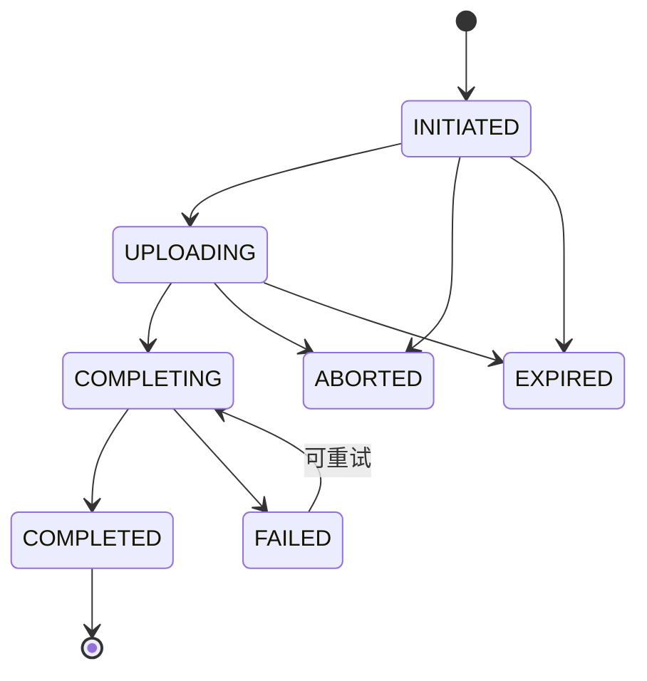

## 10.3 创建上传会话

请求必须包含：

- 目标空间和文件夹；
- 文件名；
- 文件大小；
- MIME 或客户端类型；
- SHA-256（可选，秒传时必需）；
- 上传意图：新文件或指定 Document 的新版本；
- 预期当前版本（更新时）；
- 幂等键。

系统执行：

1. 校验用户身份；
2. 校验目标 `UPLOAD` 或 `WRITE_CONTENT` 权限；
3. 校验名称冲突、配额、最大文件限制和保留策略；
4. 判断是否可秒传；
5. 创建 UploadSession；
6. 创建对象存储 Multipart Upload；
7. 返回分片计划和短期凭证。

## 10.4 分片上传

客户端直传对象存储。每个凭证：

- 只允许指定 Bucket、Object Key、Part Number 和方法；
- 有短期有效期；
- 不允许列举 Bucket；
- 不允许读取其他对象；
- 不包含长期存储密钥。

客户端记录 Part Number、ETag 和校验值，用于断点恢复。

## 10.5 秒传

秒传匹配至少使用：

- SHA-256；
- 文件大小；
- 存储对象状态；
- 安全扫描状态；
- 租户/企业隔离策略。

秒传成功仍须创建新的 Document 或 Version 记录，并执行权限、容量和审计流程。禁止因内容相同而暴露其他用户文件存在性。

## 10.6 完成上传

完成请求必须幂等。服务端：

1. 锁定 UploadSession；
2. 校验会话状态和发起用户；
3. 校验分片列表；
4. 请求对象存储完成合并；
5. 获取对象元数据；
6. 校验大小和 Hash；
7. 在 PostgreSQL 事务中创建 StorageObject、Version、Document 或更新当前版本；
8. 更新空间容量；
9. 写入审计意图和事务外盒；
10. 将会话置为 COMPLETED；
11. 返回 Document ID 和 Version ID。

若对象合并成功但数据库事务失败，对象标记为孤儿候选，由补偿任务清理；客户端可用同一幂等键重试。

## 10.7 更新现有文件

创建新版本时必须提供：

- Document ID；
- 预期当前 Version ID 或版本号；
- 有效文件锁 Token（要求锁的场景）；
- 变更说明。

若当前版本已变化且无有效锁，返回版本冲突，不允许静默覆盖。

## 10.8 上传取消与过期

取消或过期时：

- 调用对象存储终止 Multipart Upload；
- 更新会话状态；
- 清理临时分片；
- 记录审计；
- 不创建 Document 和 Version。

清理任务必须幂等。

## 10.9 病毒扫描与隔离

上传完成后可异步扫描。企业可配置：

- 先可用后扫描；
- 扫描完成前不可下载；
- 高风险类型强制同步扫描。

检测到恶意内容时，将 Document 可用性或对应存储对象扫描状态标记为 `QUARANTINED`，不改变其生命周期状态；普通用户不可访问，管理员通过安全流程处理。

## 10.10 下载流程

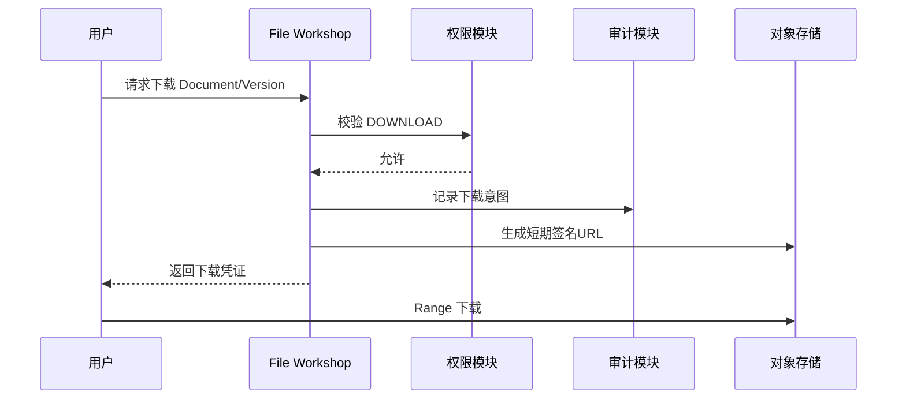

签名 URL 默认有效 5 分钟，可按文件大小调整。签名必须绑定具体对象、方法和有效期。共享下载还应绑定 Share ID。

## 10.11 下载审计边界

“生成有效下载凭证”即记录下载事件，不等待客户端完整下载结束。对象存储访问日志可补充实际字节数和结果。管理员特权下载必须在返回凭证前完成高风险审计写入。

## 10.12 存储抽象

存储接口至少提供：

- 创建分片上传；
- 生成分片凭证；
- 完成或终止分片；
- 获取对象元数据；
- 生成下载凭证；
- 复制对象；
- 删除对象；
- 切换存储级别；
- 健康检查。

业务层不得拼接具体 SeaweedFS、MinIO 或其他对象存储产品 URL，也不得依赖 Filer 路径、Volume ID、Bucket 内部前缀等实现细节。

## 10.13 孤儿对象与垃圾回收

孤儿来源包括：

- 对象合并成功但元数据事务失败；
- 数据库版本已清理但对象删除失败；
- 迁移任务中断；
- 测试或异常回调。

后台任务按对象创建时间、引用状态和保留窗口扫描。删除前必须再次查询活动版本引用，禁止仅依赖缓存引用计数。

---

# 第11章 版本、锁、回收站与生命周期

## 11.1 版本策略

- 内容变化生成新版本；
- 元数据重命名或移动不生成内容版本，但记录审计；
- 版本不可修改；
- 当前版本由 Document 指针标识；
- 版本恢复生成新版本；
- 版本默认保留，按空间生命周期策略归档或清理；
- 任一活动资料保全记录覆盖普通清理策略。

## 11.2 版本号

版本号为单 Document 内递增整数。数据库必须防止并发产生重复版本号。可通过行锁、版本序列或原子更新实现。

## 11.3 文件锁模型

V1.0 使用文件级独占写锁，读取不受锁影响。

锁包含：

- Document ID；
- 持有用户；
- 锁 Token；
- 来源：WEB、WEBDAV、OFFICE、AGENT；
- 创建时间；
- 最后心跳；
- 过期时间；
- 状态。

默认锁租期 30 分钟，客户端每 5 分钟心跳，可配置续租。客户端异常后锁自动过期。

## 11.4 锁行为

- 锁定时其他用户可预览和下载；
- 其他用户写入时返回锁冲突；
- 锁持有者必须携带锁 Token；
- 同一用户同一客户端可以幂等续租；
- WebDAV LOCK Token 映射内部锁 Token；
- 系统管理员或作用域管理员可以强制解锁；
- 强制解锁必须填写原因并强审计；
- 锁失效后原持有者提交写入仍须通过预期版本校验。

## 11.5 乐观并发

即使已有锁，完成写入时仍校验 `expected_version_id`。这用于防止锁过期、网络重试或多入口导致的覆盖。

## 11.6 回收站

文件或文件夹删除时：

- 资源状态变为 TRASHED；
- 创建 RecycleItem；
- 保留原父目录、原空间、删除者和删除时间；
- 保留版本、权限、共享历史和审计；
- 活跃共享立即失效；
- 搜索结果立即通过最终授权和状态校验隐藏。

默认保留 90 天，可按空间策略配置。

## 11.7 恢复

恢复前校验：

- 恢复者权限；
- 原空间是否有效；
- 原父目录是否存在；
- 是否存在同名资源；
- 保留策略；
- 目标配额。

若原目录不存在，恢复到空间的“恢复文件”目录。名称冲突时默认追加恢复时间或要求用户选择。

## 11.8 永久清理

永久清理条件：

- 已超过回收站期限或收到授权操作；
- 文档及相关版本不存在活动资料保全；
- 无活动共享；
- 无进行中的恢复或迁移任务；
- 高风险审计已持久化；
- 存储对象删除采用引用安全检查。

永久清理先逻辑标记 PURGING，再异步清理存储对象。对象清理失败可重试，不能把元数据直接标记为完全成功。

## 11.9 生命周期策略

策略作用域：

- Space；
- Folder；
- Tag；
- 文件类型。

可配置：

- 回收站保留天数；
- 归档时间；
- 冷存储时间；
- 永久清理时间；
- 版本保留数量或期限；
- 是否允许用户覆盖。

冲突时采用更严格的保留要求。资料保全由独立保全记录设置和解除，不作为可被普通生命周期策略自动开启或覆盖的布尔配置。

## 11.10 生命周期状态

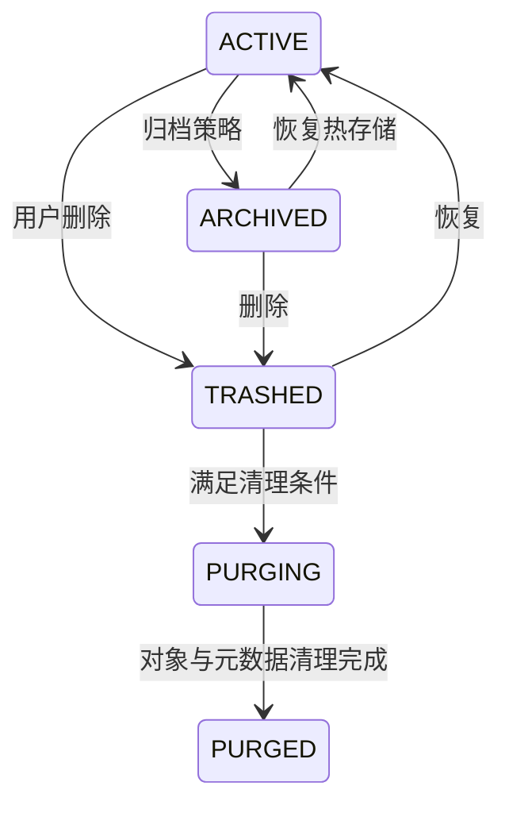

---

# 第12章 文件共享设计

## 12.1 共享目标

V1.0 支持：

- 指定用户；
- 指定组织；
- 指定目标空间；
- 内部链接。

外部匿名链接默认关闭，若企业启用必须设置有效期、下载策略和额外审计。

## 12.2 共享对象

可共享：

- Document；
- Folder。

共享 Folder 时，访问者看到共享时刻及后续符合共享范围的子资源；每次访问仍执行资源状态和权限校验。

## 12.3 共享权限

| 权限 | 默认 |
|---|---|
| 查看元数据 | 必选 |
| 在线预览 | 可选 |
| 下载 | 可选 |
| 编辑并创建新版本 | 可选，默认关闭 |
| 删除 | 禁止 |
| 管理权限 | 禁止 |
| 继续共享 | 默认禁止，可配置 |

## 12.4 共享到空间

共享到目标空间时创建 `shared_entry`，其表现为目标空间中的引用。引用包含：

- Share ID；
- 原 Document/Folder ID；
- 目标 Space 和 Folder；
- 显示名称；
- 创建者；
- 状态。

原文件移动或重命名后引用仍有效；原文件被删除、共享撤销或权限失效时引用不可访问。

## 12.5 共享有效期

共享可设置：

- 永久；
- 固定截止时间；
- 管理员策略最大期限。

到期后共享自动变为 EXPIRED，搜索、列表、Agent 和 WebDAV 均不可继续访问。

## 12.6 共享撤销

共享创建者、资源所有者、空间管理员和系统管理员可以在各自权限范围内撤销。撤销应立即通过最终授权校验生效；搜索索引和共享引用随后异步更新。

## 12.7 内部链接

内部链接只包含 Share Token 或 Share ID，不暴露对象存储地址。访问链接必须登录，并校验目标用户/组织、有效期和共享状态。

## 12.8 共享状态

- `ACTIVE`
- `EXPIRED`
- `REVOKED`
- `SOURCE_UNAVAILABLE`
- `SUSPENDED`

## 12.9 共享审计

至少记录：

- 创建、修改、撤销；
- 访问、预览、下载；
- 到期；
- 因源文件删除而失效；
- 管理员强制撤销；
- Agent 创建或撤销共享。

---

# 第13章 搜索与索引设计

## 13.1 搜索范围

支持：

- 文件名和扩展名；
- 文件夹名；
- 创建者、修改者；
- Space、Organization；
- MIME、大小、时间；
- 标签和元数据；
- 可解析文本；
- OCR 文本；
- 可选语义向量。

## 13.2 索引层次

```text
业务元数据索引
├── PostgreSQL 查询与 FTS（Lite）
└── OpenSearch（Standard/HA 可选）

AI 索引
├── 文档 Chunk
├── Embedding
└── Rerank
```

业务搜索不依赖 AI 索引。

## 13.3 权限安全 Token

索引文档保存用于候选过滤的安全 Token，例如：

- Space ID；
- 允许的 Organization Subject；
- 直接 User Subject；
- Share Subject；
- 资源状态；
- ACL 版本。

Token 只用于减少候选范围，不是最终授权事实。

## 13.4 最终授权复核

所有搜索结果在返回前执行批量权限复核。若索引仍包含已撤销权限，复核必须过滤掉结果。下载、预览和打开文件时再次校验。

## 13.5 索引一致性

目标：

- 文件创建或版本更新后 60 秒内可搜索；
- 普通元数据更新后 30 秒内可搜索；
- 权限和共享撤销在访问层立即生效；
- 索引安全 Token 目标 60 秒内刷新；
- AI 索引目标 5 分钟内刷新，失败可重试。

## 13.6 索引任务

索引任务状态：

- PENDING
- PROCESSING
- SUCCESS
- FAILED
- DEAD

每个任务包含 Document ID、Version ID、事件类型、重试次数和最后错误。任务按 Document/Version 幂等。

管理员可通过受控接口发起指定文档的索引刷新任务。该接口只负责校验文档状态、更新 `document_index_states` 为待处理状态，并写入标准后台任务；不得在 HTTP 请求内执行正文解析、OCR、对象存储读取或外部搜索引擎写入。真实索引处理器由后台任务模块注册，并按对象存储、版本和预览/文本抽取能力逐步启用。

## 13.7 大目录与分页

目录列表和搜索统一使用 `page`、`pageSize` 分页。`page` 从 1 开始且默认值为 1，`pageSize` 默认 50、最大 200。底层禁止无索引、无边界的深页码 OFFSET 扫描；大数据场景必须通过索引、稳定排序、查询改写或经评审的内部定位机制优化，但对外字段不得改为 `cursor`、`limit` 或其他别名。排序字段必须稳定并包含唯一 ID 作为次级排序。

## 13.8 查询流程

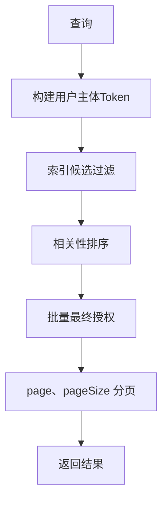

## 13.9 搜索降级

独立搜索引擎不可用时：

- 允许使用 PostgreSQL 文件名和元数据搜索；
- 全文和语义搜索显示降级状态；
- 文件浏览、上传、下载不受影响；
- 产生告警和故障事件。

---

# 第14章 WebDAV兼容层设计

## 14.1 定位

WebDAV 是兼容入口，不是主力体验，也不是 SMB 的完全等价替代。大文件、海量小文件和复杂桌面锁行为受客户端实现限制。

## 14.2 支持方法

V1.0 计划支持：

- OPTIONS
- PROPFIND
- GET
- HEAD
- PUT
- DELETE
- MKCOL
- MOVE
- COPY
- LOCK
- UNLOCK

不支持的方法返回标准 HTTP 状态码和 `Allow` 能力说明。

## 14.3 路径映射

WebDAV 路径映射 Space、Folder 和 Document，但内部始终转换为稳定 ID。禁止通过路径直接拼接对象存储 Key。

## 14.4 认证

支持：

- 短期应用密码；
- Basic over HTTPS；
- 企业统一认证适配；
- 禁止明文 HTTP。

WebDAV 凭据可以单独吊销，并记录客户端来源。

## 14.5 锁映射

LOCK/UNLOCK 映射第11章文件级租约锁。客户端请求无限锁时，服务端仍按最大租期限制并返回实际 Timeout。异常断开后锁按租约过期。

## 14.6 版本行为

PUT 到现有文件创建新版本；PUT 时校验锁 Token 和预期 ETag。无锁并发写入发生冲突时返回 423 或 409，不静默覆盖。

## 14.7 大文件限制

Windows 内置 WebDAV 客户端等可能存在系统限制。系统应：

- 在管理端提供兼容性提示；
- 对超过配置阈值的文件推荐 Web 或专用客户端；
- 不承诺 WebDAV 达到对象存储直传性能；
- 支持管理员配置 WebDAV 最大文件大小；
- 建立 Windows、macOS、Linux 兼容性矩阵。

## 14.8 WebDAV审计

WebDAV 的浏览、读取、写入、删除、移动、锁和解锁必须转换为与 Web/API 相同的审计事件，并记录客户端、方法和路径。

## 14.9 兼容性测试

至少覆盖：

- Windows 文件资源管理器；
- macOS Finder；
- Linux 常见 davfs 客户端；
- Microsoft Office 打开与保存；
- 中文和长文件名；
- 断网重连；
- 锁超时；
- 大量小文件；
- 文件移动和重命名；
- 受限权限和共享资源。

---

# 第15章 审计系统设计

## 15.1 审计与普通日志区分

| 类型 | 用途 | 是否不可变 |
|---|---|---|
| 应用日志 | 故障排查 | 否，按保留策略 |
| 访问日志 | HTTP 和对象访问 | 原始归档后不可变 |
| 业务审计 | 谁对何资源做了什么 | 是 |
| 安全审计 | 登录、权限、特权访问 | 是 |
| 指标 | 运行状态 | 否 |
| Trace | 调用链 | 否，按保留策略 |

## 15.2 全量强审计范围

所有安全相关和关键资源行为必须审计，包括：

- 登录、退出、失败、锁定、Token；
- 用户、组织和成员变化；
- 管理委派；
- 文件创建、读取、预览、下载、修改、移动、删除、恢复；
- 版本创建、恢复和下载；
- 文件锁；
- ACL；
- 共享；
- 系统管理员特权访问；
- WebDAV；
- SMB 迁移；
- AI 搜索、RAG、Tool 和 Action；
- 系统配置、备份、恢复、审计查询与导出。

目录普通列表可通过采样或聚合记录，但涉及敏感空间的列表必须完整记录。企业可选择“全部列表审计”模式。

## 15.3 审计事件字段

每个事件至少包含：

- Event ID；
- Event Type；
- Actor Type 和 Actor ID；
- Effective Role；
- Delegation ID 或 Share ID；
- Resource Type 和 Resource ID；
- Document/Version/Space/Organization 上下文；
- Action；
- Result；
- Failure Reason Code；
- IP、User Agent、Device；
- Request ID、Trace ID；
- Source Channel：WEB、API、WEBDAV、AGENT、MIGRATION、SYSTEM；
- 访问原因或工单；
- Previous Hash、Event Hash（适用时）；
- Created At。

敏感参数只保存摘要或脱敏值，不保存密码、完整 Token 和长期密钥。

## 15.4 写入策略

### 高风险事件

以下事件必须同步形成持久审计意图，失败则业务操作失败关闭：

- 管理委派创建、撤销；
- ACL 变更；
- 系统管理员特权查看、预览、下载；
- 永久删除；
- 强制解锁；
- 审计、安全和密钥配置变更；
- 备份恢复；
- 外部共享启用；
- Agent 危险 Tool。

### 普通事件

普通读取、目录操作等通过事务外盒可靠投递。即使异步审计存储短暂不可用，事件仍留在 Outbox，不能丢失。

## 15.5 不可修改设计

- 审计表业务账号只有 INSERT 和 SELECT 权限；
- 无 UPDATE、DELETE 业务 API；
- 系统管理员界面无修改和删除功能；
- 定期归档到对象锁定/WORM 存储；
- 归档文件带批次清单、Hash 和签名；
- 数据库超级管理员的操作通过数据库审计和外部归档监控。

## 15.6 完整性链

所有审计事件均可分批签名；高风险事件构建 Hash Chain。为避免全局串行瓶颈，按“企业实例 + 日期 + 分区键”形成链。

链字段：

- Chain ID；
- Sequence；
- Previous Hash；
- Event Hash；
- Batch Root；
- Anchor Location。

## 15.7 校验与告警

- 每小时增量校验高风险链；
- 每日完整校验前一日批次；
- 每月校验归档；
- 校验失败立即产生安全告警和新的不可变审计事件；
- 默认不自动停止文件读写，但暂停高风险管理操作，等待安全人员处置；
- 校验结果在审计中心展示。

## 15.8 审计查询

系统管理员可以按用户、组织、空间、文件、事件、时间、IP、渠道和结果查询。组织空间管理员只能查看授权作用域内的空间审计，不得查看全局安全事件或他人个人空间事件。

## 15.9 审计保留

默认在线保留 180 天，归档保留不少于 5 年，可按企业合规调整。永久删除业务文件不得删除相关审计。

---

# 第16章 AI、RAG与Agent集成设计

## 16.1 定位

AI 是可选的文件智能增强模块。File Workshop 核心不依赖 Dify、特定模型或外部 API。企业可以完全不部署 AI。

## 16.2 默认部署原则

- 优先企业本地部署；
- 外部模型 API 默认关闭；
- 支持 OpenAI Compatible 本地接口、Ollama、vLLM、Xinference 等适配；
- Dify 可作为编排平台，但通过 Agent Gateway 解耦；
- 模型、Embedding、Reranker 和 OCR 均可替换。

## 16.3 AI处理流水线

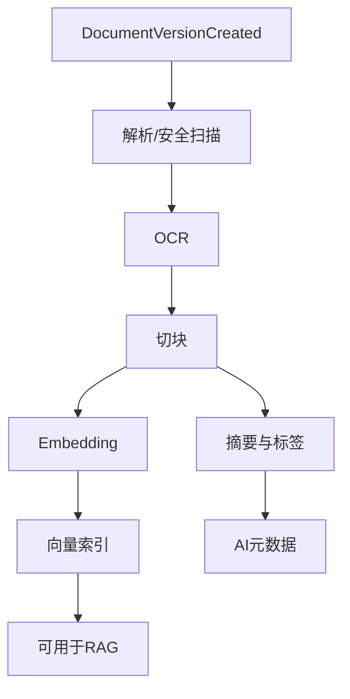

处理以 Version 为单位。当前版本变化后，新版本生成新索引；旧版本索引按版本保留或策略清理。

## 16.4 文档解析

支持优先级：

1. PDF、文本、Markdown；
2. Word、Excel、PowerPoint；
3. 图片和扫描 PDF；
4. 压缩包目录；
5. CAD 文本/元数据适配接口。

解析失败不影响原文件。

## 16.5 RAG权限

RAG 候选阶段使用安全 Token 过滤；生成回答前对所有 Chunk 对应 Document 和 Version 执行最终授权。回答必须引用：

- 文件名；
- Document ID；
- Version；
- 页码或 Chunk 定位；
- 可打开的内部链接。

权限撤销后，旧对话不得继续通过缓存返回受限内容。

## 16.6 Prompt Injection防护

文档内容被视为不可信数据。系统 Prompt 明确禁止执行文档中的指令。解析和 Tool 调用隔离；文档中的“忽略指令”“调用工具”等文本不能改变 Agent 权限或计划。

## 16.7 Agent Gateway

Agent Gateway 负责：

- 用户身份传递；
- Tool 注册；
- 参数校验；
- 权限上下文；
- 调用限流；
- 二次确认；
- 审计；
- Dify 或其他平台适配；
- Action 结果规范化。

Agent 平台不得直接访问 PostgreSQL、Redis 或对象存储。

## 16.8 Tool分类

### 只读 Tool

- `search_documents`
- `get_document`
- `list_folder`
- `get_versions`
- `preview_document`
- `get_metadata`

### 写入 Tool

- `create_share`
- `rename_document`
- `move_document`
- `lock_document`
- `unlock_document`

### 危险 Tool

- `delete_document`
- `restore_document`
- `change_permission`
- `force_unlock`
- `permanent_delete`

危险 Tool 默认不向普通 Agent 开放；启用时必须明确确认并强审计。

## 16.9 Agent Action协议

Agent 不直接控制前端 DOM，而返回结构化动作：

```json
{
  "type": "FOCUS_DOCUMENT",
  "documentId": "doc_123",
  "versionId": "ver_9",
  "requestId": "req_abc"
}
```

V1.0 Action：

- `FOCUS_DOCUMENT`
- `OPEN_DOCUMENT`
- `OPEN_PREVIEW`
- `OPEN_FOLDER`
- `SHOW_VERSIONS`
- `SHOW_METADATA`
- `SHOW_SHARE`
- `REFRESH_FILE_LIST`

前端 Action Dispatcher 负责展开目录、定位、高亮和打开预览。

## 16.10 AI任务状态

- PENDING
- PROCESSING
- SUCCESS
- FAILED
- SKIPPED
- CANCELLED

AI Worker 重试必须幂等。模型升级后可创建重建任务，不覆盖旧处理记录。

## 16.11 AI资源基线

| 模式 | 建议 |
|---|---|
| 无 GPU | 仅解析、OCR、轻量 Embedding；小模型按需 |
| 单 GPU | 本地 7B/14B 级模型、Embedding、Rerank |
| 多 GPU | 并发 RAG、较大模型和批量索引 |
| 无 AI | File Workshop 核心全部可用 |

硬件规格需按实际模型和并发压测，不写死为产品要求。

## 16.12 AI故障降级

模型、Dify、向量库或 OCR 故障时：

- 上传、下载、共享、权限和审计正常；
- UI 标记 AI 暂不可用；
- AI 任务进入重试或死信；
- 业务搜索仍可使用；
- 不返回未经验证的缓存答案。

---

# 第17章 安全设计

## 17.1 身份安全

- 密码使用 Argon2id 或同等级算法；
- 支持密码复杂度和历史策略；
- 连续失败锁定；
- Refresh Token 轮换和撤销；
- 系统管理员建议强制 MFA；
- 高风险操作要求近期重新认证；
- 会话可按设备查看和吊销；
- WebDAV 使用独立应用密码或受控凭据。

## 17.2 传输安全

- 生产环境强制 HTTPS/TLS；
- 内部服务建议 mTLS 或受控网络；
- 对象存储签名 URL 短期有效；
- 禁止在日志中记录密钥和完整 Token；
- 跨域策略白名单；
- 下载响应防止内容嗅探。

## 17.3 存储安全

- 对象存储启用服务端加密；
- 可选企业 KMS；
- 数据库磁盘加密；
- 备份加密；
- 密钥与备份分离；
- 对象存储账户最小权限；
- 应用不得持有集群管理员密钥。

## 17.4 上传安全

- 文件名规范化；
- MIME 魔数检测；
- 扩展名与类型交叉校验；
- 最大文件和配额限制；
- 病毒扫描；
- 压缩炸弹防护；
- 解析器沙箱；
- 禁止路径穿越；
- 预览转换隔离；
- 可执行文件策略。

## 17.5 应用安全

至少防护：

- SQL 注入；
- XSS；
- CSRF；
- SSRF；
- IDOR；
- 路径穿越；
- 反序列化；
- 竞态条件；
- 重放攻击；
- 签名 URL 泄露；
- 批量接口滥用；
- 资源耗尽。

## 17.6 权限安全

- 资源 ID 不能作为授权依据；
- 所有接口服务端校验；
- Web、WebDAV、Search、Preview、Agent 使用统一授权；
- 批量接口逐资源过滤；
- 管理委派防止向上和横向越权；
- 权限变化立即失效缓存；
- 共享撤销即时生效；
- 系统管理员访问强审计。

## 17.7 AI安全

- 文档内容不可信；
- Tool 参数使用 Schema 校验；
- Tool 调用绑定用户身份；
- 只读与写入 Tool 隔离；
- 危险 Tool 二次确认；
- AI 输出不直接作为数据库命令；
- 外部 API 默认关闭；
- 模型 Prompt、上下文和输出按敏感数据处理；
- RAG 结果最终授权。

## 17.8 审计安全

- 审计写入账号与业务账号分离；
- 禁止业务层删除和修改；
- 归档到不可变存储；
- Hash 校验和告警；
- 审计查询、导出也留痕；
- 导出文件加水印、有效期和访问控制。

## 17.9 安全事件响应

建立以下流程：

1. 检测和告警；
2. 确认影响范围；
3. 吊销会话、共享或凭据；
4. 冻结相关资源；
5. 保全审计证据；
6. 恢复服务；
7. 根因分析；
8. 修复和复盘。

---

# 第18章 API总体规范与接口清单

## 18.1 基本规范

- 基础路径：`/api/v1`；
- 数据格式：JSON，文件数据除外；
- 字符编码：UTF-8；
- 时间：ISO 8601 UTC；
- 认证：Bearer Token、Session 或受控 WebDAV 凭据；
- 每个响应包含或回显 `X-Request-ID`；
- 所有写操作支持或明确声明幂等策略；
- 资源 ID 使用数据库设计说明冻结的 UUIDv7；
- API 不直接暴露数据库行和对象存储 Key；
- 错误响应使用稳定错误码，不仅返回自然语言。

## 18.2 兼容性规则

### 允许在 V1 内完成

- 新增可选字段；
- 新增接口；
- 新增枚举值前提是客户端能够忽略未知值；
- 扩大可接受输入范围；
- 修复与文档不符的错误行为。

### 必须升级主版本

- 删除或重命名字段；
- 改变字段类型；
- 改变权限语义；
- 改变状态机含义；
- 改变成功和失败的核心行为；
- 让原本幂等接口变为非幂等；
- 修改签名或认证方式导致客户端不兼容。

## 18.3 统一响应

成功响应建议：

```json
{
  "data": {},
  "requestId": "req_...",
  "timestamp": "2026-08-04T07:00:00Z"
}
```

错误响应建议：

```json
{
  "error": {
    "code": "FILE_VERSION_CONFLICT",
    "message": "文件已被其他用户更新",
    "details": {}
  },
  "requestId": "req_..."
}
```

## 18.4 分页

- 所有列表接口统一使用分页，分页请求字段只能命名为 `page`、`pageSize`；
- 禁止使用 `cursor`、`limit`、`offset`、`pageNo`、`pageNum`、`pageIndex`、`current`、`size`、`page_size` 等分页字段别名；
- `page` 为从 1 开始的整数，默认值为 1；
- `pageSize` 为正整数，默认值为 50，最大值为 200；
- 非整数、`page < 1`、`pageSize < 1` 或 `pageSize > 200` 返回统一参数校验错误，不得静默修正；
- 响应至少返回 `items`、`page`、`pageSize`；只有能够准确且经济地计算时才返回 `total`；
- `totalPages` 如需返回，由 `total` 和 `pageSize` 计算，不作为独立事实维护；
- 前端不得假设所有接口一定返回 `total` 或 `totalPages`；管理报表可提供异步统计总数；
- 排序字段必须稳定并包含唯一 ID；底层禁止无界查询和低效的深分页扫描。

## 18.5 幂等

以下接口必须支持 `Idempotency-Key`：

- 创建上传会话；
- 完成上传；
- 创建共享；
- 创建授权；
- 创建管理委派；
- 删除、恢复和永久清理；
- Agent 写操作；
- SMB 迁移批次提交。

相同用户、相同接口、相同幂等键和相同请求体返回原结果；请求体不同返回冲突。

## 18.6 并发控制

可变资源使用 ETag 或 `version` 字段。客户端更新时提交 `If-Match` 或版本值。冲突返回 `409 Conflict` 或 `412 Precondition Failed`。

## 18.7 限流

按接口风险分类：

- 登录：按 IP 和账号限流；
- 搜索：按用户和实例限流；
- 上传会话：按用户和空间限流；
- 下载凭证：按用户、分享和 IP 限流；
- 审计导出：严格限流；
- AI Tool：按用户、模型和风险限流；
- 管理接口：限制高频批量操作。

## 18.8 身份与用户接口

| 方法 | 路径 | 说明 |
|---|---|---|
| POST | `/auth/login` | 登录 |
| POST | `/auth/logout` | 退出 |
| POST | `/auth/refresh` | 刷新 Token |
| GET | `/users/me` | 当前用户 |
| PATCH | `/users/me` | 修改个人资料 |
| GET | `/admin/users` | 管理员查询用户 |
| POST | `/admin/users` | 创建用户 |
| PATCH | `/admin/users/{id}` | 修改用户 |
| POST | `/admin/users/{id}/disable` | 禁用 |
| POST | `/admin/users/{id}/enable` | 启用 |
| GET | `/users/me/sessions` | 查看会话 |
| DELETE | `/users/me/sessions/{id}` | 吊销会话 |

## 18.9 组织与空间接口

| 方法 | 路径 | 说明 |
|---|---|---|
| GET | `/organizations/tree` | 获取可见组织树 |
| POST | `/admin/organizations` | 创建组织 |
| PATCH | `/admin/organizations/{id}` | 修改组织 |
| POST | `/admin/organizations/{id}/move` | 移动组织 |
| POST | `/admin/organizations/{id}/archive` | 归档组织 |
| GET | `/organizations/{id}/members` | 成员列表 |
| POST | `/organizations/{id}/members` | 添加成员 |
| DELETE | `/organizations/{id}/members/{userId}` | 移除成员 |
| GET | `/spaces` | 获取可见空间 |
| GET | `/spaces/{id}` | 空间详情 |
| PATCH | `/spaces/{id}` | 修改空间配置 |
| GET | `/spaces/{id}/usage` | 容量统计 |

组织空间管理员使用同一接口，但后端按委派作用域授权，不创建另一套“部门管理员 API”。

## 18.10 管理委派接口

| 方法 | 路径 | 说明 |
|---|---|---|
| GET | `/admin-delegations` | 查询本人可见委派 |
| POST | `/admin-delegations` | 创建委派 |
| GET | `/admin-delegations/{id}` | 委派详情 |
| POST | `/admin-delegations/{id}/revoke` | 撤销委派 |
| GET | `/organizations/{id}/administrators` | 组织管理员列表 |
| POST | `/admin-delegations/evaluate` | 评估可委派范围 |

创建前服务端必须验证委派链，而不是相信前端传入的 scope。

## 18.11 文件夹与文件接口

| 方法 | 路径 | 说明 |
|---|---|---|
| GET | `/folders/{id}` | 文件夹详情 |
| GET | `/folders/{id}/children` | 子资源游标列表 |
| POST | `/folders` | 创建文件夹 |
| PATCH | `/folders/{id}` | 重命名 |
| POST | `/folders/{id}/move` | 移动 |
| DELETE | `/folders/{id}` | 移入回收站 |
| GET | `/documents/{id}` | 文件详情 |
| PATCH | `/documents/{id}` | 修改元数据/重命名 |
| POST | `/documents/{id}/move` | 移动 |
| POST | `/documents/{id}/copy` | 复制为新文件 |
| DELETE | `/documents/{id}` | 移入回收站 |
| GET | `/documents/{id}/versions` | 版本列表 |
| POST | `/documents/{id}/versions/{versionId}/restore` | 恢复为新版本 |
| GET | `/documents/{id}/preview` | 获取预览 |
| POST | `/documents/{id}/favorite` | 收藏 |
| DELETE | `/documents/{id}/favorite` | 取消收藏 |

## 18.12 上传接口

| 方法 | 路径 | 说明 |
|---|---|---|
| POST | `/uploads` | 创建上传会话 |
| GET | `/uploads/{id}` | 获取会话和已上传分片 |
| POST | `/uploads/{id}/parts` | 申请分片凭证 |
| POST | `/uploads/{id}/complete` | 完成上传 |
| POST | `/uploads/{id}/abort` | 取消上传 |
| POST | `/uploads/{id}/refresh` | 刷新未过期凭证 |

`complete` 必须携带幂等键和分片清单。

## 18.13 下载接口

| 方法 | 路径 | 说明 |
|---|---|---|
| POST | `/documents/{id}/download-ticket` | 当前版本下载凭证 |
| POST | `/documents/{id}/versions/{versionId}/download-ticket` | 历史版本凭证 |
| GET | `/download-tickets/{id}/status` | 可选下载状态 |

返回短期 URL 或内部代理票据，不返回 Bucket 和永久 Key。

## 18.14 锁接口

| 方法 | 路径 | 说明 |
|---|---|---|
| POST | `/documents/{id}/lock` | 获取锁 |
| POST | `/documents/{id}/lock/heartbeat` | 续租 |
| DELETE | `/documents/{id}/lock` | 释放 |
| POST | `/documents/{id}/lock/force-release` | 强制解锁 |
| GET | `/documents/{id}/lock` | 查询锁状态 |

## 18.15 权限接口

| 方法 | 路径 | 说明 |
|---|---|---|
| GET | `/permissions/resources/{type}/{id}` | 查询 ACL |
| POST | `/permissions/grants` | 创建允许授权 |
| PATCH | `/permissions/grants/{id}` | 修改动作或期限 |
| POST | `/permissions/grants/{id}/revoke` | 撤销 |
| POST | `/permissions/evaluate` | 单资源授权评估 |
| POST | `/permissions/batch-evaluate` | 批量评估 |
| POST | `/permissions/resources/{type}/{id}/break-inheritance` | 断开继承 |
| POST | `/permissions/resources/{type}/{id}/restore-inheritance` | 恢复继承 |

不提供 DENY 接口。

## 18.16 共享接口

| 方法 | 路径 | 说明 |
|---|---|---|
| POST | `/shares` | 创建共享 |
| GET | `/shares/{id}` | 共享详情 |
| PATCH | `/shares/{id}` | 修改期限和允许动作 |
| POST | `/shares/{id}/revoke` | 撤销 |
| GET | `/shares/received` | 共享给我的 |
| GET | `/shares/created` | 我创建的共享 |
| POST | `/shares/{id}/open` | 打开共享并审计 |

## 18.17 回收站与生命周期接口

| 方法 | 路径 | 说明 |
|---|---|---|
| GET | `/recycle-bin` | 查询可见回收项 |
| POST | `/recycle-bin/{id}/restore` | 恢复 |
| POST | `/recycle-bin/{id}/purge` | 永久清理 |
| GET | `/retention-policies` | 查询策略 |
| POST | `/retention-policies` | 创建策略 |
| PATCH | `/retention-policies/{id}` | 修改策略 |
| POST | `/documents/{id}/preservation-holds` | 设置资料保全 |
| GET | `/preservation-holds` | 查询资料保全 |
| GET | `/preservation-holds/{id}` | 查看资料保全 |
| POST | `/preservation-holds/{id}/release` | 解除资料保全 |

## 18.18 搜索接口

| 方法 | 路径 | 说明 |
|---|---|---|
| GET | `/search` | 元数据/全文搜索 |
| POST | `/admin/search/index-refresh-jobs` | 管理员批量发起文档索引刷新任务入队 |
| POST | `/search/semantic` | 可选语义搜索 |
| GET | `/search/suggestions` | 搜索建议 |
| GET | `/search/status` | 搜索服务状态 |

搜索接口不得返回无权资源的总数和名称。

## 18.19 审计接口

| 方法 | 路径 | 说明 |
|---|---|---|
| GET | `/audit/summary` | 审计摘要统计 |
| GET | `/audit/events` | 审计查询 |
| GET | `/audit/events/{id}` | 详情 |
| POST | `/audit/exports` | 异步导出 |
| GET | `/audit/exports/{id}` | 导出状态 |
| GET | `/audit/integrity` | 完整性状态 |
| POST | `/audit/integrity/verify` | 手动校验 |

不提供修改和删除接口。组织管理员查询时自动限制作用域。

## 18.20 Agent Tool与Action接口

| 方法 | 路径 | 说明 |
|---|---|---|
| POST | `/agent/tools/{toolName}` | 受控 Tool 调用 |
| POST | `/agent/actions/validate` | 校验 Action |
| POST | `/agent/confirmations` | 创建高风险确认 |
| POST | `/agent/confirmations/{id}/approve` | 用户确认 |
| GET | `/agent/tasks/{id}` | 任务状态 |

## 18.21 API审计

所有写接口、下载票据、预览、权限拒绝、管理查询和 Agent Tool 必须写入审计。对纯健康检查和公开静态资源不写业务审计。

---

# 第19章 前端交互设计

## 19.1 前端技术建议

- Vue 3；
- TypeScript；
- Pinia；
- Vue Router；
- 组件库可替换；
- 大目录采用虚拟列表；
- 上传使用 Web Worker 计算 Hash；
- 所有 API 类型由 OpenAPI 生成；
- 权限用于隐藏操作入口，但服务端仍是最终判定。

## 19.2 页面结构

### 普通用户

- 首页；
- 我的文件；
- 组织空间；
- 公共空间；
- 共享给我的；
- 最近访问；
- 收藏；
- 回收站；
- 搜索；
- 文档智能助手；
- 个人设置。

### 组织空间管理员

在普通界面基础上增加：

- 空间成员和权限；
- 管理委派；
- 空间回收站；
- 空间容量；
- 生命周期策略；
- 空间审计；
- 文件锁管理。

### 系统管理员

- 系统概览；
- 用户与会话；
- 组织树；
- 空间；
- 全局委派与权限；
- 审计中心；
- 存储和容量；
- 搜索；
- AI；
- 备份与恢复；
- 高可用状态；
- 系统配置。

## 19.3 文件管理布局

建议桌面端：

```text
┌─────────────────────────────────────────────────────────┐
│ 顶部：搜索 / 智能查找 / 上传 / 用户                     │
├──────────────┬──────────────────────┬───────────────────┤
│ 空间与文件树 │ 文件列表             │ 详情/预览/版本     │
│              │                      │                   │
├──────────────┴──────────────────────┴───────────────────┤
│ 上传队列 / 系统状态 / Agent Action 提示                 │
└─────────────────────────────────────────────────────────┘
```

## 19.4 上传交互

上传面板显示：

- 文件名、大小和目标位置；
- Hash 计算；
- 分片进度；
- 当前速度和剩余时间；
- 暂停、恢复、取消；
- 秒传；
- 重试；
- 版本冲突；
- 安全扫描状态。

刷新页面后可通过 UploadSession 恢复。

## 19.5 文件锁交互

文件被锁时展示：

- 持有者；
- 锁来源；
- 到期时间；
- 只读打开；
- 联系持有者；
- 管理员强制解锁入口（按权限显示）。

## 19.6 权限管理交互

不直接展示底层 ACL 行给普通管理员，而提供：

- 成员/组织选择；
- 权限模板；
- 当前目录还是包含子目录；
- 是否断开继承；
- 到期时间；
- 变更影响预览。

高级页面可以展开查看授权来源。

## 19.7 管理委派交互

组织树中选择目标节点后显示：

- 管理员列表；
- SELF/SUBTREE；
- 能力集合；
- 是否可继续委派；
- 委派来源链；
- 到期时间；
- 可委派范围预览。

不允许前端生成超范围选项，但后端仍须校验。

## 19.8 系统管理员特权访问

管理员打开无普通权限的文件时，前端必须：

1. 明确提示“将进行特权访问并留痕”；
2. 要求填写原因或工单；
3. 高敏文件要求二次认证；
4. 成功后显示特权访问状态；
5. 不允许静默降级成普通访问。

## 19.9 Agent交互

Agent 可以嵌入顶部搜索和右侧助手。返回 Action 后：

- 验证 Action；
- 展开目标文件夹；
- 滚动到文件；
- 高亮；
- 打开预览或版本；
- 显示 Agent 使用了哪些 Tool；
- 对写入和危险操作要求确认。

## 19.10 状态与错误

前端必须区分：

- 无权限/资源不存在；
- 文件被锁；
- 版本冲突；
- 上传过期；
- 配额不足；
- 搜索降级；
- AI 不可用；
- WebDAV 客户端限制；
- 安全隔离；
- 服务切换或只读维护。

错误信息面向用户可理解，同时保留 Request ID 便于排障。

## 19.11 无障碍与国际化

- 关键操作支持键盘；
- 图标配文字或可访问标签；
- 颜色不是唯一状态表达；
- 文本使用 i18n；
- 默认简体中文；
- 时间、大小和时区本地化。

---

# 第20章 SMB迁移设计

## 20.1 迁移目标

迁移工具提供从现有 SMB 共享盘到 File Workshop 的可验证路径，尽量保留：

- 目录结构；
- 文件内容；
- 文件名；
- 修改时间；
- 创建时间（源支持时）；
- 文件所有者映射；
- ACL 映射；
- Hash；
- 迁移错误和处置记录。

## 20.2 迁移阶段


## 20.3 盘点

迁移前生成：

- 文件和目录数量；
- 总容量；
- 大文件分布；
- 无权限文件；
- 不合法名称；
- 超长路径；
- 重复文件；
- 无法读取文件；
- SMB ACL；
- 所有者和组；
- 最近修改时间；
- 热点目录。

## 20.4 映射

### 路径映射

源 SMB 根路径映射到目标 Space/Folder。迁移计划保存映射，不依赖人工记忆。

### 用户和组映射

- 域用户映射 File Workshop User；
- AD 组或本地组映射 Organization 或显式授权模板；
- 无法映射的账号进入异常清单；
- 不自动将未知账号授权给所有人。

### ACL映射

SMB ACL 可能包含复杂 DENY。由于 File Workshop V1.0 不支持 DENY，迁移工具必须：

- 识别无法无损转换的 ACL；
- 生成风险报告；
- 建议断开继承并重新授权；
- 未经管理员确认不自动放宽权限。

## 20.5 首次迁移

- 并发可配置；
- 大文件使用分片；
- 保留 mtime；
- 每个文件计算 SHA-256；
- 创建 Document 和初始 Version；
- 记录源路径与目标 ID；
- 失败可重试；
- 迁移 Agent 使用专用服务身份并强审计。

## 20.6 增量同步

通过周期扫描、变更日志或文件系统能力识别：

- 新增；
- 内容修改；
- 重命名；
- 移动；
- 删除。

内容修改创建新版本；重命名和移动保持 Document ID；无法可靠识别时按 Hash、文件 ID 和时间组合判断，并记录不确定项。

## 20.7 最终切换

建议：

1. 通知用户；
2. SMB 设置只读；
3. 执行最终增量；
4. 核验数量、大小和 Hash；
5. 切换入口；
6. 保留 SMB 只读回退窗口；
7. 观察审计、性能和错误；
8. 到期后下线旧写入。

## 20.8 验收

| 项目 | 要求 |
|---|---|
| 文件数 | 与可读取源文件一致 |
| 总大小 | 差异可解释 |
| Hash | 抽样100%，关键目录全量 |
| 目录结构 | 映射一致 |
| 时间戳 | 在源能力范围内保留 |
| 权限 | 映射经管理员确认 |
| 失败项 | 有清单、原因和重试结果 |
| 增量 | 能识别并同步变化 |
| 回退 | 在回退窗口内可执行 |

## 20.9 迁移安全

- SMB 凭据加密保存；
- 迁移节点最小网络权限；
- 迁移日志不记录密码；
- 临时文件清理；
- 迁移过程全量审计；
- 切换期间防止双写；
- 源端删除默认不自动永久删除目标文件。


# 第21章 部署与高可用设计

## 21.1 部署原则

- 同一代码支持 Lite、Standard、HA；
- AI、独立搜索和预览可选；
- 应用节点无状态；
- 文件内容不落应用节点本地盘；
- 配置和密钥外置；
- 组件健康状态可被自动检测；
- 单机版强调开箱即用，HA 版强调故障隔离；
- 部署复杂度与企业规模匹配。

## 21.2 Lite部署

适合开发、演示和小型工厂。

```text
单台服务器
├── Nginx
├── File Workshop 应用
├── 后台任务执行器
├── PostgreSQL
├── Redis
├── SeaweedFS（S3 Gateway）
└── 可选：本地搜索、预览、AI
```

交付内容：

- Docker Compose；
- `.env` 模板；
- 初始化脚本；
- 健康检查脚本；
- 备份和恢复脚本；
- 升级脚本；
- 默认告警；
- 运维速查表。

Lite 不承诺节点级高可用，但必须具备可靠备份和恢复。

## 21.3 Standard部署

适合中型企业。

```text
Nginx/HAProxy
├── File Workshop App 1
└── File Workshop App 2

PostgreSQL
Redis
冗余对象存储
可选 OpenSearch
独立备份存储
```

Standard 至少保证应用节点冗余；数据库和对象存储可按预算采用主备或企业已有基础设施。

## 21.4 HA部署

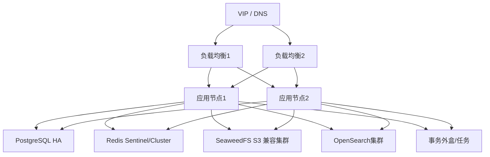

推荐技术组合：

- 负载均衡：Nginx/HAProxy；
- VIP：Keepalived 或企业负载均衡；
- PostgreSQL：Patroni + etcd/Consul；
- Redis：Sentinel 或 Cluster；
- 对象存储：分布式 SeaweedFS、企业 S3 或其他经验证的 S3 兼容对象存储；
- 搜索：OpenSearch 集群；
- 指标：Prometheus + Grafana；
- 日志：Loki/ELK；
- Trace：OpenTelemetry。

组件可替换，故障语义不得改变。

## 21.5 应用无状态要求

应用节点不得把以下数据仅保存在本地：

- Session；
- 上传会话；
- 权限缓存唯一副本；
- 文件；
- 审计；
- 异步任务唯一状态。

临时文件必须有清理策略，节点重启不能破坏核心事务。

## 21.6 健康检查

### 存活检查

只判断进程是否可响应，不依赖所有外部组件，避免依赖故障导致全部实例被错误摘除。

### 就绪检查

判断：

- 数据库可用；
- 核心配置已加载；
- 必要密钥可用；
- 对象存储可用或处于明确只读降级；
- 节点可接受流量。

### 深度健康检查

管理端单独检查 PostgreSQL、Redis、对象存储、搜索、AI、备份和审计链。

## 21.7 故障行为

| 故障 | 预期行为 |
|---|---|
| 单应用节点宕机 | LB 摘除，其他节点继续 |
| PostgreSQL 主节点宕机 | Patroni 切主，应用重连，短暂写入失败可重试 |
| Redis 故障 | 会话可能重新认证，缓存回源；核心数据不丢失 |
| 单对象存储节点故障 | 分布式存储继续提供服务 |
| 搜索故障 | 降级文件名/元数据搜索，文件核心正常 |
| AI 故障 | AI 不可用，文件核心正常 |
| 预览故障 | 预览不可用，下载正常 |
| 审计归档故障 | Outbox 积压并告警；高风险操作按失败关闭策略 |
| 消息代理故障 | Outbox 保留，异步任务延迟 |

## 21.8 数据库切换要求

应用必须：

- 使用连接池健康检查；
- 能识别只读节点错误；
- 对幂等写操作有限重试；
- 不在事务中执行长时间外部调用；
- 切主后清理失效连接；
- 记录切换期间的错误和恢复时间。

## 21.9 只读降级

当数据库写能力或对象存储写能力不可用时，可以进入只读模式：

- 允许浏览、搜索和下载可用数据；
- 禁止上传、版本、权限和共享修改；
- UI 明确显示状态；
- 所有失败请求带 Request ID；
- 恢复后自动退出或经管理员确认。

## 21.10 自动化部署

V1.0 至少提供 Docker Compose。HA 部署建议提供 Ansible Playbook 或 Helm Chart，但不强制 Kubernetes。部署工具必须：

- 幂等；
- 可重复；
- 支持离线镜像；
- 支持配置校验；
- 支持预检查；
- 支持滚动升级；
- 输出版本清单。

## 21.11 故障演练剧本模板

每个剧本必须包含：

- 故障名称；
- 前置条件；
- 注入方法；
- 预期用户影响；
- 自动恢复机制；
- RTO/RPO 目标；
- 验证步骤；
- 数据一致性检查；
- 回切步骤；
- 审计和告警；
- 复盘结论。

测试环境每次重大版本发布前执行核心剧本；生产环境按企业制度定期演练。

---

# 第22章 备份与灾难恢复

## 22.1 目标

备份必须覆盖：

- PostgreSQL 业务数据；
- 文件对象；
- 审计归档；
- 系统配置；
- 密钥和证书的安全备份；
- 部署清单；
- AI Prompt 和 Workflow 配置；
- 搜索索引可不备份，但必须可重建。

## 22.2 建议RPO/RTO

| 部署档位 | RPO初始目标 | RTO初始目标 |
|---|---:|---:|
| Lite | 24小时 | 8小时 |
| Standard | 1小时 | 4小时 |
| HA | 15分钟 | 1小时 |

企业可提高要求，但必须验证基础设施和预算能够达到。

## 22.3 PostgreSQL备份

- 定期全量基础备份；
- WAL 连续归档；
- 支持 PITR；
- 备份加密；
- 备份校验；
- 至少一份异地或离线副本；
- 恢复演练；
- 备份账户与业务账户分离。

## 22.4 对象存储保护

- 分布式冗余不是备份；
- 启用版本保护或对象锁（按策略）；
- 定期复制到独立存储域；
- 备份清单记录 Object Key、大小和 Hash；
- 防止勒索软件同时访问生产和备份；
- 定期抽样完整性校验。

## 22.5 审计备份

审计归档到 WORM/对象锁定存储。归档批次包含：

- 事件文件；
- 清单；
- 起止序号；
- Hash；
- 签名；
- 校验说明。

## 22.6 配置和密钥

- 配置纳入版本管理；
- 密钥不提交 Git；
- KMS、Vault 或加密离线介质保存；
- 恢复时保持密钥与数据版本匹配；
- 密钥轮换有回退方案。

## 22.7 恢复顺序

1. 恢复网络、DNS、证书和密钥；
2. 恢复 PostgreSQL；
3. 恢复对象存储；
4. 核对 StorageObject 与 Version 引用；
5. 恢复审计链和归档；
6. 启动核心应用；
7. 重建搜索索引；
8. 重建预览和 AI 索引；
9. 执行一致性检查；
10. 开放用户访问。

## 22.8 恢复验证

至少验证：

- 用户和组织；
- Space 和目录树；
- Document 当前版本；
- 历史版本下载；
- ACL 和管理委派；
- 共享；
- 审计完整性；
- 对象 Hash；
- 上传新文件；
- 搜索重建；
- Agent 不越权。

## 22.9 灾难场景

- 数据库逻辑误删；
- 对象存储误删；
- 勒索软件；
- 机房不可用；
- 管理员误配置；
- 审计数据损坏；
- 升级失败；
- 密钥丢失；
- 多组件同时故障。

每种场景应有恢复剧本，不以“配置了备份”替代“完成恢复”。

---

# 第23章 可观测性与运维设计

## 23.1 三大支柱

- Metrics：趋势、容量和告警；
- Logs：结构化运行日志；
- Traces：跨模块和外部组件调用链。

审计独立于三大支柱。

## 23.2 统一上下文

所有请求和任务携带：

- Request ID；
- Trace ID；
- User ID（脱敏/内部）；
- Source Channel；
- Document/Space ID（适用）；
- Deployment Node；
- Version。

## 23.3 核心指标

### API

- QPS；
- P50/P95/P99；
- 4xx/5xx；
- 限流；
- 幂等冲突；
- 权限拒绝；
- 活跃会话。

### 上传下载

- 上传会话数；
- 分片成功率；
- 完成耗时；
- 上传失败；
- 孤儿对象；
- 下载凭证；
- 下载带宽；
- Hash 校验耗时。

### 数据库

- 连接池；
- 慢查询；
- 锁等待；
- 复制延迟；
- WAL；
- 切换；
- 表和索引增长。

### 对象存储

- 容量；
- 节点状态；
- 请求延迟；
- 5xx；
- 修复队列；
- 磁盘故障；
- 未完成 Multipart。

### 权限

- 权限计算耗时；
- 缓存命中；
- 批量评估大小；
- 委派深度；
- 缓存失效延迟。

### 搜索

- 查询延迟；
- 索引积压；
- 安全过滤候选比；
- 最终授权过滤数量；
- 索引失败。

### 审计

- 事件写入；
- Outbox 积压；
- 高风险写入失败；
- 归档延迟；
- Hash 校验失败。

### AI

- 任务积压；
- 模型延迟；
- OCR/解析失败；
- Token/资源消耗；
- Tool 调用成功率；
- 权限拒绝；
- 引用完整率。

## 23.4 结构化日志

日志字段至少：

- timestamp；
- level；
- service；
- node；
- request_id；
- trace_id；
- operation；
- status；
- duration_ms；
- error_code。

不得记录密码、Token、存储密钥、完整文档内容和未脱敏 Prompt。

## 23.5 告警分级

| 级别 | 示例 |
|---|---|
| P1紧急 | 核心服务不可用、数据库无法写入、审计链异常、数据丢失风险 |
| P2严重 | 单节点故障、对象存储降级、备份失败、权限异常增长 |
| P3警告 | 搜索积压、AI失败率升高、容量接近阈值 |
| P4信息 | 版本发布、计划切换、维护窗口 |

## 23.6 一键健康检查

交付脚本至少检查：

- 应用版本；
- 数据库连接和主从；
- Redis；
- 对象存储；
- 搜索；
- Outbox；
- 审计完整性；
- 备份最新时间；
- 磁盘和容量；
- 证书有效期；
- AI 状态。

输出机器可读 JSON 和人类可读报告。

## 23.7 运维操作审计

以下运维行为必须审计：

- 配置修改；
- 扩容；
- 节点摘除；
- 数据库切换；
- 备份与恢复；
- 密钥轮换；
- 索引重建；
- 审计校验；
- 手动任务重试；
- 数据修复。


# 第24章 性能基线与容量规划

## 24.1 规划模型

以下为初始容量模型，用于设计和压测，不是商业承诺或硬限制。

| 档位 | 注册用户 | 峰值在线 | 文件数量 | 原始容量 | 典型单文件 |
|---|---:|---:|---:|---:|---|
| Lite | 100 | 30 | 100万 | 1–5 TiB | 1 KiB–10 GiB |
| Standard | 500 | 150 | 1000万 | 5–30 TiB | 1 KiB–50 GiB |
| HA | 2000 | 500 | 5000万 | 30–200 TiB | 1 KiB–100 GiB |

容量应额外考虑：

- 历史版本；
- 对象存储冗余；
- 预览；
- 审计；
- 搜索索引；
- AI 文本和向量；
- 备份；
- 增长余量。

## 24.2 参考文件分布

压测数据建议：

- 60% 小于 10 MiB；
- 25% 为 10–100 MiB；
- 10% 为 100 MiB–1 GiB；
- 4% 为 1–10 GiB；
- 1% 大于 10 GiB；
- 包含大量小文件目录和深层目录；
- 版本平均 3–5 个；
- 热数据 20%，温冷数据 80%。

## 24.3 初始响应目标

在目标硬件、数据库无异常、网络正常、缓存稳定的条件下：

| 操作 | P95目标 |
|---|---:|
| 登录 | ≤ 500 ms |
| 获取50条目录列表 | ≤ 500 ms |
| 获取文件详情 | ≤ 300 ms |
| 创建文件夹 | ≤ 500 ms |
| 创建上传会话 | ≤ 500 ms |
| 完成上传元数据提交 | ≤ 1 s（不含对象合并） |
| 生成下载凭证 | ≤ 300 ms |
| 权限单次评估 | ≤ 50 ms |
| 100项批量权限评估 | ≤ 250 ms |
| 元数据搜索 | ≤ 1 s |
| 全文搜索 | ≤ 2 s |
| Agent文件定位 | ≤ 5 s（不含大模型极端延迟） |

这些目标应由 CI 性能环境和发布前压测验证，可依据硬件调整，但调整必须记录原因。

## 24.4 上传下载吞吐

文件数据直传对象存储时，目标是达到可用网络带宽的 70% 以上。应用节点只承担控制流，不能因大文件传输导致 API 内存线性增长。

测试至少包括：

- 1 MiB、100 MiB、1 GiB、10 GiB；
- 单用户 4 分片并发；
- 20、50、100 个并发上传会话；
- 20、50、100 个并发下载；
- 中途断网和恢复；
- 重复完成请求；
- 分片丢失；
- 存储节点延迟。

## 24.5 大目录性能

测试目录规模：

- 1,000；
- 10,000；
- 100,000；
- 1,000,000 个直接子项（极限）。

要求：

- 对外统一使用 `page`、`pageSize` 分页；
- 不执行深 OFFSET；
- 列表 SQL 使用覆盖索引；
- 权限批量计算；
- 前端虚拟滚动；
- 不在响应中计算全量子树统计。

## 24.6 权限性能

重点压测：

- 用户属于多个组织；
- 多层 Folder 继承；
- 断开继承；
- 多条直接授权；
- 多条共享；
- 深层管理委派；
- 组织移动后缓存失效；
- 100–500项批量评估。

权限正确性优先于缓存命中率。缓存优化不得改变授权结果。

## 24.7 审计容量

审计容量估算：

```text
每日事件数 × 平均事件大小 × 在线保留天数
+
归档副本
+
索引开销
```

高频读取事件可按企业配置决定是否逐次记录目录列表，但文件下载、预览、写入、权限、共享和特权访问不得采样。

## 24.8 容量预警

空间、对象存储、数据库 WAL、审计分区和备份目标分别设置：

- 70%：信息；
- 80%：警告；
- 90%：严重；
- 95%：紧急。

达到严重阈值时限制非必要 AI 重建、预览生成和批量迁移，不优先阻断核心文件读取。

## 24.9 压测报告

每次正式性能基线报告应包含：

- 硬件和网络；
- 软件版本；
- 数据规模；
- 请求模型；
- P50/P95/P99；
- 吞吐；
- CPU、内存、IO；
- 数据库和存储指标；
- 错误率；
- 瓶颈；
- 参数调整；
- 与上一版本对比。

---

# 第25章 测试体系

## 25.1 测试层次

| 测试 | 目标 |
|---|---|
| 单元测试 | 领域规则和纯函数 |
| 集成测试 | PostgreSQL、Redis、对象存储、搜索 |
| API契约测试 | OpenAPI和兼容性 |
| 端到端测试 | 用户完整流程 |
| 权限测试 | 正向、拒绝、越权、缓存失效 |
| 并发测试 | 上传、版本、锁、移动、授权 |
| 性能测试 | 响应、吞吐、容量 |
| 安全测试 | 常见漏洞和Agent风险 |
| 兼容性测试 | 浏览器、WebDAV、Office |
| 恢复测试 | 备份、PITR、对象恢复 |
| 故障注入 | HA和降级 |
| 迁移测试 | SMB全量、增量、切换 |
| AI测试 | RAG准确性、引用、越权、Prompt Injection |

## 25.2 单元测试重点

- 组织树防环；
- 主组织唯一；
- 管理委派范围；
- 子委派能力子集；
- ACL继承和断开继承；
- 默认拒绝；
- 文件名规范；
- 版本号；
- 文件锁；
- 回收恢复；
- 生命周期冲突；
- 共享期限；
- 幂等键；
- 审计 Hash；
- Agent Action Schema。

领域核心模块语句覆盖率建议不低于 85%，整体覆盖率不作为唯一质量指标。

## 25.3 权限矩阵测试

必须生成自动化权限矩阵，覆盖：

- 普通用户本人个人空间；
- 他人个人空间；
- 组织成员；
- 非组织成员；
- 直接用户授权；
- 组织授权；
- 断开继承；
- 共享；
- 组织空间管理员 SELF；
- SUBTREE；
- 平级和上级越权；
- SYSTEM_ADMIN 普通和特权路径；
- Web、API、WebDAV、Search、Agent。

每个操作同时验证审计事件。

## 25.4 属性测试

对以下不变量使用属性测试或随机测试：

- 组织树永不成环；
- 子管理员永不越界；
- 没有允许来源永远拒绝；
- 版本不可变；
- 同一幂等键不创建重复版本；
- 回收恢复不丢失版本；
- 存储对象有引用时不删除；
- 权限撤销后任何入口不能访问。

## 25.5 并发测试

至少覆盖：

- 同一文件两个上传完成；
- 锁过期与写入同时发生；
- 强制解锁与原用户提交；
- 同名文件并发创建；
- 文件移动与删除；
- 授权撤销与下载凭证生成；
- 分享撤销与搜索返回；
- 组织移动与子委派创建；
- 永久清理与恢复；
- Outbox重复消费。

## 25.6 WebDAV测试集

为每个支持客户端记录：

- 客户端版本；
- 方法；
- 文件大小；
- 锁行为；
- 中文名；
- 错误码；
- 结果；
- 已知限制。

测试 Office/CAD 时应特别验证临时文件、重命名、LOCK、PUT 和冲突行为。

## 25.7 安全测试

至少覆盖 OWASP 类风险及：

- IDOR；
- 批量越权；
- 签名URL重放；
- UploadSession劫持；
- 路径穿越；
- 压缩炸弹；
- 恶意预览文件；
- WebDAV凭据泄露；
- 管理委派提权；
- 权限缓存陈旧；
- 审计绕过；
- Prompt Injection；
- Tool参数注入；
- RAG越权；
- 外部API误启用。

## 25.8 AI质量测试

- 文档解析成功率；
- OCR准确率；
- 搜索 Recall@K；
- Rerank相关性；
- 回答引用率；
- 引用内容一致性；
- 无答案时拒答；
- 权限撤销后缓存清除；
- 恶意文档不触发Tool；
- 模型故障降级。

AI指标按测试集记录，不承诺单一模型永久达到固定质量。

## 25.9 备份与恢复测试

每个正式版本至少在测试环境完成：

- 数据库全量恢复；
- PITR；
- 对象存储恢复；
- 审计归档恢复；
- 搜索重建；
- AI索引重建；
- 恢复后业务一致性检查。

## 25.10 故障注入

可使用脚本、容器操作或 Chaos 工具。至少模拟：

- 杀死应用节点；
- 数据库主节点故障；
- Redis不可用；
- 单存储节点故障；
- 搜索不可用；
- AI不可用；
- 网络延迟；
- 磁盘满；
- 证书过期；
- 任务重复投递。

## 25.11 发布质量门禁

阻止发布的条件：

- 核心单元或集成测试失败；
- 权限矩阵失败；
- Migration无法演练；
- OpenAPI不兼容；
- 高风险安全漏洞；
- 恢复测试失败；
- 审计关键事件缺失；
- 性能较基线严重回退且无批准；
- 镜像或依赖存在不可接受漏洞。

---

# 第26章 开发流程、CI/CD与代码规范

## 26.1 仓库建议

```text
file-workshop/
├── backend/
├── frontend/
├── deploy/
├── migrations/
├── docs/
├── tests/
├── scripts/
└── tools/
```

后端按模块组织，而不是按 Controller/Service/Repository 全局平铺。

## 26.2 分支策略

个人主导项目建议：

- `main`：始终可发布；
- `feature/*`：功能分支；
- `fix/*`：修复分支；
- 通过 Pull Request 合并；
- AI生成代码也必须经过 Diff、测试和审查；
- 禁止 Agent 直接无审查推送 main。

## 26.3 提交规范

- `feat:` 新功能；
- `fix:` 修复；
- `refactor:` 重构；
- `test:` 测试；
- `docs:` 文档；
- `perf:` 性能；
- `security:` 安全；
- `build:` 构建部署；
- `chore:` 维护。

提交应说明“为什么”，不只描述文件变化。

## 26.4 后端规范

建议 Go + 清晰模块边界：

- API DTO 与领域对象分离；
- Context 传递 Request ID、用户和 Trace；
- 错误使用稳定错误码；
- Repository 不返回 HTTP 错误；
- 事务由应用服务控制；
- 禁止在数据库事务中执行长时间对象存储或模型调用；
- 外部调用有超时、重试和熔断；
- 重试只用于幂等操作；
- 日志结构化；
- 不使用全局可变状态；
- 所有时间使用注入时钟以便测试。

## 26.5 前端规范

- TypeScript strict；
- API类型自动生成；
- 状态区分服务器事实和本地UI；
- 权限隐藏只改善体验，不替代服务端校验；
- 上传状态持久化；
- 大列表虚拟化；
- 所有错误显示Request ID；
- Agent Action使用Schema验证；
- 不在浏览器保存长期对象存储密钥。

## 26.6 数据库规范

- Migration不可修改已发布历史；
- 每个Migration有升级说明；
- 大表变更分阶段；
- 所有查询有超时；
- 慢SQL进入性能审查；
- 不使用无界查询；
- 审计表禁止业务更新删除；
- 外键删除策略显式定义；
- JSONB字段必须有Schema和版本。

## 26.7 OpenAPI优先

API实现前更新 OpenAPI。前端、测试和 Agent Tool Schema 从 OpenAPI 或共享 Schema 生成。接口行为变化必须同步文档和契约测试。

## 26.8 CI流水线


## 26.9 CD流程

- 开发环境自动部署；
- 测试环境按主分支部署；
- 生产环境手动批准；
- 数据库Migration先执行兼容扩展；
- 应用滚动升级；
- 健康检查；
- 核心验收；
- 失败自动停止并按方案回滚；
- 记录发布审计。

## 26.10 AI编程治理

Codex等Agent定位为工程执行器，不是架构裁决者。

每个Agent任务必须提供：

- 目标模块；
- 本文档相关章节；
- 允许修改范围；
- 不变量；
- 验收测试；
- 禁止行为。

Agent生成代码后必须：

- 查看Diff；
- 运行测试；
- 检查权限和审计；
- 检查是否新增未批准依赖；
- 检查是否跨模块访问数据；
- 检查是否修改冻结语义。

## 26.11 定义完成

一项功能完成必须同时满足：

- 代码；
- Migration；
- OpenAPI；
- 单元和集成测试；
- 权限测试；
- 审计验证；
- 指标与日志；
- 错误处理；
- 文档；
- 安全检查；
- 可回滚或可前滚方案。

## 26.12 建议实施阶段

1. 工程骨架、CI、配置和基础设施；
2. 用户、身份、组织、空间；
3. 权限和管理委派；
4. 文件夹、Document、Version；
5. UploadSession、对象存储直传和下载；
6. 锁、回收站、生命周期；
7. 共享；
8. 审计；
9. 搜索；
10. WebDAV；
11. SMB迁移；
12. HA、备份、运维；
13. AI/RAG/Agent；
14. 全量安全、性能、恢复验收。

AI不得先于文件核心和权限体系成为开发主线。

---

# 第27章 验收标准

## 27.1 产品边界验收

- 系统聚焦文件；
- 不包含冻结范围外业务；
- 文件、组织、权限、审计术语一致；
- 无未经批准的新系统角色；
- AI为可选模块。

## 27.2 组织与空间

- 支持任意层级；
- 用户可属于多个组织；
- 仅一个主组织；
- 每个组织有组织空间；
- 组织移动不改变空间和文件ID；
- 组织树无环；
- 组织重组有受控流程。

## 27.3 管理委派

- SELF和SUBTREE正确；
- 可管理两个或多个组织；
- 可以向下委派；
- 不能向上或平级越权；
- 不能授予超出自身能力；
- 上级委派失效会使下级失效；
- 全部留痕。

## 27.4 文件与版本

- 上传、下载、移动、重命名；
- Document ID稳定；
- 内容变化创建版本；
- 历史版本不可变；
- 恢复创建新版本；
- Hash校验；
- 孤儿对象可清理；
- 大文件直传和断点续传。

## 27.5 权限

- 默认拒绝；
- 显式允许；
- 继承和断开继承；
- Web/API/WebDAV/Search/AI结果一致；
- 撤销立即生效；
- 批量权限不泄露；
- 系统管理员特权访问留痕。

## 27.6 共享

- 用户、组织、空间共享；
- 不复制原Document；
- 到期和撤销；
- 共享权限不超过允许集合；
- 目标空间引用正确；
- 原文件删除后共享失效；
- 共享访问审计。

## 27.7 审计

- 所有关键动作留痕；
- 高风险事件同步持久化；
- 无更新删除API；
- 数据库业务账号不能修改删除；
- Hash校验；
- WORM归档；
- 审计查询本身被审计。

## 27.8 WebDAV

- 兼容矩阵核心场景通过；
- 锁、版本、权限、审计一致；
- 大文件限制明确；
- 客户端异常不会永久锁；
- 不绕过应用层访问对象。

## 27.9 AI

- 未部署AI时核心正常；
- Agent使用用户身份；
- RAG引用来源；
- 不越权；
- Prompt Injection测试；
- Action定位、高亮和预览；
- 写操作确认；
- Tool调用审计。

## 27.10 HA与恢复

- 单应用节点故障无整体中断；
- 数据库切换符合RTO；
- 存储节点故障符合预期；
- 搜索/AI故障可降级；
- 完成真实备份恢复；
- 恢复后权限和审计正确；
- 故障剧本有报告。

## 27.11 性能

在目标环境达到第24章基线或形成经批准的新基线。任何基线调整必须记录硬件、数据量和原因。

## 27.12 迁移

- 全量、增量和切换流程可执行；
- 文件数、容量、Hash可核验；
- ACL无法转换项有报告；
- 失败可重试；
- 回退窗口有效；
- 不发生无意权限放宽。

---

# 第28章 发布、变更与兼容性管理

## 28.1 版本规则

建议语义化版本：

- `1.0.0`：V1正式；
- `1.x.0`：向后兼容功能；
- `1.x.y`：修复；
- `2.0.0`：破坏性产品或API变化。

## 28.2 变更分类

| 类别 | 示例 | 审批 |
|---|---|---|
| 产品边界 | 新增项目管理 | 拒绝进入V1，进入未来池 |
| 架构 | 拆微服务、改变权限语义 | 架构变更评审 |
| 数据 | 表结构和迁移 | 数据设计评审 |
| API | 兼容新增字段 | 常规评审 |
| 安全 | 密码、授权、审计 | 安全专项评审 |
| 配置 | 分片大小、缓存时长 | 测试后调整 |
| 修复 | 不改变语义的Bug | 常规流程 |

## 28.3 架构决策记录

重大决策使用 ADR，至少记录：

- 背景；
- 决策；
- 备选；
- 后果；
- 状态；
- 日期；
- 影响章节。

## 28.4 数据兼容

新版本部署必须能够读取旧数据。删除字段、改变枚举语义和重写版本历史需要主版本升级或显式迁移计划。

## 28.5 客户端兼容

WebDAV和API兼容矩阵随版本发布。旧客户端的最低支持版本必须明确。服务端新增枚举值时客户端应容忍未知值。

## 28.6 回滚与前滚

数据库结构变化优先支持前滚修复。生产发布前必须明确：

- 应用回滚；
- Migration回滚或兼容；
- 配置回滚；
- 对象存储变化；
- 索引重建；
- 数据修复。

## 28.7 技术债

技术债必须登记：

- 原因；
- 风险；
- 影响模块；
- 临时措施；
- 计划版本；
- 验证方式。

不得用“后续优化”掩盖权限、安全和数据一致性缺陷。

---

# 第29章 V1.0冻结声明与后续边界

## 29.1 正式冻结内容

以下内容自本文档发布起冻结：

- File Workshop 定位为制造企业文件基础设施；
- 系统角色仅 `USER`、`SYSTEM_ADMIN`；
- 无限层级组织树；
- 用户与组织多对多、最多一个主组织；
- 每组织一个组织空间；
- 个人、组织、公共三类空间；
- 管理委派与普通ACL分离；
- SELF和SUBTREE递归委派；
- V1只允许授权、默认拒绝，不支持显式DENY；
- 文件属于空间，路径不是身份；
- Document、Version、StorageObject分离；
- 版本不可变；
- 大文件分片、断点续传、对象存储直传；
- WebDAV为兼容层；
- 共享引用优于复制；
- 搜索和AI必须最终授权复核；
- 所有安全相关操作强审计；
- 审计不可通过业务系统修改或删除；
- AI本地部署优先、可选、可替换；
- 模块化单体优先；
- Lite、Standard、HA三档部署；
- HA与Backup/DR分离；
- V1不做MES、ERP、PLM、BOM、排班、工艺、项目管理和IM。

## 29.2 允许调整的实现参数

- 分片大小；
- 上传并发；
- 缓存TTL；
- 搜索组件；
- 消息代理；
- 模型和Agent平台；
- 预览组件；
- 备份频率；
- 部署节点数；
- 性能基线参数；
- UI组件库。

调整不得破坏冻结语义。

## 29.3 后续候选能力

进入 V1.x/V2 候选池：

- LDAP/AD/OIDC深度集成；
- 桌面同步客户端；
- 外部共享高级策略；
- DLP、动态水印、密级；
- CAD专业预览和批注；
- 多公共空间模板；
- 跨组织项目空间；
- 独立审计员角色；
- 多租户SaaS；
- 地域级灾备；
- 更复杂的策略引擎；
- 原生移动客户端。

## 29.4 开发启动结论

本文档完成后，项目不再进行总体产品发散。后续工作围绕：

- 实现；
- 测试；
- 性能；
- 安全；
- 备份恢复；
- 故障验证；
- 文档维护。

Codex等Agent可对本文档提出和实施修订，但不得静默改变冻结内容。

---

# 附录A 权限动作矩阵

| 资源 | 动作 | 普通ACL | 共享可授予 | 管理委派隐含 | 系统管理员 |
|---|---|---:|---:|---:|---:|
| Space | LIST | 是 | 否 | 是 | 是 |
| Space | UPLOAD | 是 | 否 | 是 | 是 |
| Space | CREATE_FOLDER | 是 | 否 | 是 | 是 |
| Space | MANAGE_PERMISSION | 是 | 否 | 是 | 是 |
| Folder | LIST | 是 | 是 | 是 | 是 |
| Folder | CREATE_FOLDER | 是 | 否 | 是 | 是 |
| Folder | UPLOAD | 是 | 否 | 是 | 是 |
| Folder | RENAME | 是 | 否 | 是 | 是 |
| Folder | MOVE | 是 | 否 | 是 | 是 |
| Folder | DELETE | 是 | 否 | 是 | 是 |
| Folder | SHARE | 是 | 否 | 是 | 是 |
| Document | READ_METADATA | 是 | 是 | 是 | 是 |
| Document | PREVIEW | 是 | 是 | 是 | 是 |
| Document | DOWNLOAD | 是 | 是 | 是 | 是 |
| Document | WRITE_CONTENT | 是 | 可选 | 是 | 是 |
| Document | RENAME | 是 | 否 | 是 | 是 |
| Document | MOVE | 是 | 否 | 是 | 是 |
| Document | DELETE | 是 | 否 | 是 | 是 |
| Document | SHARE | 是 | 默认否 | 是 | 是 |
| Document | LOCK | 是 | 否 | 是 | 是 |
| Document | MANAGE_VERSION | 是 | 否 | 是 | 是 |
| Document | MANAGE_PERMISSION | 是 | 否 | 是 | 是 |
| RecycleItem | RESTORE | 是 | 否 | 是 | 是 |
| RecycleItem | PURGE | 可配置 | 否 | 可配置 | 是 |

---

# 附录B 审计事件目录

## B.1 身份事件

- `AUTH_LOGIN_SUCCESS`
- `AUTH_LOGIN_FAILURE`
- `AUTH_LOGOUT`
- `AUTH_SESSION_REVOKED`
- `AUTH_ACCOUNT_LOCKED`
- `AUTH_PASSWORD_CHANGED`
- `AUTH_MFA_CHANGED`

## B.2 用户与组织

- `USER_CREATED`
- `USER_UPDATED`
- `USER_DISABLED`
- `USER_ENABLED`
- `USER_ROLE_CHANGED`
- `ORGANIZATION_CREATED`
- `ORGANIZATION_UPDATED`
- `ORGANIZATION_MOVED`
- `ORGANIZATION_ARCHIVED`
- `ORGANIZATION_MEMBER_ADDED`
- `ORGANIZATION_MEMBER_REMOVED`

## B.3 管理委派与权限

- `ADMIN_DELEGATION_CREATED`
- `ADMIN_DELEGATION_REVOKED`
- `ADMIN_DELEGATION_INVALIDATED`
- `PERMISSION_GRANT_CREATED`
- `PERMISSION_GRANT_UPDATED`
- `PERMISSION_GRANT_REVOKED`
- `PERMISSION_INHERITANCE_BROKEN`
- `PERMISSION_INHERITANCE_RESTORED`
- `PERMISSION_ACCESS_DENIED`

## B.4 文件

- `FOLDER_CREATED`
- `FOLDER_RENAMED`
- `FOLDER_MOVED`
- `FOLDER_TRASHED`
- `DOCUMENT_CREATED`
- `DOCUMENT_VIEWED`
- `DOCUMENT_PREVIEWED`
- `DOCUMENT_DOWNLOADED`
- `DOCUMENT_RENAMED`
- `DOCUMENT_MOVED`
- `DOCUMENT_COPIED`
- `DOCUMENT_TRASHED`
- `DOCUMENT_RESTORED`
- `DOCUMENT_PURGE_REQUESTED`
- `DOCUMENT_PURGED`
- `DOCUMENT_QUARANTINED`
- `DOCUMENT_VERSION_CREATED`
- `DOCUMENT_VERSION_RESTORED`
- `DOCUMENT_VERSION_DOWNLOADED`
- `DOCUMENT_LOCKED`
- `DOCUMENT_UNLOCKED`
- `DOCUMENT_FORCE_UNLOCKED`

## B.5 上传与存储

- `UPLOAD_SESSION_CREATED`
- `UPLOAD_SESSION_COMPLETED`
- `UPLOAD_SESSION_ABORTED`
- `UPLOAD_SESSION_EXPIRED`
- `UPLOAD_INTEGRITY_FAILED`
- `STORAGE_OBJECT_ORPHANED`
- `STORAGE_OBJECT_DELETED`
- `VIRUS_SCAN_FAILED`
- `VIRUS_DETECTED`

## B.6 共享

- `SHARE_CREATED`
- `SHARE_UPDATED`
- `SHARE_OPENED`
- `SHARE_DOWNLOADED`
- `SHARE_EXPIRED`
- `SHARE_REVOKED`

## B.7 特权与安全

- `ADMIN_PRIVILEGED_ACCESS`
- `ADMIN_PRIVILEGED_DOWNLOAD`
- `ADMIN_SECURITY_CONFIG_CHANGED`
- `AUDIT_EXPORTED`
- `AUDIT_INTEGRITY_VERIFIED`
- `AUDIT_INTEGRITY_FAILED`
- `BACKUP_STARTED`
- `BACKUP_COMPLETED`
- `BACKUP_FAILED`
- `RESTORE_STARTED`
- `RESTORE_COMPLETED`
- `RESTORE_FAILED`

## B.8 AI与迁移

- `AI_TASK_STARTED`
- `AI_TASK_COMPLETED`
- `AI_TASK_FAILED`
- `AGENT_TOOL_CALLED`
- `AGENT_TOOL_DENIED`
- `AGENT_ACTION_RETURNED`
- `MIGRATION_JOB_STARTED`
- `MIGRATION_ITEM_COPIED`
- `MIGRATION_ITEM_FAILED`
- `MIGRATION_CUTOVER_COMPLETED`

---

# 附录C 核心状态枚举

## C.1 用户

`ACTIVE`、`DISABLED`、`LOCKED`、`DELETED`

## C.2 组织

`ACTIVE`、`DISABLED`、`ARCHIVED`、`DELETED`

## C.3 空间

`ACTIVE`、`FROZEN`、`ARCHIVED`、`DELETED`

## C.4 文件

生命周期：`ACTIVE`、`TRASHED`、`ARCHIVED`、`PURGING`、`PURGED`  
可用性：`AVAILABLE`、`PENDING_SCAN`、`QUARANTINED`、`BLOCKED`  
资料保全：由独立保全记录表达，不属于文件状态枚举

## C.5 上传会话

`INITIATED`、`UPLOADING`、`COMPLETING`、`COMPLETED`、`ABORTED`、`EXPIRED`、`FAILED`

## C.6 锁

`ACTIVE`、`RELEASED`、`EXPIRED`、`FORCED`

## C.7 授权和委派

`ACTIVE`、`REVOKED`、`EXPIRED`、`INVALIDATED`

## C.8 共享

`ACTIVE`、`EXPIRED`、`REVOKED`、`SUSPENDED`、`SOURCE_UNAVAILABLE`

## C.9 任务

`PENDING`、`PROCESSING`、`SUCCESS`、`FAILED`、`DEAD`、`CANCELLED`、`SKIPPED`

---

# 附录D 错误码规范

| 错误码 | HTTP | 说明 |
|---|---:|---|
| AUTH_REQUIRED | 401 | 未认证 |
| AUTH_INVALID_CREDENTIALS | 401 | 凭据错误 |
| AUTH_ACCOUNT_LOCKED | 423 | 账号锁定 |
| ACCESS_DENIED | 403/404 | 无权或资源不可见 |
| RESOURCE_NOT_FOUND | 404 | 资源不存在 |
| RESOURCE_NAME_CONFLICT | 409 | 同名冲突 |
| ORGANIZATION_CYCLE | 409 | 组织树成环 |
| DELEGATION_SCOPE_EXCEEDED | 403 | 委派越界 |
| DELEGATION_CAPABILITY_EXCEEDED | 403 | 能力越界 |
| FILE_LOCKED | 423 | 文件被锁 |
| FILE_VERSION_CONFLICT | 409 | 版本冲突 |
| FILE_QUARANTINED | 423 | 文件隔离 |
| UPLOAD_SESSION_EXPIRED | 410 | 上传会话过期 |
| UPLOAD_PART_MISSING | 409 | 分片缺失 |
| UPLOAD_INTEGRITY_FAILED | 422 | 完整性失败 |
| SPACE_QUOTA_EXCEEDED | 413 | 超过空间配额 |
| FILE_SIZE_EXCEEDED | 413 | 文件过大 |
| SHARE_EXPIRED | 410 | 共享过期 |
| SHARE_REVOKED | 410 | 共享撤销 |
| RETENTION_POLICY_BLOCKED | 409 | 保留策略阻止 |
| PRESERVATION_HOLD_ACTIVE | 409 | 资料保全阻止 |
| SEARCH_UNAVAILABLE | 503 | 搜索不可用 |
| AI_UNAVAILABLE | 503 | AI不可用 |
| AUDIT_WRITE_FAILED | 503 | 关键审计写入失败 |
| IDEMPOTENCY_CONFLICT | 409 | 幂等键请求不一致 |
| RATE_LIMITED | 429 | 限流 |
| SERVICE_READ_ONLY | 503 | 服务只读 |
| INTERNAL_ERROR | 500 | 未分类内部错误 |

---

# 附录E 架构决策记录索引

| ADR | 决策 |
|---|---|
| ADR-001 | V1采用模块化单体而非微服务 |
| ADR-002 | 文件元数据与对象存储分离 |
| ADR-003 | 系统角色仅USER和SYSTEM_ADMIN |
| ADR-004 | 管理委派与普通文件ACL分离 |
| ADR-005 | V1采用允许授权、默认拒绝，不支持显式DENY |
| ADR-006 | 用户与组织多对多，最多一个主组织 |
| ADR-007 | 每个组织绑定一个组织空间 |
| ADR-008 | Document、Version、StorageObject分离 |
| ADR-009 | 大文件采用对象存储直传 |
| ADR-010 | WebDAV为兼容层 |
| ADR-011 | 全量强审计，高风险事件Hash Chain |
| ADR-012 | 搜索候选过滤加最终权限复核 |
| ADR-013 | AI可选、本地优先、通过Agent Gateway |
| ADR-014 | 事务外盒保证异步任务可靠性 |
| ADR-015 | Lite、Standard、HA三档部署 |
| ADR-016 | HA与备份恢复分离 |
| ADR-017 | 共享引用优于复制 |
| ADR-018 | SMB ACL无法无损映射时禁止自动放宽 |
| ADR-019 | 数据库详细设计独立化并采用可约束的首版数据模型 |

---

# 文档结束

**File Workshop V1.0 产品需求与总体架构自本文档发布起正式冻结。**

后续实现以本文件的业务与总体架构、独立数据库设计说明的数据库结构以及技术选型说明的工程基线共同为准。任何模型、Agent 或人工修改均应保留版本记录，并对冻结项变更进行显式审查。
