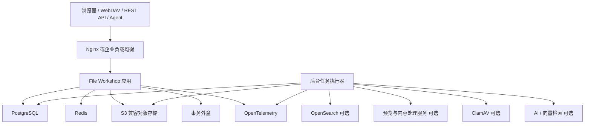
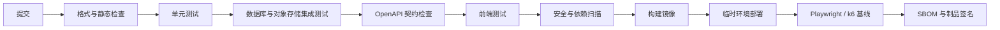

# File Workshop V1.0 技术选型说明

> **中文名称：** 文件车间  
> **英文名称：** File Workshop  
> **文档编号：** FW-TS-V1.0  
> **文档版本：** V1.2  
> **文档状态：** 技术选型基线  
> **编制日期：** 2026-08-04  
> **本次修订：** 后端测试基线调整为 Go Test、httptest 与本地隔离 PostgreSQL/Redis 集成测试；Testcontainers 改为 Docker/CI 环境可选方案  
> **适用范围：** File Workshop V1.0 的设计、开发、测试、部署、运维与技术评审  
> **主要读者：** 项目负责人、Codex 等编码 Agent、代码审查人员、测试人员、部署与运维人员

---

## 文档使用规则

1. 本文档是《File Workshop V1.0 企业级文件管理系统开发设计文档》的独立配套文件，专门说明技术栈、工程工具、组件边界和替换规则。
2. 本文档不重新定义组织、权限、文件、共享、审计等业务语义；业务语义以主设计文档为准。
3. 本文档中的“冻结”表示 V1.0 默认实施方案；“可选”表示仅在对应部署档位或功能启用时安装；“可替换”表示可以采用等价实现，但不得改变主设计文档规定的行为、安全边界和故障语义。
4. 本文档不固定所有依赖的精确补丁版本。项目正式启动开发时，应统一核实稳定版本，并在 `go.mod`、前端锁文件、容器镜像标签和软件物料清单中冻结。
5. Codex 或其他 Agent 可以修改技术实现，但涉及架构形态、数据库、对象存储、权限入口、审计可靠性、文件数据路径和安全边界的变更，必须提交架构决策记录（ADR）。
6. 技术组件不得因为“接入方便”而绕过应用服务、权限服务、审计服务或对象存储访问控制。

---

# 目录

1. 文档目的与选型范围  
2. 选型原则  
3. 技术架构基线  
4. 总体技术栈结论  
5. 后端技术选型  
6. API 与契约技术选型  
7. 数据库与数据访问技术选型  
8. 对象存储与文件传输技术选型  
9. 缓存、会话、限流与分布式协调  
10. 异步任务与事件可靠性  
11. 搜索与索引技术选型  
12. 文件预览、内容提取与病毒扫描  
13. 前端技术选型  
14. WebDAV 技术选型  
15. 身份认证与企业目录集成  
16. AI、RAG 与 Agent 技术选型  
17. 可观测性与运维技术选型  
18. 测试技术选型  
19. 安全工程与供应链安全  
20. 构建、CI/CD 与制品管理  
21. 部署技术选型  
22. 开发环境与仓库组织  
23. 版本冻结与升级策略  
24. 暂缓引入与明确不采用的技术  
25. 分阶段实施建议  
26. 技术风险与缓解措施  
27. 最终冻结清单  
附录 A：技术选型决策记录  
附录 B：主设计文档映射  
附录 C：开发启动前检查表

---

# 第1章 文档目的与选型范围

## 1.1 编制目的

File Workshop 是面向制造企业的企业级文件管理基础设施。系统既要处理普通元数据业务，也要处理大文件上传、对象存储、版本管理、WebDAV 兼容、权限过滤、审计、搜索、预览和可选 AI 能力。因此，技术选型不能只考虑“快速做出页面”，还必须同时考虑：

- 文件传输稳定性；
- 权限与审计正确性；
- 私有化部署；
- 低资源部署；
- 中大型企业扩展；
- 数据恢复；
- Codex 等 Agent 的可维护性；
- Windows 与制造企业现有基础设施兼容性。

本文档用于把分散在主设计文档中的技术建议收敛为一套明确的实施基线。

## 1.2 选型范围

本文档覆盖：

- 后端语言、Web 框架和应用架构；
- API 契约、代码生成和错误规范；
- PostgreSQL、数据访问和数据库迁移；
- S3 兼容对象存储与分片直传；
- Redis、缓存、会话、限流和租约；
- 后台任务、事务外盒和事件处理；
- 搜索、文件预览、内容提取和病毒扫描；
- Vue 前端、组件库和客户端状态管理；
- WebDAV、身份认证、OIDC 和 LDAP/AD；
- AI、向量检索和 Agent Gateway；
- 日志、指标、链路追踪、告警与运维；
- 测试、CI/CD、容器化和高可用部署；
- 依赖版本、升级、安全扫描和制品管理。

## 1.3 不在本文档中重复定义的内容

以下内容由主设计文档定义，本文档只提供实现技术：

- 产品定位与业务边界；
- 组织与空间模型；
- 权限、管理委派和访问控制语义；
- 文件、版本、锁和回收站语义；
- 共享规则；
- 审计事件语义；
- API 业务接口清单；
- 验收标准。

---

# 第2章 选型原则

## 2.1 模块化单体优先

V1.0 采用模块化单体，而不是微服务。原因如下：

- 核心权限、文件元数据、版本、共享和审计之间存在较强一致性要求；
- 个人主导开发和小团队维护不适合过早承担服务治理成本；
- 单体内仍可以通过模块边界、仓储边界和接口约束保持清晰结构；
- 后台执行器可以独立进程部署，但与主应用共享代码库和领域定义；
- 将来确有容量或组织需要时，再按稳定边界拆分服务。

## 2.2 控制面与文件数据面分离

应用服务负责上传授权、会话、权限、版本、审计和提交确认；大文件内容默认由客户端直接传输至对象存储。应用节点不得长期代理全部大文件流量。

## 2.3 关系数据库保存事实，对象存储保存二进制

- PostgreSQL 是业务元数据、授权、审计、上传会话和任务状态的事实来源；
- 对象存储保存文件二进制；
- Redis 只保存可丢失、可重建的短期状态；
- OpenSearch 保存可重建搜索索引；
- 向量索引属于可选 AI 派生数据。

## 2.4 标准协议优先

优先采用：

- HTTP/HTTPS；
- OpenAPI；
- S3 API；
- OIDC/OAuth 2.0 相关标准；
- LDAP/Active Directory；
- WebDAV；
- OpenTelemetry；
- Prometheus 指标格式。

## 2.5 显式 SQL 与显式边界优先

权限、组织树、版本、审计和搜索过滤存在复杂查询。V1.0 选择 `pgx + sqlc + 显式 SQL`，不采用重型 ORM 作为核心数据访问方式。

## 2.6 可替换但不可改变语义

组件可以替换，但必须保持：

- 统一认证、授权和审计入口；
- 文件内容与元数据分离；
- 对象存储不可被客户端任意访问；
- 高风险审计不可静默丢失；
- Redis、搜索和 AI 故障不得破坏核心业务事实；
- 大文件分片、断点续传和幂等提交语义不变。

## 2.7 私有化与离线环境优先

制造企业可能处于内网、隔离网或受限网络。默认技术栈应支持：

- 私有镜像仓库；
- 离线安装包；
- 本地对象存储；
- 本地身份源；
- 本地搜索；
- 可选本地模型；
- 不依赖外部 SaaS 才能运行核心文件功能。

---

# 第3章 技术架构基线

## 3.1 逻辑架构



## 3.2 进程与组件

V1.0 至少包含两个自研运行进程：

| 进程 | 职责 |
|---|---|
| `file-workshop-server` | HTTP API、Web 页面接口、权限、文件元数据、上传控制、WebDAV 适配、审计入口 |
| `file-workshop-worker` | Outbox 消费、Hash 校验、病毒扫描、预览转换、内容提取、索引、生命周期任务 |

这两个进程可以来自同一 Go Module 和同一代码仓库，通过不同入口构建。

## 3.3 部署档位

| 档位 | 核心组件 | 可选组件 |
|---|---|---|
| Lite | Nginx、Server、Worker、PostgreSQL、Redis、MinIO | ClamAV、预览、AI |
| Standard | 多应用实例、PostgreSQL、Redis、冗余对象存储 | OpenSearch、独立预览节点、企业身份源 |
| HA | 负载均衡冗余、应用集群、PostgreSQL HA、Redis HA、分布式对象存储 | OpenSearch 集群、集中可观测平台、AI 集群 |

---

# 第4章 总体技术栈结论

## 4.1 冻结技术栈

| 技术领域 | V1.0 默认选型 | 状态 |
|---|---|---|
| 应用架构 | 模块化单体 + 独立后台执行器 | 冻结 |
| 后端语言 | Go | 冻结 |
| Web 框架 | Gin | 冻结 |
| HTTP 基础 | Go 标准库 `net/http` | 底层约束 |
| API 契约 | OpenAPI 3.1 | 冻结 |
| OpenAPI 代码生成 | `oapi-codegen` 或经评审的等价工具 | 默认 |
| 数据库 | PostgreSQL | 冻结 |
| PostgreSQL 驱动 | pgx | 冻结 |
| SQL 代码生成 | sqlc | 冻结 |
| 数据库迁移 | Goose | 默认，可等价替换 |
| 对象存储 | MinIO，使用标准 S3 API | 冻结语义，组件可替换 |
| 缓存与短期状态 | Redis | 冻结 |
| 异步可靠性 | PostgreSQL Outbox + Go Worker | 冻结 |
| 消息队列 | V1.0 不强制引入 | 冻结 |
| Lite 搜索 | PostgreSQL 元数据与文件名搜索 | 冻结 |
| Standard/HA 搜索 | OpenSearch | 可选 |
| 前端 | Vue 3 + TypeScript + Vite | 冻结 |
| 前端组件库 | Element Plus | 默认 |
| 前端路由 | Vue Router | 冻结 |
| 客户端状态 | Pinia + TanStack Vue Query | 默认 |
| WebDAV | Go WebDAV 适配器 | 冻结 |
| PDF 预览 | PDF.js | 默认 |
| Office 转换 | 隔离的 LibreOffice 服务 | 可选 |
| 图片缩略图 | libvips | 默认 |
| 病毒扫描 | ClamAV | 可选但生产推荐 |
| AI 编排 | Dify，通过 Agent Gateway 解耦 | AI 功能启用时默认 |
| 向量存储 | PostgreSQL + pgvector | AI 默认 |
| 可观测性 | OpenTelemetry + Prometheus + Grafana | Standard/HA 默认 |
| 日志平台 | Loki 或企业现有平台 | 可替换 |
| 后端测试 | Go Test + httptest + 本地隔离 PostgreSQL/Redis 集成测试 | 冻结；Testcontainers 可选 |
| 前端测试 | Vitest + Playwright | 冻结 |
| 性能测试 | k6 | 默认 |
| 基础部署 | Docker Compose | 冻结 |
| HA 编排 | Helm/Kubernetes 或企业现有平台 | 可选 |
| 反向代理 | Nginx | Lite 默认 |
| CI/CD | GitHub Actions 或 GitLab CI | 按代码托管平台冻结 |

## 4.2 不固定精确版本的原因

本文档编制阶段不在线核实 2026 年 8 月各组件的最新稳定版本，因此不写未经验证的精确版本号。正式开发启动时必须完成一次版本冻结，至少确定：

- Go 工具链；
- Node.js 与包管理器；
- PostgreSQL 主版本；
- Redis 主版本；
- MinIO 镜像版本；
- Vue、Vite、Element Plus；
- OpenSearch；
- ClamAV；
- LibreOffice；
- OpenTelemetry Collector；
- Docker Engine 与 Compose。

版本冻结应优先选择仍在安全维护期内的稳定版本，不追求“最新”本身。

---

# 第5章 后端技术选型

## 5.1 后端语言：Go

### 选择理由

- 标准库网络能力成熟，适合 HTTP、流式传输和 WebDAV；
- 并发模型适合上传、下载、后台任务和对象存储调用；
- 编译产物单一，便于私有化和离线部署；
- 运行时资源消耗可控，适合 Lite 部署；
- 静态类型和工具链有利于 Codex 生成后进行编译验证；
- `context.Context`、结构化错误和接口机制适合统一请求链路。

### 使用约束

- 禁止在 Handler 中直接编写数据库和对象存储业务；
- 事务由应用服务控制；
- 外部调用必须设置超时；
- 重试仅用于可证明幂等的操作；
- 不使用全局可变业务状态；
- 时间、随机数和 ID 生成应可注入测试替身；
- 所有 Goroutine 必须有生命周期、取消和错误收敛机制。

## 5.2 Web 框架：Gin

File Workshop V1.0 核心后端统一采用 **Gin** 作为 Web 框架，本项为冻结选型。

### 选择理由

- Gin 基于 Go 标准库 `net/http`，可以继续使用标准请求、响应、流式传输、取消、超时和中间件能力；
- 路由分组、中间件、参数绑定和 JSON 响应能力成熟，适合企业文件管理系统的大量管理 API；
- 社区资料、测试示例和工程实践丰富，便于项目负责人、Codex 等编码 Agent 生成和审查代码；
- 能够直接访问 `c.Request` 与 `c.Writer`，满足 Range 下载、流式响应、预签名上传控制和大文件相关 HTTP 语义；
- 可以通过标准 `http.Handler` 适配 WebDAV、健康检查和其他协议入口；
- 相比更轻量的路由器，Gin 在不明显牺牲底层能力的前提下，提高了单人主导与 AI 辅助开发效率。

### 与 `net/http` 的关系

Gin 是本项目唯一冻结的 Web 框架，`net/http` 是 Gin 依赖的 Go 标准 HTTP 基础。二者不是两个并列框架：项目在接口层使用 Gin，在底层继续遵循标准 HTTP 语义。

项目可以直接使用以下标准能力：

- `http.Request`；
- `http.ResponseWriter`；
- `request.Context()`；
- `http.Handler`；
- `http.ServeContent`；
- 标准 Header、Range、缓存和连接语义。

### 框架边界

`gin.Context` 只能存在于 HTTP 接口适配层，不得进入应用服务、领域服务、权限模块、仓储接口、对象存储接口和后台任务。

正确调用方式：

```go
func (h *DocumentHandler) CreateUploadSession(c *gin.Context) {
    var req CreateUploadSessionRequest
    if err := c.ShouldBindJSON(&req); err != nil {
        writeValidationError(c, err)
        return
    }

    result, err := h.service.CreateUploadSession(
        c.Request.Context(),
        req.toCommand(),
    )
    if err != nil {
        writeApplicationError(c, err)
        return
    }

    c.JSON(http.StatusCreated, result)
}
```

应用服务应保持与 Gin 无关：

```go
func (s *DocumentService) CreateUploadSession(
    ctx context.Context,
    command CreateUploadSessionCommand,
) (*UploadSessionResult, error) {
    // 权限校验、事务编排和领域操作
}
```

### Handler 约束

Gin Handler 只负责：

- 读取路由参数、查询参数、Header 和请求体；
- 调用生成的 OpenAPI 类型和验证逻辑；
- 建立当前用户、Request ID、Trace ID 等请求上下文；
- 调用应用服务；
- 将应用错误映射为统一 HTTP 错误响应；
- 输出 JSON、流式内容或重定向结果。

Gin Handler 禁止：

- 直接执行 SQL；
- 直接访问 MinIO 或其他对象存储；
- 自行拼接权限规则；
- 自行修改审计记录；
- 承担跨模块事务；
- 将完整文件读入内存后再上传或下载；
- 把 `gin.Context` 保存到异步任务或 Goroutine 中。

### 中间件顺序

建议按以下顺序组织全局中间件：

1. Panic Recovery；
2. Request ID；
3. 可信代理与客户端地址解析；
4. 结构化访问日志；
5. OpenTelemetry Trace；
6. 安全响应头与 CORS；
7. 请求体大小限制；
8. 身份认证；
9. 粗粒度接口限流；
10. 路由处理；
11. 统一错误与指标收敛。

资源级权限不得只依赖 Gin 中间件完成。Handler 或应用服务必须针对具体空间、文件夹、文件、版本、共享和管理操作调用统一权限服务。

### WebDAV 适配

WebDAV 可以作为标准 `http.Handler` 挂载到同一 HTTP Server，也可以通过 Gin 的标准 Handler 包装方式接入。无论采用哪种挂载方式，WebDAV 只负责协议转换，最终文件操作必须调用 File Workshop 应用服务，并遵守统一身份、权限、文件锁、版本和审计规则。

## 5.3 模块组织

建议仓库内按业务模块组织：

```text
backend/
├── cmd/
│   ├── server/
│   └── worker/
├── internal/
│   ├── identity/
│   ├── users/
│   ├── organizations/
│   ├── spaces/
│   ├── permissions/
│   ├── files/
│   ├── versions/
│   ├── storage/
│   ├── shares/
│   ├── search/
│   ├── audit/
│   ├── webdav/
│   ├── ai/
│   └── platform/
├── api/
├── migrations/
└── tests/
```

每个模块内部可以包含：

- `domain`：领域实体、值对象和不变量；
- `application`：用例编排和事务边界；
- `repository`：仓储接口与实现；
- `transport`：HTTP、WebDAV 或任务入口；
- `events`：模块事件和 Outbox 处理。

禁止在仓库顶层把全部 Controller、Service、Repository 分别平铺，避免模块边界丢失。

## 5.4 依赖注入

V1.0 默认采用显式构造函数注入，不引入重型运行时依赖注入容器。允许使用简单代码生成工具，但最终依赖图必须可读、可追踪、可测试。

## 5.5 日志

后端使用结构化日志，优先采用 Go 标准结构化日志能力或成熟轻量实现。日志至少包含：

- 时间；
- 级别；
- Request ID；
- Trace ID；
- 当前用户或服务主体；
- 模块；
- 操作；
- 资源类型和稳定 ID；
- 错误码；
- 耗时。

禁止记录密码、会话密钥、对象存储签名、完整 Token 和不必要的文件内容。

---

# 第6章 API 与契约技术选型

## 6.1 OpenAPI 3.1

OpenAPI 是 REST API 的唯一权威契约来源。API 实现前应先更新契约，再生成或校验：

- Go 请求/响应类型；
- 前端 TypeScript 类型；
- API 客户端；
- Agent Tool Schema；
- 契约测试；
- 接口文档。

## 6.2 代码生成

默认使用 `oapi-codegen` 生成 Go 类型和 Gin 服务端接口骨架。生成代码只负责契约适配，不得包含领域规则、事务编排或数据库访问。前端使用兼容 OpenAPI 的生成器生成 TypeScript 客户端。

代码生成产物必须：

- 可重复生成；
- 不手工修改；
- 生成命令写入 Makefile 或 Taskfile；
- 在 CI 中检查生成结果是否与契约一致。

## 6.3 API 风格

- 基础路径：`/api/v1`；
- 使用稳定资源 ID，不使用名称作为唯一定位；
- 所有列表接口使用分页，请求字段统一为 `page`、`pageSize`；
- `page` 从 1 开始且默认值为 1，`pageSize` 默认 50、最大 200；
- 禁止使用 `cursor`、`limit`、`offset`、`pageNo`、`pageNum`、`pageIndex`、`current`、`size`、`page_size` 等分页字段别名；
- 分页响应至少包含 `items`、`page`、`pageSize`，`total` 仅在能够准确且经济地计算时返回；
- 所有写请求支持稳定错误码；
- 适合重试的写请求支持幂等键；
- 下载和上传使用票据或预签名 URL；
- 资源权限由应用服务判定，不在网关独立推导；
- API 名称不包含 File Workshop 产品名，避免品牌变更影响路径。

## 6.4 数据格式

- 普通 API 使用 JSON；
- 时间使用 ISO 8601/RFC 3339 表示，内部统一 UTC；
- 文件流不编码为 Base64；
- 大文件通过对象存储数据面传输；
- 错误响应包含稳定错误码、用户可读消息和 Request ID。

---

# 第7章 数据库与数据访问技术选型

## 7.1 数据库：PostgreSQL

PostgreSQL 用于保存：

- 用户、身份与会话元数据；
- 组织、空间和成员关系；
- 管理委派和文件访问授权；
- 文件、文件夹、版本和锁；
- 上传会话和存储对象映射；
- 共享；
- 审计事件；
- Outbox 事件和任务状态；
- 搜索元数据；
- AI 启用时的向量和索引元数据。

选择理由：

- 事务和约束能力强；
- 递归查询、JSONB、全文检索和扩展生态完善；
- 适合复杂权限查询；
- 支持单机和成熟高可用方案；
- 私有化部署成熟。

## 7.2 数据访问：pgx + sqlc

PostgreSQL 逻辑模型、物理字段、约束、索引、事务和分区统一遵循 `File-Workshop-V1.0-数据库设计说明.md`，本章只冻结数据访问技术和工程约束。

### 选择理由

- PostgreSQL 特性支持完整；
- SQL 明确，可进行执行计划审查；
- sqlc 提供编译期类型安全；
- 便于针对权限、树结构和审计编写精确查询；
- 避免 ORM 隐式关联加载和难以控制的 SQL。

### 约束

- 实体表主键字段使用语义化 `snake_case` 名称 `<entity>_id`，例如 `users.user_id`、`documents.document_id`，禁止使用通用 `id`；关联表联合主键和稳定自然键除外；
- 实体 ID 存储为 PostgreSQL 原生 `uuid`，由 Go 侧生成 UUIDv7；具体时刻统一使用 `TIMESTAMPTZ`；
- 外键按关系语义命名，多个外键指向同一实体时必须区分角色；
- 禁止拼接未参数化 SQL；
- 所有查询必须可设置超时；
- 列表查询必须分页或限定结果，对外分页契约统一使用 `page`、`pageSize`；
- 分页底层实现不得执行无索引、无边界的深页扫描；
- 高风险查询必须有索引和执行计划验证；
- 跨模块只允许通过应用接口或明确的只读查询协作；
- 事务中不得执行长时间对象存储、杀毒、预览或 AI 调用。

## 7.3 数据库迁移：Goose

默认采用 Goose 管理数据库版本。也允许替换为 `golang-migrate`，但一个项目只能冻结一种工具。

迁移规则：

- 已发布 Migration 不允许修改；
- 每个 Migration 必须可在空库和升级库测试；
- 大表变更采用扩展—迁移—收敛流程；
- 生产迁移前执行备份和演练；
- 破坏性变更必须有回滚或恢复方案；
- Migration 不自动依赖应用启动隐式执行。

## 7.4 连接池

连接池由 pgxpool 管理。连接数必须根据数据库容量和应用实例数计算，不得让每个实例使用过大的默认连接数。

## 7.5 数据库高可用

HA 档可采用：

- Patroni + etcd/Consul；
- 云或企业托管 PostgreSQL；
- 企业现有 PostgreSQL 高可用平台。

应用必须支持连接恢复、短暂故障重试和主从切换后的连接重建。

---

# 第8章 对象存储与文件传输技术选型

## 8.1 对象存储：MinIO / S3 API

Lite 默认使用 MinIO。应用代码必须面向 S3 兼容接口，避免绑定 MinIO 私有管理 API。

可替换为：

- 企业已有 S3 兼容对象存储；
- 公有云 S3 类服务；
- 其他经兼容测试的对象存储。

## 8.2 文件数据路径

大型文件默认流程：

1. 客户端向 File Workshop 创建上传会话；
2. 应用校验目标空间、文件夹、配额和权限；
3. 应用创建对象存储分片上传并返回预签名信息；
4. 客户端直接上传分片到对象存储；
5. 客户端提交完成请求；
6. 应用校验对象、大小和分片状态；
7. 数据库事务创建存储对象、文件版本和业务记录；
8. 后台任务执行 Hash、病毒扫描、预览和索引。

## 8.3 SDK

Go 端使用成熟 S3 SDK。业务代码不得直接依赖具体厂商 URL 和 Bucket 结构，应通过存储适配器封装：

- 创建分片上传；
- 生成预签名 URL；
- 完成或取消分片；
- HEAD 对象；
- 流式读取；
- 复制或删除对象；
- 生命周期和保留策略查询。

## 8.4 对象 Key

对象 Key 由系统生成，禁止直接使用用户文件名。推荐使用不可预测的稳定 ID 和分层前缀。文件名、路径和业务归属只保存在 PostgreSQL。

## 8.5 加密与传输安全

- 客户端、应用和对象存储之间均使用 TLS；
- 对象存储凭据仅保存在服务端安全配置；
- 预签名 URL 具有短有效期和最小操作权限；
- 可按企业要求启用服务端加密或 KMS；
- 禁止把长期对象存储密钥发给浏览器或 WebDAV 客户端。

---

# 第9章 缓存、会话、限流与分布式协调

## 9.1 Redis 定位

Redis 用于：

- 会话辅助信息；
- 短期权限缓存；
- API 限流；
- 短期下载/上传票据辅助状态；
- 分布式锁或租约辅助；
- 热点目录和配置缓存；
- 后台任务短期协调。

Redis 不得成为以下数据的唯一来源：

- 用户与组织；
- 权限授权；
- 文件和版本；
- 上传会话最终状态；
- 审计事件；
- 异步任务唯一状态。

## 9.2 故障语义

Redis 故障时允许：

- 缓存失效；
- 用户重新登录；
- 限流进入保守降级；
- 性能下降；
- 部分非关键功能临时不可用。

Redis 故障不得造成业务事实丢失或越权。

## 9.3 高可用

Standard/HA 可使用 Redis Sentinel、Redis Cluster 或企业托管 Redis。具体方式根据容量和运维能力选择。

---

# 第10章 异步任务与事件可靠性

## 10.1 默认方案：PostgreSQL Outbox + Go Worker

V1.0 不强制部署 Kafka、RabbitMQ、NATS 等消息队列。业务事务将事件写入 PostgreSQL `outbox_events`，Worker 可靠领取和处理。

适合的任务包括：

- 文件 Hash；
- 病毒扫描；
- 预览生成；
- 文本提取；
- 搜索索引；
- AI 索引；
- 过期共享处理；
- 生命周期处理；
- 审计链增强；
- 存储垃圾回收。

## 10.2 设计约束

- Outbox 写入与业务变更处于同一 PostgreSQL 事务；
- Worker 领取任务必须支持并发安全；
- 消费者必须幂等；
- 任务状态、重试次数和最后错误写入 PostgreSQL；
- 重试采用退避策略；
- 永久失败进入死信状态并告警；
- 外部组件不可用不能阻塞核心事务长期持锁。

## 10.3 何时再引入消息队列

只有出现以下情况之一时，才评估独立消息队列：

- Outbox 表和数据库轮询成为明确瓶颈；
- 多个独立服务需要大规模事件订阅；
- 需要跨地域高吞吐事件流；
- 需要独立事件保留与回放能力；
- 经压测证明数据库方案不能满足目标。

引入消息队列必须通过 ADR，不得仅因“企业系统通常用 MQ”而增加复杂度。

---

# 第11章 搜索与索引技术选型

## 11.1 Lite：PostgreSQL 搜索

Lite 默认支持：

- 文件名；
- 路径；
- 扩展名；
- 标签；
- 创建人；
- 创建和修改时间；
- 空间；
- 文件类型；
- 结构化元数据；
- 简单模糊匹配。

PostgreSQL 默认全文检索不应被描述为完整、高质量的中文正文搜索方案。中文正文检索只有在采用合适分词扩展并通过测试后才能启用。

## 11.2 Standard/HA：OpenSearch

需要以下能力时启用 OpenSearch：

- 中文正文全文搜索；
- 大规模索引；
- 高亮、聚合和复杂筛选；
- 独立搜索扩展；
- 更高查询吞吐；
- 多字段权重和相关性调优。

## 11.3 权限过滤

搜索引擎只提供候选结果，不是最终授权者。实现必须：

1. 在索引查询阶段尽量加入空间、主体或可见范围过滤；
2. 返回前由应用服务执行最终权限校验；
3. 权限变更触发索引可见性更新；
4. 权限索引延迟时优先少返回，禁止越权返回。

## 11.4 索引可重建

OpenSearch 索引和 AI 向量索引都是派生数据，必须能从 PostgreSQL 和对象存储重建。不得把搜索引擎作为唯一业务事实来源。

---

# 第12章 文件预览、内容提取与病毒扫描

## 12.1 PDF 预览：PDF.js

浏览器使用 PDF.js 展示 PDF。应用负责生成受控预览访问票据，前端不得通过公开对象 URL 绕过权限。

## 12.2 Office 文档转换：LibreOffice

Word、Excel、PowerPoint 等文档可通过独立 LibreOffice 转换服务生成 PDF 或缩略图。转换进程必须：

- 与主应用隔离；
- 使用非特权用户；
- 限制 CPU、内存、文件大小和执行时间；
- 使用临时目录并及时清理；
- 禁止访问不必要网络；
- 失败时记录原因并允许重试；
- 转换失败不破坏原始文件。

## 12.3 图片处理：libvips

缩略图、尺寸读取和常见图片转换默认使用 libvips 或其受控封装。其资源占用通常比在应用层完整解码大图更适合服务端批量处理。

## 12.4 文本提取

内容提取由 Worker 执行。具体解析库按文件类型选择并通过安全评估。提取结果属于派生数据，可以重建。

## 12.5 病毒扫描：ClamAV

生产部署建议启用 ClamAV。推荐流程：

1. 文件上传完成后进入 `PENDING_SCAN`；
2. Worker 流式读取对象并提交扫描；
3. 通过后进入可正常访问状态；
4. 命中恶意内容时进入隔离状态；
5. 扫描失败进入可重试状态并告警；
6. 未扫描文件是否允许下载由安全策略配置，默认不允许普通用户访问。

## 12.6 内容处理隔离

预览、解压、文本提取和杀毒都处理不可信文件，必须视为高风险工作负载。不得在主 API 进程内直接加载复杂 Office 文档或不可信压缩包。

---

# 第13章 前端技术选型

## 13.1 Vue 3 + TypeScript + Vite

选择理由：

- 适合企业后台和复杂交互；
- TypeScript 有利于 OpenAPI 类型生成；
- Vue 生态成熟；
- Vite 开发和构建体验较轻；
- 对个人主导开发和 Codex 辅助较友好。

## 13.2 组件库：Element Plus

默认采用 Element Plus，主要用于：

- 表格；
- 树形控件；
- 表单；
- 对话框；
- 上传状态；
- 管理后台；
- 菜单与导航。

允许替换组件库，但必须统一设计语言和可访问性要求，不得在同一项目混用多个大型组件库。

## 13.3 状态管理

- Pinia：登录用户、界面布局、上传队列视图、本地偏好等客户端状态；
- TanStack Vue Query：服务端数据缓存、请求状态、失效和重试；
- 禁止把服务端事实长期复制到多个 Pinia Store；
- 权限按钮隐藏只改善体验，服务端仍必须再次授权。

## 13.4 API 客户端

前端 API 类型和客户端从 OpenAPI 生成。禁止人工重复维护请求/响应 DTO。

## 13.5 上传实现

- 浏览器分片直传对象存储；
- 使用 Web Worker 计算大文件 Hash，避免阻塞主线程；
- 上传会话状态可持久化，支持刷新后恢复；
- 限制并发分片数量；
- 支持暂停、恢复、取消和失败重试；
- 对过期预签名 URL 自动重新申请；
- 不在浏览器持久化对象存储长期凭据。

## 13.6 大目录性能

- 文件列表采用虚拟滚动；
- 树结构按需加载；
- 搜索和筛选防抖；
- 预览按需加载；
- 不一次性加载整个企业组织树和全部文件元数据。

## 13.7 测试

- Vitest：组件、工具和状态逻辑；
- Playwright：登录、文件上传、权限、分享、搜索、回收站、WebDAV 关键联动等端到端场景。

---

# 第14章 WebDAV 技术选型

## 14.1 定位

WebDAV 是兼容接入层，不是独立文件系统，也不是 SMB 的完全替代。内部请求必须映射到 File Workshop 的应用服务、权限、版本、锁和审计。

## 14.2 Go 实现

可以基于 `golang.org/x/net/webdav` 或经验证的等价实现完成协议解析和基础方法支持，但不得直接把对象存储 Bucket 暴露为 WebDAV 文件系统。

## 14.3 方法映射

至少评估：

- `PROPFIND`；
- `GET`；
- `HEAD`；
- `PUT`；
- `MKCOL`；
- `MOVE`；
- `COPY`；
- `DELETE`；
- `LOCK`；
- `UNLOCK`。

每个方法必须转换为内部稳定 ID 操作和统一审计事件。

## 14.4 凭据

WebDAV 默认使用独立应用密码或受控访问凭据，不直接暴露主登录密码。凭据可以单独创建、吊销和审计。

## 14.5 兼容性

必须建立 Windows、macOS 和主流第三方客户端兼容矩阵。Windows 内置 WebDAV 客户端存在文件大小、认证和锁行为限制，产品不得承诺其等同 SMB 性能。

---

# 第15章 身份认证与企业目录集成

## 15.1 V1.0 认证组合

默认支持：

- 内置账号密码；
- 浏览器安全 Cookie 会话；
- REST API Personal Access Token；
- WebDAV 独立应用密码；
- OIDC 接入能力；
- LDAP/Active Directory 适配能力。

## 15.2 浏览器会话

浏览器优先使用：

- `HttpOnly` Cookie；
- `Secure`；
- 合理的 `SameSite`；
- CSRF 防护；
- 会话轮换；
- 退出和管理员吊销。

不建议把长期访问 Token 存入浏览器 LocalStorage。

## 15.3 密码存储

内置密码使用现代密码哈希算法和每用户随机盐。具体参数在开发启动时按当时安全建议冻结。密码策略、失败锁定、重置和审计必须由身份模块统一实现。

## 15.4 OIDC

企业已有统一身份平台时，优先通过 OIDC 集成。File Workshop 保存外部身份映射，但业务用户、组织、权限和审计仍由本系统管理。

## 15.5 LDAP/Active Directory

LDAP/AD 用于：

- 用户同步；
- 组织或组映射；
- 登录认证或身份发现；
- 定时增量同步。

外部目录组不得未经映射直接变成系统管理员。同步删除默认先停用用户，不直接物理删除业务记录。

## 15.6 不强制 Keycloak

V1.0 不强制部署 Keycloak。原因是 Lite 部署应保持较低复杂度。企业需要统一身份代理、MFA 或多系统 SSO 时，可以部署 Keycloak 或使用现有身份平台，但 File Workshop 核心不得依赖其才能启动。

---

# 第16章 AI、RAG 与 Agent 技术选型

## 16.1 可选定位

AI 不是 File Workshop 核心依赖。未部署 AI 时，文件、权限、搜索、共享、审计和 WebDAV 必须完整运行。

## 16.2 Agent Gateway

所有 AI 平台通过 Agent Gateway 调用受控工具：

- 使用当前用户身份或明确服务身份；
- 调用正式应用 API；
- 每次读取、下载、搜索和动作均通过权限校验；
- 所有操作写入审计；
- 禁止模型直接连接 PostgreSQL、Redis、MinIO 或 OpenSearch。

## 16.3 模型接口

内部定义模型适配接口，优先兼容 OpenAI 风格 API，但不得把业务代码绑定到单一模型供应商。企业可接入：

- 本地模型服务；
- 私有云模型；
- 经批准的外部模型；
- Dify 等编排平台。

## 16.4 Dify

Dify 是 File Workshop 启用 AI 功能时的默认 AI 编排平台，负责：

- 模型接入与切换；
- Prompt 管理；
- Workflow 与 Agent 编排；
- RAG 流程；
- Tool Calling；
- 对话应用与知识检索流程。

AI 功能整体仍然是可选能力。未部署 Dify 时，文件、权限、搜索、共享、审计和 WebDAV 必须完整运行。

Dify 不保存 File Workshop 的核心权限事实，也不得直接连接 PostgreSQL 业务表、Redis、MinIO 或 OpenSearch。Dify 只能通过 Agent Gateway 调用受控工具，所有调用都必须携带明确的用户或服务身份，并经过权限校验和审计。

V1.0 不默认建设 FastAPI 或其他 Python AI 中间层。只有出现 Dify 无法承载的专项能力，例如深度定制 OCR、CAD 解析、GPU 推理调度或特殊版面分析时，才允许通过 ADR 增加独立处理服务。

## 16.5 向量存储

AI 初期默认采用 PostgreSQL + pgvector：

- 降低组件数量；
- 便于按文档、版本、空间和权限范围关联；
- 适合中小规模起步。

当向量规模、查询吞吐或隔离需求明确超过 PostgreSQL 方案时，再通过 ADR 评估独立向量数据库。

## 16.6 内容外发

默认不把文件内容发送到外部模型。启用外部模型时必须具备：

- 管理员明确配置；
- 文件类型和空间策略；
- 敏感内容限制；
- 审计；
- 超时和失败降级；
- 用户可见提示；
- 数据处理协议评估。

---

# 第17章 可观测性与运维技术选型

## 17.1 OpenTelemetry

应用和 Worker 使用 OpenTelemetry 统一采集 Trace、Metrics 和必要日志关联信息。

## 17.2 指标

Prometheus 格式指标至少覆盖：

- API 请求量、错误率和延迟；
- 权限判定延迟和拒绝量；
- 上传会话、分片失败和完成率；
- 下载流量；
- 数据库连接池和慢查询；
- Redis 命中率和故障；
- Outbox 堆积、重试和死信；
- 对象存储错误与容量；
- 搜索索引延迟；
- 病毒扫描、预览和 AI 任务；
- 审计写入失败；
- 备份和恢复状态。

## 17.3 Grafana

Standard/HA 默认使用 Grafana 展示运行状态和容量趋势。Lite 可提供简化内置状态页与基础 Prometheus 指标。

## 17.4 日志平台

默认推荐 Loki，也允许使用企业现有 ELK/OpenSearch 日志平台。日志系统故障不得阻塞普通业务请求，但关键审计不是普通日志，必须按审计设计单独可靠保存。

## 17.5 Trace

Trace 应覆盖：

- 网关；
- 应用服务；
- PostgreSQL；
- Redis；
- 对象存储；
- OpenSearch；
- Worker；
- 预览和杀毒；
- Agent Tool 调用。

## 17.6 健康检查

区分：

- Liveness：进程是否存活；
- Readiness：是否可以接收流量；
- Dependency Status：PostgreSQL、Redis、对象存储、搜索、AI 等组件状态。

不得因为可选 AI 或搜索不可用就把核心 API 进程判定为完全不可用。

---

# 第18章 测试技术选型

## 18.1 后端单元测试

使用 Go Test。领域不变量、权限算法、状态机、幂等和错误映射必须有高覆盖测试。

## 18.2 集成测试

基础开发阶段直接连接专用的本地真实依赖：

- PostgreSQL 测试创建随机命名的临时数据库，从空库执行全部 Migration，并在结束后精确删除该临时数据库；
- Redis 测试使用随机唯一键、短 TTL 和精确清理，不执行 `FLUSHALL` 或 `FLUSHDB`；
- MinIO、OpenSearch 和 ClamAV 启用后，应使用专用测试实例或等价隔离环境，不得操作开发或生产业务数据；
- Testcontainers 仅作为具备 Docker/CI 环境后的可选自动隔离方案，不是本地开发、构建或运行前提。

核心集成测试不得仅使用内存 Mock 代替数据库约束和对象存储行为。

## 18.3 API 契约测试

CI 验证：

- 实现与 OpenAPI 一致；
- 前端生成代码可编译；
- 错误响应符合规范；
- 版本兼容性没有未经批准的破坏性变化。

## 18.4 前端测试

- Vitest：单元和组件；
- Playwright：关键用户流程；
- 上传、搜索、权限、分享和回收站应使用真实测试环境验证。

## 18.5 性能测试

默认使用 k6。至少建立以下基线：

- 登录；
- 目录列表；
- 权限判定；
- 小文件上传；
- 大文件分片上传；
- 下载；
- 搜索；
- 高并发分享访问；
- Worker 堆积恢复。

## 18.6 安全测试

至少覆盖：

- 越权访问；
- IDOR；
- 预签名 URL 泄露和过期；
- 路径穿越；
- 恶意文件；
- 压缩炸弹；
- WebDAV 方法滥用；
- Token 与应用密码吊销；
- 权限缓存过期；
- 审计绕过；
- SSRF 和外部模型调用边界。

## 18.7 恢复测试

必须自动或半自动演练：

- PostgreSQL 恢复；
- 对象存储恢复；
- 索引重建；
- Redis 全部丢失后的恢复；
- Worker 重复执行；
- 备份一致性；
- 升级失败回滚。

---

# 第19章 安全工程与供应链安全

## 19.1 基础安全

- 所有外部通信使用 TLS；
- 密钥通过环境变量、文件挂载或 Secret 管理，不写入仓库；
- 容器使用非 root 用户；
- 最小化镜像；
- 文件处理容器限制能力和网络；
- 默认拒绝跨域；
- 上传类型检查不能只依赖扩展名；
- 错误响应不泄露内部路径和 SQL；
- 管理员特权访问必须强审计。

## 19.2 依赖扫描

CI 至少执行：

- Go 依赖漏洞检查；
- npm 依赖漏洞检查；
- 容器镜像漏洞扫描；
- Secret 扫描；
- 静态代码检查；
- 许可证检查。

## 19.3 SBOM

每个发布版本生成软件物料清单（SBOM），记录：

- 后端模块；
- 前端依赖；
- 容器基础镜像；
- 第三方二进制；
- 版本和许可证；
- 构建时间和提交 ID。

## 19.4 制品签名

正式镜像和离线安装包应支持签名和校验。生产部署只能使用通过 CI 构建、扫描并签名的制品。

---

# 第20章 构建、CI/CD 与制品管理

## 20.1 构建工具

建议提供统一 Makefile 或 Taskfile，至少包含：

```text
make generate
make format
make lint
make test
make integration-test
make frontend-test
make e2e
make build
make images
make sbom
make security-scan
```

## 20.2 后端构建

- Go Module 管理依赖；
- 启用可复现构建信息；
- 编译时写入版本、提交 ID 和构建时间；
- Server 和 Worker 分别生成二进制；
- CI 禁止依赖开发者本机缓存才能成功。

## 20.3 前端构建

- 使用固定 Node.js 版本；
- 锁定包管理器和 Lockfile；
- 生产构建禁止静默忽略 TypeScript 错误；
- 前端静态资源使用内容 Hash；
- 构建时注入版本信息，不注入秘密。

## 20.4 CI 流程



## 20.5 CD

- 开发环境可自动部署；
- 测试环境由主分支或发布分支部署；
- 生产部署需要人工批准；
- Migration 与应用采用兼容升级顺序；
- 发布后执行健康检查和核心验收；
- 失败时停止继续扩散并按方案回滚；
- 发布过程写入审计和变更记录。

## 20.6 CI 平台

- GitHub 仓库：GitHub Actions；
- GitLab 仓库：GitLab CI；
- 企业已有 Jenkins 等平台：可以接入，但流水线要求不变。

项目只冻结一个主 CI 平台，避免重复维护。

---

# 第21章 部署技术选型

## 21.1 Docker Compose

V1.0 必须提供 Docker Compose，作为：

- 本地开发依赖环境；
- 自动化集成测试环境；
- Lite 部署方案；
- 演示和验收环境；
- 离线部署基础。

Compose 文件不得把生产密钥直接写入仓库。

## 21.2 Nginx

Lite 默认使用 Nginx，负责：

- TLS 终止；
- 静态前端资源；
- 反向代理；
- 请求大小和超时策略；
- 基础限流；
- 安全响应头。

Nginx 不负责文件资源级权限判断。

## 21.3 Standard/HA

Standard/HA 可采用：

- Nginx/HAProxy；
- Keepalived 或企业负载均衡；
- 多应用实例；
- PostgreSQL HA；
- Redis Sentinel/Cluster；
- 分布式 MinIO 或企业 S3；
- OpenSearch 集群；
- Prometheus、Grafana、Loki 和 OpenTelemetry Collector。

## 21.4 Kubernetes/Helm

Kubernetes 不是 V1.0 Lite 的前置条件。企业已有 Kubernetes 平台或需要 HA 编排时，可提供 Helm Chart。

禁止为了“云原生”而让普通单机部署也必须依赖 Kubernetes。

## 21.5 配置管理

配置优先级建议：

1. 命令行参数；
2. 环境变量；
3. 外部配置文件；
4. 安全默认值。

敏感配置使用 Secret 文件、Kubernetes Secret、Vault 或企业密钥平台。

## 21.6 离线交付

离线包应包含：

- 已签名容器镜像；
- Compose/Helm；
- 数据库 Migration；
- 初始化脚本；
- 配置模板；
- 备份恢复脚本；
- SBOM；
- 校验文件；
- 升级说明；
- 运维速查表。

---

# 第22章 开发环境与仓库组织

## 22.1 仓库名称

产品更名后统一使用：

| 场景 | 名称 |
|---|---|
| Git 仓库 | `file-workshop` |
| Go 服务 | `file-workshop-server` |
| 后台执行器 | `file-workshop-worker` |
| 前端项目 | `file-workshop-web` |
| 数据库 | `file_workshop` |
| Compose 项目 | `file-workshop` |
| 环境变量前缀 | `FILE_WORKSHOP_` |

## 22.2 Monorepo

V1.0 推荐 Monorepo：

```text
file-workshop/
├── backend/
├── frontend/
├── api/
├── migrations/
├── deploy/
│   ├── compose/
│   ├── helm/
│   └── scripts/
├── docs/
├── tests/
├── tools/
├── Makefile
└── README.md
```

## 22.3 本地开发

推荐：

- 本机运行 Go Server、Worker 和 Vue；
- PostgreSQL、Redis、MinIO 等依赖通过 Docker Compose 启动；
- 预览、ClamAV、OpenSearch 和 AI 使用可选 Profile；
- 提供演示数据和可重复初始化脚本；
- Windows 开发环境通过 WSL2 或标准 Docker Desktop 支持，但构建脚本不得只适配单一操作系统。

## 22.4 代码质量

后端至少执行：

- `gofmt`；
- `go vet`；
- 静态检查工具；
- 单元测试；
- Race 检测（适用测试集）；
- 依赖漏洞检查。

前端至少执行：

- ESLint；
- TypeScript strict；
- 格式化检查；
- Vitest；
- 构建验证。

---

# 第23章 版本冻结与升级策略

## 23.1 版本分层

| 层级 | 位置 | 作用 |
|---|---|---|
| 技术路线 | 本文档 | 冻结 Go、PostgreSQL、Vue、S3 等主方向 |
| 主版本 | 架构基线/ADR | 冻结兼容范围和升级策略 |
| 精确版本 | `go.mod`、Lockfile、镜像标签 | 保证可复现构建 |
| 发布清单 | SBOM、Release Notes | 记录实际交付内容 |

## 23.2 升级原则

- 优先安全补丁；
- 主版本升级先在测试环境验证；
- PostgreSQL、OpenSearch、MinIO 等基础组件不得跨多个不兼容主版本直接升级；
- 升级前必须备份；
- 数据库 Migration 与旧应用保持一段兼容窗口；
- 客户端和 API 兼容性按主设计文档管理；
- 依赖升级由自动化测试和性能基线验证。

## 23.3 版本冻结输出

开发启动前生成：

- `.tool-versions` 或等价工具链版本文件；
- `go.mod`；
- 前端 Lockfile；
- 容器镜像清单；
- `versions.md`；
- SBOM 基线；
- 已知兼容性说明。

---

# 第24章 暂缓引入与明确不采用的技术

## 24.1 暂缓微服务

V1.0 不采用多业务微服务。原因：

- 增加分布式事务和一致性成本；
- 增加部署、日志、追踪和服务治理复杂度；
- 权限和文件核心模型尚未通过生产规模验证；
- 当前团队规模不需要。

## 24.2 暂缓独立消息队列

默认使用 PostgreSQL Outbox。只有压测和运行数据证明必要时再引入 MQ。

## 24.3 不采用重型 ORM 作为核心访问层

不以 GORM 等 ORM 承载核心权限、审计和文件查询。允许在极简单的辅助工具中局部使用，但需要审查，且不得形成第二套数据访问体系。

## 24.4 不把 Elasticsearch/OpenSearch 设为 Lite 必需组件

Lite 应能在不部署搜索集群时完成基本元数据搜索和核心文件管理。

## 24.5 不强制 Kubernetes

Kubernetes 只用于已有平台或 HA 需求，不是单机和小型工厂部署的必需条件。

## 24.6 不强制 Keycloak

认证核心由 File Workshop 内置能力和标准适配接口完成。Keycloak 或其他身份代理是可选集成。

## 24.7 不把 Dify 作为核心依赖

Dify 不得成为权限、文件、搜索和审计运行的前置条件。

## 24.8 不采用 GraphQL 作为 V1.0 主 API

V1.0 使用 OpenAPI REST。原因：

- 文件上传下载和预签名流程与 REST 更自然；
- 权限和审计入口更容易标准化；
- Agent Tool、客户端生成和运维接口已经可以由 OpenAPI 支撑；
- 避免同时维护两套 API 语义。

## 24.9 不把对象存储目录当作业务目录

对象 Key 不是用户目录。不得通过 Bucket 前缀代替文件夹、权限、版本和组织空间模型。

## 24.10 不采用 FastAPI 作为 V1.0 核心后端

V1.0 核心后端已经冻结为 Go + Gin，不再同时维护 FastAPI 业务后端。Dify 负责 AI 编排，因此也不默认增加通用 Python AI 中间层。

后续确需 Python 专项处理服务时，必须满足：

- 仅承担明确的异步处理或模型适配职责；
- 不保存核心业务事实；
- 不绕过 File Workshop 权限和审计；
- 不直接向用户暴露第二套业务 API；
- 通过 ADR 说明新增组件的必要性、部署成本和故障边界。

---

# 第25章 分阶段实施建议

## 25.1 第一阶段：核心骨架

- Go + Gin 模块化单体；
- PostgreSQL + pgx + sqlc；
- OpenAPI；
- Vue 3 + TypeScript；
- 内置认证；
- 用户、组织、空间；
- 权限与审计；
- MinIO 基础接入；
- Docker Compose；
- 基础测试和 CI。

## 25.2 第二阶段：文件核心

- 文件夹、文件、版本；
- 分片直传；
- 下载票据；
- Hash 校验；
- 回收站；
- 锁；
- 配额；
- Outbox + Worker；
- 基础 WebDAV。

## 25.3 第三阶段：治理能力

- 共享；
- 搜索；
- 权限缓存；
- 生命周期；
- 审计中心；
- ClamAV；
- PDF 和图片预览；
- 备份恢复；
- 可观测性。

## 25.4 第四阶段：企业集成

- OIDC；
- LDAP/AD；
- Office 预览转换；
- OpenSearch；
- HA 部署；
- SMB 迁移工具；
- 性能和灾难恢复验收。

## 25.5 第五阶段：AI 可选能力

- 文本提取；
- pgvector；
- Agent Gateway；
- Dify 适配；
- RAG；
- 用户确认型 Agent Action；
- AI 权限和审计专项测试。

---

# 第26章 技术风险与缓解措施

| 风险 | 影响 | 缓解措施 |
|---|---|---|
| 权限查询过于复杂 | 响应变慢或越权 | 明确不变量、显式 SQL、索引、权限矩阵测试、最终授权检查 |
| 大文件经应用中转 | 应用带宽和内存瓶颈 | 默认 S3 分片直传，应用只负责控制面 |
| Redis 被误用为事实来源 | 故障时数据丢失 | 核心状态全部写 PostgreSQL，Redis 仅缓存 |
| Outbox 堆积 | 预览、索引、扫描延迟 | 指标、并发 Worker、重试、死信、容量压测 |
| 中文搜索效果不足 | 用户难以检索正文 | Lite 明确只保证元数据；Standard 启用 OpenSearch 和中文分析器 |
| Office 转换漏洞 | 主机被恶意文档攻击 | 独立容器、非 root、资源限制、无网络、及时更新 |
| 病毒库过期 | 恶意文件漏检 | 自动更新、版本监控、扫描状态告警 |
| WebDAV 客户端差异 | 锁和大文件行为不一致 | 建立兼容矩阵、限制声明、独立凭据、专项测试 |
| ORM 或框架隐式行为 | SQL 和事务不可控 | pgx + sqlc + 显式事务 |
| Gin 侵入业务层 | 核心代码难以测试和替换入口 | `gin.Context` 仅限接口适配层，应用服务统一使用 `context.Context` |
| 组件过多 | Lite 部署困难 | 核心最小集合；OpenSearch、预览、AI 可选 Profile |
| AI 绕过权限 | 数据泄露 | Agent Gateway、当前用户身份、正式 API、强审计 |
| 依赖版本过旧 | 安全风险 | SBOM、自动扫描、定期升级窗口 |
| 过早微服务化 | 开发和运维失控 | 模块化单体，依据真实瓶颈再拆分 |
| 单机误认为高可用 | 故障导致停机 | Lite 明确非 HA，提供备份恢复；HA 按完整链路建设 |

---

# 第27章 最终冻结清单

## 27.1 必须采用

1. Go；
2. Gin Web 框架；
3. 模块化单体；
4. 独立 Worker；
5. OpenAPI 3.1；
6. PostgreSQL；
7. pgx + sqlc；
8. S3 兼容对象存储；
9. 大文件分片直传；
10. Redis 仅作短期状态和缓存；
11. PostgreSQL Outbox；
12. Vue 3 + TypeScript + Vite；
13. Docker Compose；
14. 统一认证、权限和审计入口；
15. 自动化测试；
16. 结构化日志、指标和 Request ID；
17. 精确版本锁定与 SBOM。

## 27.2 默认采用，可等价替换

1. `oapi-codegen`；
2. Goose；
3. MinIO；
4. Element Plus；
5. Pinia + TanStack Vue Query；
6. PDF.js；
7. libvips；
8. Nginx；
9. Prometheus + Grafana；
10. Loki；
11. Testcontainers（具备 Docker/CI 环境时可选）；
12. k6。

替换必须通过技术评审，且不得改变业务语义、故障语义和安全边界。

## 27.3 按需启用

1. OpenSearch；
2. LibreOffice 预览转换；
3. ClamAV；
4. OIDC；
5. LDAP/Active Directory；
6. pgvector；
7. Dify（启用 AI 功能时默认）；
8. Kubernetes/Helm；
9. PostgreSQL、Redis 和对象存储 HA 方案。

## 27.4 V1.0 不引入

1. 多业务微服务；
2. 强制消息队列；
3. 重型 ORM 核心数据层；
4. GraphQL 主 API；
5. 强制 Kubernetes；
6. 强制 Keycloak；
7. AI 核心依赖；
8. 把对象存储前缀当业务文件夹；
9. 让 Agent、WebDAV、搜索或预览绕过应用权限；
10. FastAPI 核心业务后端或默认 Python AI 中间层。

---

# 附录 A：技术选型决策记录

| ADR | 决策 | 状态 |
|---|---|---|
| ADR-TS-001 | V1.0 采用模块化单体 | 接受 |
| ADR-TS-002 | 后端采用 Go | 接受 |
| ADR-TS-003 | 核心 Web 框架采用 Gin，底层遵循 Go `net/http` 语义 | 接受 |
| ADR-TS-004 | API 采用 OpenAPI 3.1 优先 | 接受 |
| ADR-TS-005 | PostgreSQL 为核心事实数据库 | 接受 |
| ADR-TS-006 | 数据访问采用 pgx + sqlc | 接受 |
| ADR-TS-007 | 文件内容使用 S3 兼容对象存储 | 接受 |
| ADR-TS-008 | 大文件默认对象存储直传 | 接受 |
| ADR-TS-009 | Redis 不作为核心事实来源 | 接受 |
| ADR-TS-010 | V1.0 使用 PostgreSQL Outbox，不强制 MQ | 接受 |
| ADR-TS-011 | Lite 不强制 OpenSearch | 接受 |
| ADR-TS-012 | 前端采用 Vue 3 + TypeScript + Vite | 接受 |
| ADR-TS-013 | WebDAV 仅作为协议适配层 | 接受 |
| ADR-TS-014 | 预览与不可信文件处理独立隔离 | 接受 |
| ADR-TS-015 | AI 通过 Agent Gateway 接入，启用 AI 时默认采用 Dify 编排 | 接受 |
| ADR-TS-016 | Docker Compose 为 V1.0 必交付部署方式 | 接受 |
| ADR-TS-017 | Kubernetes 仅用于可选 HA 部署 | 接受 |
| ADR-TS-018 | 精确依赖版本在开发启动时统一冻结 | 接受 |
| ADR-TS-019 | V1.0 不采用 FastAPI 作为核心后端或默认 AI 中间层 | 接受 |

---

# 附录 B：主设计文档映射

| 本文档章节 | 主设计文档相关章节 |
|---|---|
| 技术架构基线 | 总体架构设计、系统模块设计 |
| PostgreSQL 与数据访问 | 独立文档 `File-Workshop-V1.0-数据库设计说明.md` |
| 对象存储与传输 | 文件上传、下载与存储设计 |
| Redis 与 Outbox | 总体架构、上传、审计、任务设计 |
| 搜索 | 搜索与索引设计 |
| 预览与杀毒 | 文件管理、安全设计 |
| 前端 | 前端交互设计 |
| WebDAV | WebDAV 兼容层设计 |
| 身份认证 | 身份认证、用户管理、安全设计 |
| AI | AI、RAG 与 Agent 集成设计 |
| 可观测性 | 可观测性与运维设计 |
| 测试 | 测试体系、验收标准 |
| CI/CD | 开发流程、CI/CD 与代码规范 |
| 部署 | 部署与高可用设计、备份与灾难恢复 |

---

# 附录 C：开发启动前检查表

## C.1 工具链冻结

- [ ] 核实并冻结 Go 版本；
- [ ] 核实并冻结 Node.js 和包管理器版本；
- [ ] 核实 PostgreSQL 主版本；
- [ ] 核实 Redis 主版本；
- [ ] 核实 MinIO 或目标 S3 服务版本；
- [ ] 核实 Vue、Vite、Element Plus 版本；
- [ ] 核实 Docker Engine 与 Compose 版本；
- [ ] 记录所有基础镜像摘要或不可变标签。

## C.2 工程骨架

- [ ] 建立 Monorepo；
- [ ] 建立 Server 和 Worker 入口；
- [ ] 建立 OpenAPI 生成流程；
- [ ] 建立 pgx/sqlc；
- [ ] 建立 Migration；
- [ ] 建立 Docker Compose；
- [ ] 建立结构化日志、Request ID 和 Trace；
- [ ] 建立统一错误码；
- [ ] 建立 CI 质量门禁。

## C.3 基础验证

- [ ] PostgreSQL 事务和迁移测试通过；
- [ ] MinIO 分片上传与预签名测试通过；
- [ ] Redis 故障降级测试通过；
- [ ] Outbox 幂等和重试测试通过；
- [ ] 权限矩阵测试框架建立；
- [ ] 审计不可漏写的关键路径建立；
- [ ] 前端 OpenAPI 客户端生成成功；
- [ ] 端到端测试可在 CI 运行；
- [ ] 生成首版 SBOM。

---

# 结束语

File Workshop V1.0 的技术选型以“可开发、可验证、可私有化、可恢复、可扩展”为目标，不追求组件数量和架构形式上的复杂。V1.0 应优先把组织、权限、文件、版本、共享和审计做正确，再依据真实容量、故障数据和团队规模决定是否引入独立消息队列、更多服务拆分或更重的平台组件。

本文档与主设计文档共同构成 File Workshop V1.0 的开发基线。技术替换允许发生，但核心业务语义、安全边界、审计要求和数据一致性不得因为组件变化而改变。
