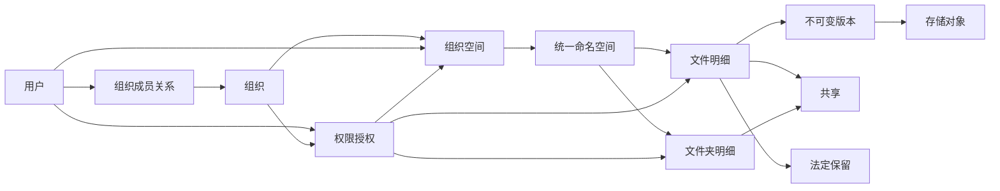

# File Workshop V1.0 数据库设计说明

> **文档编号：** FH-DB-V1.0  
> **文档版本：** V1.1  
> **文档状态：** 数据库详细设计基线  
> **发布日期：** 2026-08-05  
> **适用范围：** File Workshop V1.0 PostgreSQL 逻辑模型、物理约束、索引、事务、分区、数据生命周期与 Migration  
> **默认路径：** `docs/File-Workshop-V1.0-数据库设计说明.md`  
> **关联决策：** `docs/adr/ADR-019-数据库详细设计独立化与约束模型.md`、`docs/adr/ADR-020-本地集成测试基线与Testcontainers可选化.md`

---

# 目录

1. 文档定位与设计目标  
2. 冻结技术决策与通用规范  
3. 数据域、关系与表清单  
4. 身份、用户与会话  
5. 组织、成员与空间  
6. 统一目录命名空间与文件  
7. 存储对象、上传、版本与锁  
8. 权限、管理委派与共享  
9. 标签、回收、保留与法定冻结  
10. 审计、幂等、事务外盒与后台任务  
11. 搜索、预览、AI 与 Agent  
12. 迁移、配置与历史  
13. 外键、删除和状态一致性  
14. 索引、分区与容量规划  
15. 事务边界、并发和锁顺序  
16. 数据安全与数据库权限  
17. Migration、测试与验收  

---

# 第1章 文档定位与设计目标

## 1.1 权威边界

本文档是 File Workshop V1.0 数据库结构的唯一权威设计来源，独立于产品与总体架构文档维护。

- 业务语义、安全边界和故障语义以 `File-Workshop-V1.0-企业级文件管理系统开发设计文档.md` 为准；
- PostgreSQL 表、字段、类型、主外键、唯一约束、检查约束、索引、分区和事务规则以本文档为准；
- 组件与工程工具以 `File-Workshop-V1.0-技术选型说明.md` 为准；
- OpenAPI 是外部 REST 契约的唯一权威来源，数据库列名不直接决定 JSON 字段名；
- Migration 和 sqlc 查询必须与本文档一致，任何有意偏差必须先更新本文档；
- 改变数据库、对象存储边界、权限入口、审计可靠性或文件数据路径时必须新增或更新 ADR。

## 1.2 设计目标

数据库设计必须同时满足：

1. 用数据库约束保护能够表达的领域不变量；
2. 权限、审计、幂等和文件版本不依赖“调用方一定正确”；
3. 支持单机、Standard 和 HA 部署，不引入跨数据库事务；
4. 支持 5000 万级文件元数据、长期审计和大规模后台任务；
5. 保持模块化单体边界，并允许同一 PostgreSQL 事务原子写入业务事实、审计意图和 Outbox；
6. 所有派生数据均可从 PostgreSQL 事实和对象存储重建；
7. 结构可通过 Goose Migration 从空库创建，并可按扩展—回填—切换—收敛方式升级。

## 1.3 设计原则

- PostgreSQL 保存业务事实，对象存储保存二进制；
- 文件路径、名称、工号、组织编码等可变业务属性不作为实体主键；
- 关键安全事实优先使用类型化外键，不在权限表中使用无法校验的 `type + id` 多态引用；
- 生命周期状态、可用性状态和法定保留相互独立，不复用单一状态字段表达多个维度；
- 历史事实只追加；当前状态与历史记录分表保存；
- 业务删除默认逻辑删除，物理删除必须经过保留、审计和引用安全检查；
- Redis、搜索、预览和 AI 表均不成为权限或文件事实的唯一来源。

## 1.4 V1.0 非目标

- 不支持多租户 SaaS，不在每张表重复增加 `tenant_id`；
- 不使用 PostgreSQL RLS 作为主要业务授权体系，避免与应用权限服务形成两套规则；
- 不把对象存储二进制、完整文件正文或明文密钥保存到 PostgreSQL；
- 不在数据库中实现跨模块工作流编排，长任务由 Outbox 与 Worker 驱动；
- 不使用重型 ORM 自动建表或隐式迁移。

---

# 第2章 冻结技术决策与通用规范

## 2.1 PostgreSQL Schema

业务表统一放在 PostgreSQL Schema `file_workshop` 中。扩展、监控和 Migration 工具表不得与业务表混放。应用连接设置固定 `search_path`，Migration 中仍建议使用带 Schema 的全限定表名。

## 2.2 主键与 ID

- 实体 ID 的数据库类型统一为原生 `uuid`；
- 新 ID 使用 UUIDv7，由 Go 侧统一生成；数据库只负责类型和唯一性校验；
- 数据库实体表主键列使用语义化 `snake_case` 名称 `<entity>_id`，禁止通用 `id`；
- `users.user_id` 中的点号仅表示“表名.字段名”，实际字段名为 `user_id`；
- 纯关联表允许语义明确的联合主键；稳定配置键允许作为自然主键；
- API、日志和事件中的资源 ID 与数据库 ID 使用同一值，但字段命名服从各自契约。

## 2.3 时间与时区

- 表示具体时刻的字段统一使用 `TIMESTAMPTZ`，数据库会话时区固定为 UTC；
- 仅表示自然日期或分区日期的字段使用 `DATE`；
- `created_at` 默认 `CURRENT_TIMESTAMP`，不得由客户端提供；
- 可变事实表必须包含 `updated_at`；
- 时间区间必须满足结束时间为空或严格晚于开始时间；
- 对外统一使用 RFC 3339，前端按用户时区展示。

## 2.4 字符串、规范化与大小写

- JSON 和 API 使用 `camelCase`，数据库列使用 `snake_case`；
- 用户名、邮箱、工号、组织名称、组织编码和目录名称必须同时保存原始值与规范化值；
- 规范化算法由应用层版本化实现，数据库唯一约束只作用于规范化列；
- 规范化规则升级必须采用新增列、回填、冲突报告和切换流程，不得原地静默改变唯一语义；
- 禁止依赖部署机器的默认排序规则决定安全标识唯一性。

## 2.5 精确数据类型

| 数据 | 类型 | 规则 |
|---|---|---|
| 实体 ID | `uuid` | UUIDv7 |
| 时间点 | `timestamptz` | UTC |
| 自然日期 | `date` | 不含时区 |
| 容量/计数 | `bigint` | 必须有非负检查 |
| IP 地址 | `inet` | 不用字符串模拟 |
| SHA-256 | `bytea` | `octet_length(value) = 32` |
| Token/恢复码摘要 | `bytea` | HMAC-SHA-256，`octet_length(value) = 32` |
| 密码哈希 | `text` | 保存含算法参数的 PHC 字符串 |
| 可扩展元数据 | `jsonb` | 必须同时保存 Schema 版本 |
| 有限状态 | `varchar` + `CHECK` | 通过 Migration 扩展 |
| 权限动作 | 明细关联表 | 不使用未约束 JSONB 或不透明位图 |

## 2.6 通用字段

除明确声明为纯关联、不可变事件或可重建投影的表外，实体表至少包含：

- 语义化主键；
- `created_at TIMESTAMPTZ NOT NULL DEFAULT CURRENT_TIMESTAMP`；
- `updated_at TIMESTAMPTZ NOT NULL DEFAULT CURRENT_TIMESTAMP`；
- `row_version BIGINT NOT NULL DEFAULT 1 CHECK (row_version >= 1)`；
- 需要逻辑删除时使用 `deleted_at TIMESTAMPTZ NULL` 或明确状态，不同时维护两个互相矛盾的删除事实。

`updated_at` 和 `row_version` 由显式 SQL 更新，不依赖隐藏 ORM Hook。

## 2.7 外键与删除默认值

- 未特别说明的业务事实外键使用 `ON DELETE RESTRICT`；
- 指向历史操作者的可空引用可以使用 `ON DELETE SET NULL`，但审计必须保存操作者快照；
- 只有完全从属且可重建的数据允许 `ON DELETE CASCADE`；
- 审计事件不对可删除业务实体建立外键；
- 外键列默认建立索引，低基数且不参与查询的列除外；
- 所有 `ON DELETE` 行为必须在 Migration 中显式书写。

## 2.8 状态、范围与 JSONB

- 状态字段必须有 `CHECK`；状态与时间字段必须有一致性约束；
- `valid_until` 为空表示无固定截止时间，不使用魔法日期；
- JSONB 必须有 `*_schema_version`，只保存非核心、可版本化扩展数据；
- 权限、所有者、目标资源、状态、重试次数、租约和密钥引用不得藏入 JSONB；
- JSONB 只对经过查询验证的表达式建立 GIN 或表达式索引。

---

# 第3章 数据域、关系与表清单

## 3.1 核心关系

## 3.2 表清单

| 数据域 | 权威事实表 | 历史、关联或投影表 |
|---|---|---|
| 身份 | `users`、`user_credentials`、`user_sessions`、`user_mfa_methods`、`user_offboarding_cases` | `user_password_history`、`mfa_recovery_codes`、`session_refresh_tokens`、`login_attempts`、`principal_security_versions` |
| 组织 | `organizations`、`user_organizations`、`spaces`、`organization_change_plans` | `organization_closure`、`organization_security_versions`、`organization_change_operations`、`quota_reservations` |
| 委派 | `admin_delegations` | `admin_delegation_capabilities` |
| 文件 | `namespace_entries`、`folders`、`documents`、`document_versions` | `recycle_items`、`favorites`、`recent_documents` |
| 存储上传 | `storage_objects`、`upload_sessions` | `storage_scan_results`、`upload_parts`、`document_lock_counters`、`document_locks` |
| 权限共享 | `permission_grants`、`shares` | `permission_grant_actions`、`share_actions`、`shared_entries` |
| 元数据生命周期 | `tags`、`retention_policies`、`legal_holds` | `document_tags`、`retention_policy_targets` |
| 可靠性 | `idempotency_records`、`outbox_events`、`background_jobs` | 无 |
| 审计 | `audit_events`、`audit_chain_heads` | WORM 归档清单由对象存储保存 |
| 搜索预览AI | `preview_artifacts`、`document_extractions`、`ai_tasks`、`agent_confirmations` | `document_index_states`、`document_chunks`、`chunk_embeddings`、`agent_tool_calls` |
| 迁移配置 | `migration_jobs`、`migration_items`、`system_settings` | `system_setting_revisions` |

## 3.3 事实与投影

- 文件、版本、授权、共享、法定保留、审计、幂等结果和系统配置属于事实；
- `recent_documents`、路径缓存、容量缓存、预览、分块、Embedding 和搜索索引属于可重建投影；
- 投影故障不得修改事实，也不得绕过最终权限校验；
- 投影表可以物理清理并重建，事实表只能按本文件定义的生命周期处理。

## 3.4 不进入 PostgreSQL 的短期状态

下列数据默认由短期签名令牌或 Redis 保存，丢失后可以安全重建或要求客户端重新申请：

- Access Token 和对象存储预签名 URL；
- 下载票据与短期下载状态；
- 上传分片临时凭证；
- API 限流计数和登录短窗口速率计数；
- 权限计算缓存和搜索候选缓存；
- WebSocket/SSE 在线连接状态；
- 可重新生成的临时导出下载地址。

Redis 不得成为会话撤销、权限、幂等业务结果、上传完成结果或法定保留的唯一事实来源。

---

# 第4章 身份、用户与会话

## 4.1 `users`

| 字段 | 类型 | 必填 | 约束/说明 |
|---|---|---:|---|
| user_id | uuid | 是 | 主键 |
| username | varchar(128) | 是 | 原始登录名 |
| username_normalized | varchar(128) | 是 | 永久唯一，不因逻辑删除复用 |
| employee_no | varchar(128) | 否 | 工号原值 |
| employee_no_normalized | varchar(128) | 否 | 非空时唯一 |
| display_name | varchar(128) | 是 | 显示名称 |
| email | varchar(256) | 否 | 邮箱原值 |
| email_normalized | varchar(256) | 否 | 非空时唯一 |
| phone | varchar(64) | 否 | 电话 |
| avatar_storage_object_id | uuid | 否 | 外键 `storage_objects`，后置添加，删除时置空 |
| system_role | varchar(32) | 是 | `USER`/`SYSTEM_ADMIN` |
| status | varchar(32) | 是 | `ACTIVE`/`DISABLED`/`LOCKED`/`DELETED` |
| locale | varchar(16) | 是 | 默认 `zh-CN` |
| timezone | varchar(64) | 是 | IANA 时区 |
| last_login_at | timestamptz | 否 | 最近成功登录 |
| created_by_user_id | uuid | 否 | 自引用，删除时置空 |
| created_at | timestamptz | 是 | 创建时间 |
| updated_at | timestamptz | 是 | 更新时间 |
| deleted_at | timestamptz | 否 | 逻辑删除时间 |
| row_version | bigint | 是 | 乐观锁 |

关键约束：

- `username_normalized <> ''`；
- `status = 'DELETED'` 时 `deleted_at` 必须非空，其他状态下必须为空；
- SYSTEM_ADMIN 变更必须与审计事件在同一事务持久化；
- 用户删除不得级联删除文件、版本、权限、共享或审计。

## 4.2 `user_credentials`

| 字段 | 类型 | 必填 | 约束/说明 |
|---|---|---:|---|
| user_credential_id | uuid | 是 | 主键 |
| user_id | uuid | 是 | 外键 `users`，RESTRICT |
| credential_type | varchar(32) | 是 | `PASSWORD`/`LDAP`/`OIDC`/`APP_PASSWORD` |
| provider | varchar(64) | 否 | 外部身份源 |
| identifier | varchar(256) | 是 | 外部标识或应用密码名称 |
| identifier_normalized | varchar(256) | 是 | 规范化标识 |
| secret_hash | text | 否 | PASSWORD/APP_PASSWORD 必填 |
| status | varchar(32) | 是 | `ACTIVE`/`REVOKED`/`EXPIRED` |
| expires_at | timestamptz | 否 | 到期时间 |
| last_used_at | timestamptz | 否 | 最近使用 |
| created_at | timestamptz | 是 | 创建时间 |
| updated_at | timestamptz | 是 | 更新时间 |
| revoked_at | timestamptz | 否 | 撤销时间 |
| revoke_reason | text | 否 | 撤销原因 |
| row_version | bigint | 是 | 乐观锁 |

关键约束：

- PASSWORD 和 APP_PASSWORD 必须有 `secret_hash`；LDAP/OIDC 不在本表保存外部密码；
- 每个用户最多一个活动 PASSWORD；
- 外部凭据按 `(credential_type, provider, identifier_normalized)` 活动唯一；
- 应用密码按 `(user_id, identifier_normalized)` 活动唯一；
- 撤销状态与 `revoked_at` 必须一致。

## 4.3 `user_mfa_methods`

| 字段 | 类型 | 必填 | 约束/说明 |
|---|---|---:|---|
| user_mfa_method_id | uuid | 是 | 主键 |
| user_id | uuid | 是 | 外键 `users`，RESTRICT |
| method_type | varchar(32) | 是 | `TOTP`/`WEBAUTHN` |
| label | varchar(128) | 是 | 用户可识别名称 |
| secret_ref | varchar(512) | 否 | TOTP Secret 的 Vault/KMS 引用 |
| credential_id | bytea | 否 | WebAuthn Credential ID，唯一 |
| public_key | bytea | 否 | WebAuthn 公钥 |
| sign_count | bigint | 否 | WebAuthn 计数器，非负 |
| status | varchar(32) | 是 | `PENDING`/`ACTIVE`/`REVOKED` |
| created_at | timestamptz | 是 | 创建时间 |
| updated_at | timestamptz | 是 | 更新时间 |
| verified_at | timestamptz | 否 | 首次验证时间 |
| last_used_at | timestamptz | 否 | 最近使用 |
| revoked_at | timestamptz | 否 | 撤销时间 |
| row_version | bigint | 是 | 乐观锁 |

TOTP 仅允许 `secret_ref` 非空；WEBAUTHN 仅允许 `credential_id/public_key/sign_count` 非空。MFA Secret、挑战值和恢复码明文不得进入数据库。

## 4.4 `mfa_recovery_codes`

| 字段 | 类型 | 必填 | 约束/说明 |
|---|---|---:|---|
| mfa_recovery_code_id | uuid | 是 | 主键 |
| user_id | uuid | 是 | 外键 `users`，RESTRICT |
| code_batch_id | uuid | 是 | 同一次生成批次 |
| code_hash | bytea | 是 | 唯一摘要 |
| status | varchar(32) | 是 | `ACTIVE`/`USED`/`REVOKED` |
| created_at | timestamptz | 是 | 创建时间 |
| updated_at | timestamptz | 是 | 更新时间 |
| used_at | timestamptz | 否 | 使用时间 |
| revoked_at | timestamptz | 否 | 撤销时间 |
| row_version | bigint | 是 | 并发控制 |

恢复码通过条件 UPDATE 从 ACTIVE 原子改为 USED。重新生成恢复码时撤销该用户之前所有 ACTIVE 批次。

## 4.5 `user_password_history`

| 字段 | 类型 | 必填 | 约束/说明 |
|---|---|---:|---|
| user_password_history_id | uuid | 是 | 主键 |
| user_id | uuid | 是 | 外键 `users`，RESTRICT |
| secret_hash | text | 是 | 历史 PHC 哈希 |
| password_changed_at | timestamptz | 是 | 变更时间 |
| created_by_user_id | uuid | 否 | 管理员重置时记录 |
| created_at | timestamptz | 是 | 插入时间 |

该表只允许 INSERT/SELECT；按密码历史策略保留，不保存明文或可逆密文。

## 4.6 `user_sessions`

| 字段 | 类型 | 必填 | 约束/说明 |
|---|---|---:|---|
| user_session_id | uuid | 是 | 主键 |
| user_id | uuid | 是 | 外键 `users`，RESTRICT |
| device_id | varchar(256) | 否 | 设备标识摘要或受控标识 |
| ip_address | inet | 否 | 创建会话 IP |
| user_agent | text | 否 | 客户端信息 |
| status | varchar(32) | 是 | `ACTIVE`/`REVOKED`/`EXPIRED` |
| expires_at | timestamptz | 是 | 会话绝对到期 |
| last_seen_at | timestamptz | 否 | 限频更新 |
| created_at | timestamptz | 是 | 创建时间 |
| updated_at | timestamptz | 是 | 更新时间 |
| revoked_at | timestamptz | 否 | 撤销时间 |
| revoke_reason | text | 否 | 原因 |
| row_version | bigint | 是 | 乐观锁 |

## 4.7 `session_refresh_tokens`

| 字段 | 类型 | 必填 | 约束/说明 |
|---|---|---:|---|
| refresh_token_id | uuid | 是 | 主键 |
| user_session_id | uuid | 是 | 外键 `user_sessions`，RESTRICT |
| token_family_id | uuid | 是 | 同一轮换家族 |
| parent_refresh_token_id | uuid | 否 | 自引用，RESTRICT |
| rotation_number | integer | 是 | 家族内从 1 递增 |
| token_hash | bytea | 是 | 唯一，只存摘要 |
| status | varchar(32) | 是 | `ACTIVE`/`USED`/`REVOKED`/`REUSED`/`EXPIRED` |
| issued_at | timestamptz | 是 | 签发时间 |
| expires_at | timestamptz | 是 | 到期时间 |
| updated_at | timestamptz | 是 | 更新时间 |
| used_at | timestamptz | 否 | 成功轮换时间 |
| revoked_at | timestamptz | 否 | 撤销时间 |
| row_version | bigint | 是 | 并发控制 |

唯一约束为 `(token_family_id, rotation_number)`。已经 USED 的 Token 再次出现时标记 REUSED，并在同一事务吊销整个 Session 和活动 Token 家族。

## 4.8 `login_attempts`

按 `created_at` 月分区。

| 字段 | 类型 | 必填 | 约束/说明 |
|---|---|---:|---|
| login_attempt_id | uuid | 是 | 事件 ID |
| username_normalized | varchar(128) | 是 | 尝试的登录名 |
| user_id | uuid | 否 | 解析出的用户；不建立删除级联 |
| result | varchar(32) | 是 | `SUCCESS`/`FAILURE`/`LOCKED` |
| failure_code | varchar(64) | 否 | 失败码 |
| ip_address | inet | 否 | 来源 IP |
| user_agent | text | 否 | 客户端 |
| request_id | uuid | 是 | 请求 ID |
| created_at | timestamptz | 是 | 分区键 |

主键为 `(created_at, login_attempt_id)`。按安全策略在线保留，过期分区先归档后删除。

## 4.9 `principal_security_versions`

| 字段 | 类型 | 必填 | 约束/说明 |
|---|---|---:|---|
| user_id | uuid | 是 | 主键、外键 `users` |
| organization_membership_version | bigint | 是 | 默认 1 |
| delegation_version | bigint | 是 | 默认 1 |
| direct_grant_version | bigint | 是 | 默认 1 |
| share_version | bigint | 是 | 默认 1 |
| global_authorization_version | bigint | 是 | 默认 1 |
| updated_at | timestamptz | 是 | 更新时间 |

任何可能改变用户有效权限的事务必须递增对应版本；缓存键必须包含这些版本以及相关组织和资源安全版本。

## 4.10 `user_offboarding_cases`

| 字段 | 类型 | 必填 | 约束/说明 |
|---|---|---:|---|
| user_offboarding_case_id | uuid | 是 | 主键 |
| departing_user_id | uuid | 是 | 离职用户，外键 `users`，RESTRICT |
| receiver_user_id | uuid | 否 | 接收人，外键 `users`，RESTRICT |
| target_space_id | uuid | 否 | 迁移目标 Space，后置外键 |
| target_folder_id | uuid | 否 | 迁移目标 Folder，后置外键 |
| disposition | varchar(32) | 是 | `TRANSFER`/`ARCHIVE`/`MIXED`/`RETAIN_FROZEN` |
| status | varchar(32) | 是 | `DRAFT`/`APPROVED`/`PROCESSING`/`COMPLETED`/`CANCELLED`/`FAILED` |
| created_by_user_id | uuid | 是 | 外键 `users`，RESTRICT |
| approved_by_user_id | uuid | 否 | 外键 `users`，删除时置空 |
| created_at | timestamptz | 是 | 创建时间 |
| updated_at | timestamptz | 是 | 更新时间 |
| approved_at | timestamptz | 否 | 批准时间 |
| completed_at | timestamptz | 否 | 完成时间 |
| failure_code | varchar(64) | 否 | 失败码 |
| row_version | bigint | 是 | 乐观锁 |

用户禁用、会话和凭据撤销可以先完成，但个人空间转交、归档和 Legal Hold 检查必须通过该 Case 形成可恢复、可审计流程。每个离职用户最多一个未终结 Case。

---

# 第5章 组织、成员与空间

## 5.1 `organizations`

| 字段 | 类型 | 必填 | 约束/说明 |
|---|---|---:|---|
| organization_id | uuid | 是 | 主键 |
| parent_organization_id | uuid | 否 | 自引用，RESTRICT |
| name | varchar(256) | 是 | 原始名称 |
| normalized_name | varchar(256) | 是 | 同级规范名 |
| code | varchar(128) | 否 | 组织编码原值 |
| normalized_code | varchar(128) | 否 | 非空时活动唯一 |
| type_label | varchar(64) | 否 | 集团/工厂/部门/车间/班组等标签 |
| sort_order | integer | 是 | 默认 0 |
| path_cache | text | 否 | 展示缓存，不是事实 |
| depth | integer | 是 | 非负深度缓存 |
| tree_version | bigint | 是 | 结构版本，默认 1 |
| status | varchar(32) | 是 | `ACTIVE`/`DISABLED`/`ARCHIVED`/`DELETED` |
| created_by_user_id | uuid | 是 | 外键 `users`，RESTRICT |
| created_at | timestamptz | 是 | 创建时间 |
| updated_at | timestamptz | 是 | 更新时间 |
| deleted_at | timestamptz | 否 | 删除时间 |
| row_version | bigint | 是 | 乐观锁 |

关键约束与索引：

- `parent_organization_id <> organization_id`；
- 根组织和非根组织分别建立活动规范名唯一索引，避免 `NULL` 父节点破坏唯一性；
- `normalized_code` 非空且未删除时唯一；
- 删除状态与 `deleted_at` 一致；
- 组织树防环由闭包表事务和延迟约束触发器共同保证。

## 5.2 `organization_closure`

| 字段 | 类型 | 必填 | 约束/说明 |
|---|---|---:|---|
| ancestor_organization_id | uuid | 是 | 联合主键、外键 `organizations`，CASCADE |
| descendant_organization_id | uuid | 是 | 联合主键、外键 `organizations`，CASCADE |
| depth | integer | 是 | 非负；自身为 0 |
| created_at | timestamptz | 是 | 创建时间 |

主键为 `(ancestor_organization_id, descendant_organization_id)`。`depth = 0` 当且仅当祖先和后代相同。组织移动必须在同一事务更新邻接关系、闭包关系和相关安全版本。

## 5.3 `user_organizations`

| 字段 | 类型 | 必填 | 约束/说明 |
|---|---|---:|---|
| user_organization_id | uuid | 是 | 主键 |
| user_id | uuid | 是 | 外键 `users`，RESTRICT |
| organization_id | uuid | 是 | 外键 `organizations`，RESTRICT |
| membership_type | varchar(32) | 是 | `PRIMARY`/`MEMBER` |
| job_title | varchar(128) | 否 | 用户在该组织中的职务显示值 |
| status | varchar(32) | 是 | `ACTIVE`/`INACTIVE` |
| effective_from | timestamptz | 是 | 默认创建时间 |
| effective_until | timestamptz | 否 | 失效时间 |
| created_by_user_id | uuid | 是 | 外键 `users`，RESTRICT |
| created_at | timestamptz | 是 | 创建时间 |
| updated_at | timestamptz | 是 | 更新时间 |
| row_version | bigint | 是 | 乐观锁 |

必须建立：

- `(user_id, organization_id)` 在 ACTIVE 状态下唯一；
- `user_id` 在 ACTIVE 且 `membership_type='PRIMARY'` 时唯一；
- `effective_until IS NULL OR effective_until > effective_from`；
- 状态变更与用户、组织安全版本递增处于同一事务。

`job_title` 只表示展示和检索职务，不产生权限。结构化岗位体系留待独立 `positions` 模块，不在 V1.0 用字符串模拟授权。

## 5.4 `organization_security_versions`

| 字段 | 类型 | 必填 | 约束/说明 |
|---|---|---:|---|
| organization_id | uuid | 是 | 主键、外键 `organizations` |
| membership_version | bigint | 是 | 默认 1 |
| delegation_version | bigint | 是 | 默认 1 |
| grant_version | bigint | 是 | 默认 1 |
| share_version | bigint | 是 | 默认 1 |
| subtree_security_epoch | bigint | 是 | 默认 1 |
| updated_at | timestamptz | 是 | 更新时间 |

组织移动、成员变化、组织授权、组织共享和委派变化必须递增相应版本。影响整个子树的变更递增 `subtree_security_epoch`，不逐行更新所有后代文件。

## 5.5 `spaces`

| 字段 | 类型 | 必填 | 约束/说明 |
|---|---|---:|---|
| space_id | uuid | 是 | 主键 |
| space_type | varchar(32) | 是 | `PERSONAL`/`ORGANIZATION`/`PUBLIC` |
| name | varchar(256) | 是 | 空间名称 |
| normalized_name | varchar(256) | 是 | 规范名 |
| owner_user_id | uuid | 否 | PERSONAL 必填，外键 `users` |
| organization_id | uuid | 否 | ORGANIZATION 必填，外键 `organizations` |
| root_folder_id | uuid | 否 | 根文件夹，后置延迟外键 |
| quota_bytes | bigint | 是 | 非负 |
| used_bytes | bigint | 是 | 已提交逻辑容量，非负 |
| reserved_bytes | bigint | 是 | 上传预留容量，非负 |
| acl_version | bigint | 是 | 直接 ACL 版本，默认 1 |
| security_epoch | bigint | 是 | 继承和搜索安全版本，默认 1 |
| config_schema_version | integer | 是 | 默认 1 |
| config_json | jsonb | 是 | 默认空对象 |
| status | varchar(32) | 是 | `ACTIVE`/`FROZEN`/`ARCHIVED`/`DELETED` |
| created_by_user_id | uuid | 是 | 外键 `users` |
| created_at | timestamptz | 是 | 创建时间 |
| updated_at | timestamptz | 是 | 更新时间 |
| deleted_at | timestamptz | 否 | 删除时间 |
| row_version | bigint | 是 | 乐观锁 |

条件约束：

- PERSONAL：仅 `owner_user_id` 非空；
- ORGANIZATION：仅 `organization_id` 非空；
- PUBLIC：两者均为空；
- 每个用户最多一个未删除 PERSONAL；每个组织恰有一个未删除 ORGANIZATION；
- `used_bytes + reserved_bytes <= quota_bytes`，无限配额使用明确的实例级最大值，不使用负数；
- 根文件夹必须属于本空间、类型为 FOLDER、父目录为空；该约束使用可延迟约束触发器验证。

## 5.6 `quota_reservations`

| 字段 | 类型 | 必填 | 约束/说明 |
|---|---|---:|---|
| quota_reservation_id | uuid | 是 | 主键 |
| space_id | uuid | 是 | 外键 `spaces`，RESTRICT |
| user_id | uuid | 是 | 外键 `users`，RESTRICT |
| reserved_bytes | bigint | 是 | 严格大于 0 |
| status | varchar(32) | 是 | `ACTIVE`/`CONSUMED`/`RELEASED`/`EXPIRED` |
| expires_at | timestamptz | 是 | 到期时间 |
| created_at | timestamptz | 是 | 创建时间 |
| updated_at | timestamptz | 是 | 更新时间 |
| consumed_at | timestamptz | 否 | 消费时间 |
| released_at | timestamptz | 否 | 释放时间 |
| row_version | bigint | 是 | 乐观锁 |

创建预留必须通过单条条件 UPDATE 或锁定 Space 行，原子保证容量不超卖。消费、释放和过期处理必须幂等，并同步调整 `spaces.reserved_bytes`。

## 5.7 `admin_delegations`

| 字段 | 类型 | 必填 | 约束/说明 |
|---|---|---:|---|
| admin_delegation_id | uuid | 是 | 主键 |
| user_id | uuid | 是 | 被委派用户，外键 `users` |
| organization_id | uuid | 是 | 目标组织，外键 `organizations` |
| scope | varchar(32) | 是 | `SELF`/`SUBTREE` |
| can_delegate | boolean | 是 | 是否允许继续委派 |
| parent_admin_delegation_id | uuid | 否 | 自引用，RESTRICT |
| granted_by_user_id | uuid | 是 | 授权人，外键 `users` |
| valid_from | timestamptz | 是 | 生效时间 |
| valid_until | timestamptz | 否 | 失效时间 |
| status | varchar(32) | 是 | `ACTIVE`/`REVOKED`/`EXPIRED`/`INVALIDATED` |
| created_at | timestamptz | 是 | 创建时间 |
| updated_at | timestamptz | 是 | 更新时间 |
| revoked_at | timestamptz | 否 | 撤销时间 |
| revoke_reason | text | 否 | 撤销原因 |
| row_version | bigint | 是 | 乐观锁 |

顶级委派只能由 SYSTEM_ADMIN 创建。子委派的组织范围、时间范围、可委派标志和能力集合必须是父委派的子集。上级失效后查询必须立即判定所有后代无效，异步状态收敛不得成为放行条件。

## 5.8 `admin_delegation_capabilities`

| 字段 | 类型 | 必填 | 约束/说明 |
|---|---|---:|---|
| admin_delegation_id | uuid | 是 | 联合主键、外键 `admin_delegations`，CASCADE |
| capability | varchar(64) | 是 | 联合主键、受约束能力代码 |
| created_at | timestamptz | 是 | 创建时间 |

能力代码由统一常量和 `CHECK` 维护，不使用 JSONB 或不可解释位图。

## 5.9 `organization_change_plans`

| 字段 | 类型 | 必填 | 约束/说明 |
|---|---|---:|---|
| organization_change_plan_id | uuid | 是 | 主键 |
| plan_type | varchar(32) | 是 | `MOVE`/`MERGE`/`SPLIT`/`BULK_RESTRUCTURE` |
| name | varchar(256) | 是 | 计划名称 |
| status | varchar(32) | 是 | `DRAFT`/`VALIDATED`/`APPROVED`/`EXECUTING`/`COMPLETED`/`CANCELLED`/`FAILED` |
| expected_tree_version | bigint | 是 | 创建计划时组织树版本 |
| created_by_user_id | uuid | 是 | 外键 `users`，RESTRICT |
| approved_by_user_id | uuid | 否 | 外键 `users`，删除时置空 |
| created_at | timestamptz | 是 | 创建时间 |
| updated_at | timestamptz | 是 | 更新时间 |
| validated_at | timestamptz | 否 | 校验时间 |
| approved_at | timestamptz | 否 | 批准时间 |
| started_at | timestamptz | 否 | 执行开始 |
| completed_at | timestamptz | 否 | 完成时间 |
| failure_code | varchar(64) | 否 | 失败码 |
| row_version | bigint | 是 | 乐观锁 |

执行前必须重新校验 `expected_tree_version`、权限、成员、空间、委派、迁移任务和 Legal Hold；过期计划返回冲突，不静默套用到新组织结构。

## 5.10 `organization_change_operations`

| 字段 | 类型 | 必填 | 约束/说明 |
|---|---|---:|---|
| organization_change_operation_id | uuid | 是 | 主键 |
| organization_change_plan_id | uuid | 是 | 外键 `organization_change_plans`，CASCADE |
| sequence_number | integer | 是 | 计划内执行顺序，从 1 开始 |
| operation_type | varchar(32) | 是 | `MOVE_NODE`/`MERGE_NODE`/`CREATE_NODE`/`MOVE_MEMBER`/`MOVE_SPACE_CONTENT` |
| source_organization_id | uuid | 否 | 外键 `organizations`，RESTRICT |
| target_organization_id | uuid | 否 | 外键 `organizations`，RESTRICT |
| operation_schema_version | integer | 是 | 扩展参数 Schema |
| operation_json | jsonb | 是 | 不包含可直接表达的核心外键 |
| status | varchar(32) | 是 | `PENDING`/`SUCCESS`/`FAILED`/`SKIPPED` |
| created_at | timestamptz | 是 | 创建时间 |
| updated_at | timestamptz | 是 | 更新时间 |
| completed_at | timestamptz | 否 | 完成时间 |
| failure_code | varchar(64) | 否 | 失败码 |
| row_version | bigint | 是 | 乐观锁 |

唯一约束为 `(organization_change_plan_id, sequence_number)`。小型 MOVE 可以单事务执行；大型计划以受控步骤运行，但每一步必须幂等并保留原计划和结果。

---

# 第6章 统一目录命名空间与文件

## 6.1 设计原因

文件夹、文件和共享引用必须共用同一目录命名空间，否则两张独立表无法用普通唯一索引保证“同一父目录下名称不冲突”。`namespace_entries` 保存所有目录项共有的身份、位置、名称和生命周期，具体类型表使用共享主键保存专属字段。

## 6.2 `namespace_entries`

| 字段 | 类型 | 必填 | 约束/说明 |
|---|---|---:|---|
| namespace_entry_id | uuid | 是 | 主键 |
| space_id | uuid | 是 | 外键 `spaces`，RESTRICT |
| parent_folder_id | uuid | 否 | 外键 `folders`，RESTRICT；根文件夹为空 |
| entry_type | varchar(32) | 是 | `FOLDER`/`DOCUMENT`/`SHARED_ENTRY` |
| name | varchar(512) | 是 | 原始显示名称 |
| normalized_name | varchar(512) | 是 | 规范化名称 |
| path_cache | text | 否 | 可重建展示缓存 |
| depth | integer | 是 | 非负；根为 0 |
| lifecycle_status | varchar(32) | 是 | `ACTIVE`/`TRASHED`/`ARCHIVED`/`PURGING`/`PURGED` |
| created_by_user_id | uuid | 是 | 外键 `users`，RESTRICT |
| created_at | timestamptz | 是 | 创建时间 |
| updated_at | timestamptz | 是 | 更新时间 |
| deleted_at | timestamptz | 否 | 进入永久清理流程的时间 |
| row_version | bigint | 是 | 乐观锁 |

关键约束：

- `name` 和 `normalized_name` 不得为空，不得包含路径分隔符、控制字符、`.` 或 `..`；
- ACTIVE/ARCHIVED 项在 `(space_id, parent_folder_id, normalized_name)` 上唯一，根项单独建立唯一索引；
- TRASHED 后释放原目录名称，但恢复时必须重新检查冲突；
- 父项必须是同一 Space 内的 FOLDER；由可延迟约束触发器在事务结束前验证；
- `entry_type` 一经创建不可改变；
- PURGED 项不能恢复为其他状态；
- 路径缓存从父链重建，不参与身份、权限和对象 Key 生成。

## 6.3 `folders`

| 字段 | 类型 | 必填 | 约束/说明 |
|---|---|---:|---|
| folder_id | uuid | 是 | 主键，同时外键 `namespace_entries.namespace_entry_id`，RESTRICT |
| inheritance_mode | varchar(32) | 是 | `INHERIT`/`BREAK` |
| acl_version | bigint | 是 | 直接 ACL 版本，默认 1 |
| created_at | timestamptz | 是 | 与命名空间项一致 |
| updated_at | timestamptz | 是 | 更新时间 |
| row_version | bigint | 是 | 乐观锁 |

约束触发器保证对应命名空间项的 `entry_type='FOLDER'`。根文件夹不可移动、删除或重命名；文件夹移动必须防环。

## 6.4 `documents`

| 字段 | 类型 | 必填 | 约束/说明 |
|---|---|---:|---|
| document_id | uuid | 是 | 主键，同时外键 `namespace_entries.namespace_entry_id`，RESTRICT |
| owner_user_id | uuid | 是 | 外键 `users`，RESTRICT |
| current_version_id | uuid | 否 | 当前版本，使用组合延迟外键 |
| availability_status | varchar(32) | 是 | `AVAILABLE`/`PENDING_SCAN`/`QUARANTINED`/`BLOCKED` |
| extension_normalized | varchar(64) | 否 | 从当前名称提取的规范化扩展名投影 |
| inheritance_mode | varchar(32) | 是 | `INHERIT`/`BREAK` |
| acl_version | bigint | 是 | 直接 ACL 版本，默认 1 |
| classification | varchar(64) | 否 | 数据分级 |
| metadata_schema_version | integer | 是 | 默认 1 |
| metadata_json | jsonb | 是 | 默认空对象 |
| created_at | timestamptz | 是 | 创建时间 |
| updated_at | timestamptz | 是 | 更新时间 |
| row_version | bigint | 是 | 乐观锁 |

文档生命周期由 `namespace_entries.lifecycle_status` 表达，扫描可用性由 `availability_status` 表达，法定冻结由 `legal_holds` 表达，三者不得互相覆盖。

约束触发器保证对应命名空间项的 `entry_type='DOCUMENT'`。`current_version_id` 必须属于同一 `document_id`；详细组合外键见第7章。

---

# 第7章 存储对象、上传、版本与锁

## 7.1 `document_versions`

| 字段 | 类型 | 必填 | 约束/说明 |
|---|---|---:|---|
| document_version_id | uuid | 是 | 主键 |
| document_id | uuid | 是 | 外键 `documents`，RESTRICT |
| version_number | bigint | 是 | 文档内从 1 递增 |
| storage_object_id | uuid | 是 | 外键 `storage_objects`，RESTRICT |
| size_bytes | bigint | 是 | 非负 |
| sha256 | bytea | 是 | 32 字节，与存储对象一致 |
| mime_type | varchar(256) | 是 | 服务端判定 MIME |
| change_note | text | 否 | 变更说明 |
| source_type | varchar(32) | 是 | `WEB`/`WEBDAV`/`MIGRATION`/`AGENT`/`RESTORE` |
| restored_from_version_id | uuid | 否 | 同一文档内恢复来源 |
| created_by_user_id | uuid | 是 | 外键 `users`，RESTRICT |
| created_at | timestamptz | 是 | 创建时间 |

必须建立：

- `UNIQUE (document_id, version_number)`；
- `UNIQUE (document_id, document_version_id)`，供组合外键使用；
- `documents(document_id, current_version_id)` 到本表 `(document_id, document_version_id)` 的 `DEFERRABLE INITIALLY DEFERRED` 外键；
- `(document_id, restored_from_version_id)` 到本表的组合外键；
- `version_number >= 1`、`size_bytes >= 0`、`octet_length(sha256)=32`。

该表只允许 INSERT/SELECT。当前版本切换与新版本插入必须锁定 Document 行并在同一事务完成；恢复历史版本必须创建新版本，禁止修改旧行。

## 7.2 `storage_objects`

| 字段 | 类型 | 必填 | 约束/说明 |
|---|---|---:|---|
| storage_object_id | uuid | 是 | 主键 |
| provider | varchar(64) | 是 | 存储提供者标识 |
| bucket | varchar(256) | 是 | Bucket |
| object_key | varchar(1024) | 是 | 系统生成 Key |
| provider_version_id | varchar(512) | 否 | 对象存储版本标识 |
| size_bytes | bigint | 是 | 非负 |
| sha256 | bytea | 是 | 32 字节 |
| etag | varchar(256) | 否 | 仅作存储元数据，不代替 SHA-256 |
| storage_class | varchar(64) | 是 | 存储级别 |
| encryption_key_ref | varchar(512) | 否 | KMS/密钥引用，不保存密钥 |
| scan_status | varchar(32) | 是 | `PENDING`/`CLEAN`/`INFECTED`/`FAILED` |
| status | varchar(32) | 是 | `ACTIVE`/`ORPHAN`/`PENDING_DELETE`/`DELETED` |
| created_at | timestamptz | 是 | 创建时间 |
| updated_at | timestamptz | 是 | 更新时间 |
| verified_at | timestamptz | 否 | 最近完整性校验 |
| deleted_at | timestamptz | 否 | 物理删除确认时间 |
| row_version | bigint | 是 | 乐观锁 |

唯一约束为 `(provider, bucket, object_key)`，不得假设不同 Bucket 的 Key 全局唯一。可选秒传索引为 `(sha256, size_bytes, scan_status, status)`。

多个 Version 可以引用同一 StorageObject。垃圾回收删除前必须实时检查 `document_versions`、预览、头像和提取结果的活动引用，缓存引用计数不能成为唯一依据。

## 7.3 `storage_scan_results`

| 字段 | 类型 | 必填 | 约束/说明 |
|---|---|---:|---|
| storage_scan_result_id | uuid | 是 | 主键 |
| storage_object_id | uuid | 是 | 外键 `storage_objects`，RESTRICT |
| scanner_name | varchar(128) | 是 | 扫描器 |
| scanner_version | varchar(128) | 是 | 引擎版本 |
| signature_version | varchar(128) | 否 | 病毒库版本 |
| result | varchar(32) | 是 | `CLEAN`/`INFECTED`/`FAILED` |
| threat_name | varchar(512) | 否 | 威胁名称 |
| failure_code | varchar(64) | 否 | 失败码 |
| started_at | timestamptz | 是 | 开始时间 |
| completed_at | timestamptz | 是 | 完成时间 |
| created_at | timestamptz | 是 | 写入时间 |

该表只追加。`storage_objects.scan_status` 是最新有效结果的投影。

## 7.4 `upload_sessions`

| 字段 | 类型 | 必填 | 约束/说明 |
|---|---|---:|---|
| upload_session_id | uuid | 是 | 主键 |
| user_id | uuid | 是 | 发起用户，外键 `users` |
| space_id | uuid | 是 | 目标空间，外键 `spaces` |
| folder_id | uuid | 是 | 目标文件夹，外键 `folders` |
| quota_reservation_id | uuid | 是 | 外键 `quota_reservations`，唯一 |
| target_document_id | uuid | 否 | NEW_VERSION 时必填 |
| upload_intent | varchar(32) | 是 | `CREATE`/`NEW_VERSION` |
| file_name | varchar(512) | 是 | 原始名称 |
| normalized_name | varchar(512) | 是 | 规范名 |
| declared_size_bytes | bigint | 是 | 非负 |
| declared_sha256 | bytea | 否 | 32 字节 |
| declared_mime_type | varchar(256) | 否 | 客户端声明，仅供参考 |
| provider_upload_id | varchar(512) | 否 | Multipart Upload ID |
| temporary_object_key | varchar(1024) | 是 | 唯一、系统生成 |
| part_size_bytes | bigint | 是 | 严格大于 0 |
| expected_part_count | integer | 是 | 严格大于 0 |
| expected_current_version_id | uuid | 否 | 乐观并发基线 |
| expected_lock_fencing_token | bigint | 否 | 需要锁时必填 |
| lock_token_hash | bytea | 否 | 锁 Token 摘要 |
| status | varchar(32) | 是 | `INITIATED`/`UPLOADING`/`COMPLETING`/`COMPLETED`/`ABORTED`/`EXPIRED`/`FAILED` |
| expires_at | timestamptz | 是 | 到期时间 |
| created_at | timestamptz | 是 | 创建时间 |
| updated_at | timestamptz | 是 | 更新时间 |
| completed_at | timestamptz | 否 | 完成时间 |
| failure_code | varchar(64) | 否 | 失败码 |
| result_document_id | uuid | 否 | 完成后结果文档 |
| result_version_id | uuid | 否 | 完成后结果版本 |
| row_version | bigint | 是 | 乐观锁 |

条件约束：

- CREATE 时 `target_document_id` 为空；NEW_VERSION 时必须非空；
- `folder_id` 必须属于 `space_id`，由约束触发器验证；
- NEW_VERSION 的目标文档必须属于该 Space，且预期版本属于目标文档；
- COMPLETED 必须有结果 Document/Version 和 `completed_at`；
- 会话只能消费自己的 ACTIVE 配额预留；
- 幂等语义由 `idempotency_records` 统一承担，不把幂等键永久锁死在上传会话表。

## 7.5 `upload_parts`

| 字段 | 类型 | 必填 | 约束/说明 |
|---|---|---:|---|
| upload_session_id | uuid | 是 | 联合主键、外键 `upload_sessions`，CASCADE |
| part_number | integer | 是 | 联合主键，从 1 开始 |
| etag | varchar(256) | 是 | 对象存储 ETag |
| size_bytes | bigint | 是 | 严格大于 0 |
| checksum | bytea | 否 | 分片校验摘要 |
| status | varchar(32) | 是 | `UPLOADED`/`VERIFIED` |
| uploaded_at | timestamptz | 是 | 上传时间 |
| verified_at | timestamptz | 否 | 校验时间 |
| updated_at | timestamptz | 是 | 更新时间 |
| row_version | bigint | 是 | 并发控制 |

主键为 `(upload_session_id, part_number)`。完成上传时必须校验分片序号范围、总大小、缺失分片和最终对象 Hash。

## 7.6 `document_lock_counters`

| 字段 | 类型 | 必填 | 约束/说明 |
|---|---|---:|---|
| document_id | uuid | 是 | 主键、外键 `documents`，CASCADE |
| last_fencing_token | bigint | 是 | 非负、单调递增 |
| updated_at | timestamptz | 是 | 更新时间 |

获取新锁时锁定该行并递增 `last_fencing_token`。所有写入提交必须携带 Fencing Token，旧锁持有者即使仍持有 Token 也不能覆盖新锁之后的版本。

## 7.7 `document_locks`

| 字段 | 类型 | 必填 | 约束/说明 |
|---|---|---:|---|
| document_lock_id | uuid | 是 | 主键 |
| document_id | uuid | 是 | 外键 `documents`，RESTRICT |
| user_id | uuid | 是 | 持有者，外键 `users` |
| token_hash | bytea | 是 | 唯一摘要 |
| fencing_token | bigint | 是 | 文档内唯一、单调递增 |
| source | varchar(32) | 是 | `WEB`/`WEBDAV`/`OFFICE`/`AGENT` |
| status | varchar(32) | 是 | `ACTIVE`/`RELEASED`/`EXPIRED`/`FORCED` |
| acquired_at | timestamptz | 是 | 获取时间 |
| heartbeat_at | timestamptz | 是 | 最近心跳 |
| expires_at | timestamptz | 是 | 到期时间 |
| released_at | timestamptz | 否 | 释放时间 |
| released_by_user_id | uuid | 否 | 外键 `users`，删除时置空 |
| release_reason | text | 否 | 强制释放必填 |
| created_at | timestamptz | 是 | 创建时间 |
| updated_at | timestamptz | 是 | 更新时间 |
| row_version | bigint | 是 | 乐观锁 |

必须建立 `(document_id) WHERE status='ACTIVE'` 部分唯一索引，以及 `(document_id, fencing_token)` 唯一约束。获取锁事务先锁定 Counter 行，再把已到期 ACTIVE 锁更新为 EXPIRED，最后插入新锁；不得在部分索引谓词中使用 `CURRENT_TIMESTAMP`。

---

# 第8章 权限、管理委派与共享

## 8.1 权限引用策略

权限事实表必须使用可校验的类型化外键：主体通过 `subject_user_id` 或 `subject_organization_id` 表达；资源通过 `space_id`、`folder_id` 或 `document_id` 表达。每组列必须恰有一个非空。

审计和异步事件为了保留历史，可以保存不可外键约束的类型与 ID 快照；两类场景不得混淆。

## 8.2 `permission_grants`

| 字段 | 类型 | 必填 | 约束/说明 |
|---|---|---:|---|
| permission_grant_id | uuid | 是 | 主键 |
| subject_user_id | uuid | 否 | 外键 `users`，RESTRICT |
| subject_organization_id | uuid | 否 | 外键 `organizations`，RESTRICT |
| space_id | uuid | 否 | 外键 `spaces`，RESTRICT |
| folder_id | uuid | 否 | 外键 `folders`，RESTRICT |
| document_id | uuid | 否 | 外键 `documents`，RESTRICT |
| inherit_to_descendants | boolean | 是 | 仅 Space/Folder 可为 true |
| grant_source | varchar(32) | 是 | `MANUAL`/`TEMPLATE`/`MIGRATION`/`SYSTEM` |
| valid_from | timestamptz | 是 | 生效时间 |
| valid_until | timestamptz | 否 | 失效时间 |
| status | varchar(32) | 是 | `ACTIVE`/`REVOKED`/`EXPIRED` |
| granted_by_user_id | uuid | 是 | 外键 `users`，RESTRICT |
| grant_reason | text | 否 | 原因 |
| created_at | timestamptz | 是 | 创建时间 |
| updated_at | timestamptz | 是 | 更新时间 |
| revoked_at | timestamptz | 否 | 撤销时间 |
| revoked_by_user_id | uuid | 否 | 外键 `users`，删除时置空 |
| revoke_reason | text | 否 | 撤销原因 |
| row_version | bigint | 是 | 乐观锁 |

约束：

- 主体两列恰有一个非空；资源三列恰有一个非空；
- Document 授权不得向下继承；
- `valid_until IS NULL OR valid_until > valid_from`；
- V1.0 只存 ALLOW，不存在 DENY；
- 不合并来源、期限或授权人不同的记录，有效权限由活动记录动作并集计算，以保留撤销粒度和来源；
- 新增、修改、撤销必须与资源 ACL Version、Space Security Epoch、主体版本和审计/Outbox 同事务更新。

## 8.3 `permission_grant_actions`

| 字段 | 类型 | 必填 | 约束/说明 |
|---|---|---:|---|
| permission_grant_id | uuid | 是 | 联合主键、外键 `permission_grants`，CASCADE |
| action | varchar(64) | 是 | 联合主键、权限动作代码 |
| created_at | timestamptz | 是 | 创建时间 |

动作必须来自附录权限动作清单，空动作集合禁止保存。

## 8.4 `shares`

| 字段 | 类型 | 必填 | 约束/说明 |
|---|---|---:|---|
| share_id | uuid | 是 | 主键 |
| source_document_id | uuid | 否 | 外键 `documents`，RESTRICT |
| source_folder_id | uuid | 否 | 外键 `folders`，RESTRICT |
| creator_user_id | uuid | 是 | 外键 `users`，RESTRICT |
| target_kind | varchar(32) | 是 | `USER`/`ORGANIZATION`/`SPACE`/`LINK` |
| target_user_id | uuid | 否 | 外键 `users`，RESTRICT |
| target_organization_id | uuid | 否 | 外键 `organizations`，RESTRICT |
| target_space_id | uuid | 否 | 外键 `spaces`，RESTRICT |
| token_hash | bytea | 否 | LINK 必填，唯一 |
| password_hash | text | 否 | 可选 PHC 哈希 |
| allow_reshare | boolean | 是 | 默认 false |
| valid_from | timestamptz | 是 | 生效时间 |
| valid_until | timestamptz | 否 | 到期时间 |
| status | varchar(32) | 是 | `ACTIVE`/`EXPIRED`/`REVOKED`/`SUSPENDED`/`SOURCE_UNAVAILABLE` |
| created_at | timestamptz | 是 | 创建时间 |
| updated_at | timestamptz | 是 | 更新时间 |
| revoked_at | timestamptz | 否 | 撤销时间 |
| revoked_by_user_id | uuid | 否 | 外键 `users`，删除时置空 |
| revoke_reason | text | 否 | 原因 |
| row_version | bigint | 是 | 乐观锁 |

来源两列恰有一个非空。目标列必须与 `target_kind` 完全对应；LINK 的三个目标外键为空且 `token_hash` 非空，其他类型 `token_hash` 为空。有效期限、状态时间和撤销字段必须一致。

## 8.5 `share_actions`

| 字段 | 类型 | 必填 | 约束/说明 |
|---|---|---:|---|
| share_id | uuid | 是 | 联合主键、外键 `shares`，CASCADE |
| action | varchar(64) | 是 | 联合主键、受限共享动作 |
| created_at | timestamptz | 是 | 创建时间 |

共享动作只能是共享白名单的子集，不允许删除、授权管理或系统管理能力。

## 8.6 `shared_entries`

| 字段 | 类型 | 必填 | 约束/说明 |
|---|---|---:|---|
| shared_entry_id | uuid | 是 | 主键，同时外键 `namespace_entries.namespace_entry_id` |
| share_id | uuid | 是 | 外键 `shares`，RESTRICT，唯一 |
| status | varchar(32) | 是 | `ACTIVE`/`UNAVAILABLE`/`REMOVED` |
| created_by_user_id | uuid | 是 | 外键 `users` |
| created_at | timestamptz | 是 | 创建时间 |
| updated_at | timestamptz | 是 | 更新时间 |
| removed_at | timestamptz | 否 | 移除时间 |
| row_version | bigint | 是 | 乐观锁 |

显示名称、目标 Space 和目标 Folder 由对应 `namespace_entries` 行提供，因此共享引用与文件、文件夹共享同一个名称唯一约束。约束触发器保证 Entry Type 为 `SHARED_ENTRY`。

---

# 第9章 标签、回收、保留与法定冻结

## 9.1 `tags`

| 字段 | 类型 | 必填 | 约束/说明 |
|---|---|---:|---|
| tag_id | uuid | 是 | 主键 |
| name | varchar(128) | 是 | 原始名称 |
| normalized_name | varchar(128) | 是 | 规范名 |
| scope_kind | varchar(32) | 是 | `GLOBAL`/`SPACE` |
| scope_space_id | uuid | 否 | SPACE 时必填，外键 `spaces` |
| created_by_user_id | uuid | 是 | 外键 `users` |
| created_at | timestamptz | 是 | 创建时间 |
| updated_at | timestamptz | 是 | 更新时间 |
| row_version | bigint | 是 | 乐观锁 |

GLOBAL 标签按 `normalized_name` 唯一；SPACE 标签按 `(scope_space_id, normalized_name)` 唯一。两类索引分开建立，避免 NULL 语义破坏唯一性。

## 9.2 `document_tags`

| 字段 | 类型 | 必填 | 约束/说明 |
|---|---|---:|---|
| document_tag_id | uuid | 是 | 主键 |
| document_id | uuid | 是 | 外键 `documents`，CASCADE |
| tag_id | uuid | 是 | 外键 `tags`，RESTRICT |
| source | varchar(32) | 是 | `USER`/`AI`/`SYSTEM` |
| source_reference | varchar(256) | 是 | 用户固定值或模型/规则版本 |
| confidence | numeric(5,4) | 否 | AI 时 0–1 |
| status | varchar(32) | 是 | `ACTIVE`/`REMOVED` |
| created_by_user_id | uuid | 否 | 用户来源时必填 |
| created_at | timestamptz | 是 | 创建时间 |
| updated_at | timestamptz | 是 | 更新时间 |
| removed_at | timestamptz | 否 | 移除时间 |
| row_version | bigint | 是 | 并发控制 |

活动唯一约束为 `(document_id, tag_id, source, source_reference)`。同一标签可以同时保留用户和 AI 来源，查询有效标签时去重，不覆盖来源证据。

## 9.3 `favorites`

| 字段 | 类型 | 必填 | 约束/说明 |
|---|---|---:|---|
| user_id | uuid | 是 | 联合主键、外键 `users`，CASCADE |
| namespace_entry_id | uuid | 是 | 联合主键、外键 `namespace_entries`，CASCADE |
| created_at | timestamptz | 是 | 收藏时间 |

主键为 `(user_id, namespace_entry_id)`。收藏不产生访问权限。

## 9.4 `recent_documents`

| 字段 | 类型 | 必填 | 约束/说明 |
|---|---|---:|---|
| user_id | uuid | 是 | 联合主键、外键 `users`，CASCADE |
| document_id | uuid | 是 | 联合主键、外键 `documents`，CASCADE |
| last_action | varchar(32) | 是 | 最近动作 |
| last_accessed_at | timestamptz | 是 | 排序字段 |
| access_count | bigint | 是 | 非负 |
| updated_at | timestamptz | 是 | 更新时间 |

该表是可重建投影，不是审计事实。高频写入应批量合并或异步更新。

## 9.5 `recycle_items`

| 字段 | 类型 | 必填 | 约束/说明 |
|---|---|---:|---|
| recycle_item_id | uuid | 是 | 主键 |
| namespace_entry_id | uuid | 是 | 外键 `namespace_entries`，RESTRICT |
| original_space_id | uuid | 是 | 外键 `spaces`，RESTRICT |
| original_parent_folder_id | uuid | 否 | 历史位置，可不建立强外键 |
| original_name | varchar(512) | 是 | 原名称快照 |
| deleted_by_user_id | uuid | 是 | 外键 `users`，RESTRICT |
| deleted_at | timestamptz | 是 | 删除时间 |
| expires_at | timestamptz | 是 | 最早允许自动清理时间 |
| status | varchar(32) | 是 | `ACTIVE`/`RESTORED`/`PURGING`/`PURGED` |
| restored_to_folder_id | uuid | 否 | 恢复位置 |
| restored_at | timestamptz | 否 | 恢复时间 |
| created_at | timestamptz | 是 | 创建时间 |
| updated_at | timestamptz | 是 | 更新时间 |
| row_version | bigint | 是 | 乐观锁 |

每个 Namespace Entry 最多一个 ACTIVE 回收项。恢复与命名空间状态、目标名称检查和配额检查必须同事务完成。

## 9.6 `retention_policies`

| 字段 | 类型 | 必填 | 约束/说明 |
|---|---|---:|---|
| retention_policy_id | uuid | 是 | 主键 |
| name | varchar(256) | 是 | 策略名称 |
| normalized_name | varchar(256) | 是 | 唯一规范名 |
| recycle_days | integer | 否 | 非负 |
| archive_after_days | integer | 否 | 非负 |
| cold_after_days | integer | 否 | 非负 |
| purge_after_days | integer | 否 | 非负 |
| version_retention_days | integer | 否 | 非负 |
| min_versions | integer | 否 | 非负 |
| allow_user_override | boolean | 是 | 默认 false |
| priority | integer | 是 | 冲突排序 |
| status | varchar(32) | 是 | `ACTIVE`/`DISABLED` |
| created_by_user_id | uuid | 是 | 外键 `users` |
| created_at | timestamptz | 是 | 创建时间 |
| updated_at | timestamptz | 是 | 更新时间 |
| row_version | bigint | 是 | 乐观锁 |

时间值为空表示不启用对应规则。若同时配置，必须满足归档、冷存储和永久清理时间的单调顺序。策略冲突取更严格结果。

## 9.7 `retention_policy_targets`

| 字段 | 类型 | 必填 | 约束/说明 |
|---|---|---:|---|
| retention_policy_target_id | uuid | 是 | 主键 |
| retention_policy_id | uuid | 是 | 外键 `retention_policies`，CASCADE |
| target_kind | varchar(32) | 是 | `SPACE`/`FOLDER`/`TAG`/`MIME` |
| space_id | uuid | 否 | 外键 `spaces` |
| folder_id | uuid | 否 | 外键 `folders` |
| tag_id | uuid | 否 | 外键 `tags` |
| mime_pattern | varchar(256) | 否 | MIME 精确值或受限模式 |
| created_at | timestamptz | 是 | 创建时间 |

目标列必须与 `target_kind` 完全对应且恰有一个非空。MIME 不再错误地使用 UUID 字段。相同策略和目标不得重复。

## 9.8 `legal_holds`

| 字段 | 类型 | 必填 | 约束/说明 |
|---|---|---:|---|
| legal_hold_id | uuid | 是 | 主键 |
| document_id | uuid | 是 | 外键 `documents`，RESTRICT |
| document_version_id | uuid | 否 | 为空表示整个文档；非空时必须属于该文档 |
| case_reference | varchar(256) | 是 | 工单、案件或合规编号 |
| reason | text | 是 | 设置原因 |
| status | varchar(32) | 是 | `ACTIVE`/`RELEASED` |
| placed_by_user_id | uuid | 是 | 外键 `users`，RESTRICT |
| placed_at | timestamptz | 是 | 设置时间 |
| released_by_user_id | uuid | 否 | 外键 `users`，删除时置空 |
| released_at | timestamptz | 否 | 解除时间 |
| release_reason | text | 否 | 解除原因 |
| created_at | timestamptz | 是 | 创建时间 |
| updated_at | timestamptz | 是 | 更新时间 |
| row_version | bigint | 是 | 并发控制 |

版本级 Hold 使用 `(document_id, document_version_id)` 组合外键。允许同一文档存在多个独立 Hold；任一 ACTIVE Hold 都阻止相应文档或版本永久清理。设置和解除只能追加或完成既有 Hold，不删除历史行，并必须强审计。

---

# 第10章 审计、幂等、事务外盒与后台任务

## 10.1 `audit_events`

按 `partition_date` 月分区。审计表不对可删除业务实体建立外键，依靠不可变 ID 和快照保留历史语义。

| 字段 | 类型 | 必填 | 约束/说明 |
|---|---|---:|---|
| audit_event_id | uuid | 是 | 事件 ID |
| event_type | varchar(128) | 是 | 稳定事件类型 |
| risk_level | varchar(16) | 是 | `NORMAL`/`HIGH`/`CRITICAL` |
| actor_type | varchar(32) | 是 | `USER`/`SYSTEM`/`AGENT`/`MIGRATION`/`SERVICE` |
| actor_id | uuid | 否 | 操作者 ID 快照，不设外键 |
| actor_display_name | varchar(256) | 否 | 操作者名称快照 |
| actor_employee_no | varchar(128) | 否 | 工号快照，按策略脱敏 |
| effective_role | varchar(32) | 否 | 实际角色 |
| admin_delegation_id | uuid | 否 | 委派 ID 快照 |
| share_id | uuid | 否 | 共享 ID 快照 |
| resource_type | varchar(32) | 否 | 资源类型快照 |
| resource_id | uuid | 否 | 资源 ID 快照 |
| resource_name | varchar(512) | 否 | 资源名称快照 |
| space_id | uuid | 否 | 空间上下文 |
| organization_id | uuid | 否 | 组织上下文 |
| document_id | uuid | 否 | 文档上下文 |
| document_version_id | uuid | 否 | 版本上下文 |
| action | varchar(128) | 是 | 动作 |
| result | varchar(32) | 是 | `SUCCESS`/`FAILURE`/`DENIED` |
| failure_code | varchar(64) | 否 | 稳定失败码 |
| source_channel | varchar(32) | 是 | `WEB`/`API`/`WEBDAV`/`AGENT`/`MIGRATION`/`SYSTEM` |
| ip_address | inet | 否 | 来源 IP |
| user_agent | text | 否 | 客户端 |
| request_id | uuid | 是 | 请求 ID |
| trace_id | varchar(128) | 否 | Trace ID |
| correlation_id | uuid | 否 | 业务关联 ID |
| reason | text | 否 | 特权或高风险原因 |
| metadata_schema_version | integer | 是 | 默认 1 |
| metadata_json | jsonb | 是 | 脱敏扩展上下文 |
| hash_schema_version | integer | 否 | 高风险事件规范化哈希算法版本 |
| chain_id | varchar(128) | 否 | 完整性链 ID |
| sequence_number | bigint | 否 | 链内序号 |
| previous_hash | bytea | 否 | 32 字节 |
| event_hash | bytea | 否 | 32 字节 |
| partition_date | date | 是 | UTC 事件日期、分区键 |
| created_at | timestamptz | 是 | 事件时间 |

主键为 `(partition_date, audit_event_id)`，以满足 PostgreSQL 分区表唯一约束要求。应用生成的 `audit_event_id` 仍须全局唯一；按 ID 查询必须同时提供日期范围，或者先通过审计查询索引定位分区。约束触发器校验 `partition_date` 等于 `created_at` 的 UTC 日期。

高风险事件的 `hash_schema_version、chain_id、sequence_number、previous_hash、event_hash` 必须全部非空，普通事件则全部为空。链内唯一约束为 `(partition_date, chain_id, sequence_number)`；链 ID 本身包含企业实例、日期和分片。Event Hash 使用按 `hash_schema_version` 固定的规范化字段序列计算。

业务账号仅有 INSERT/SELECT，不授予 UPDATE/DELETE/TRUNCATE。分区归档和删除由独立受控维护角色执行并强审计。

## 10.2 `audit_chain_heads`

| 字段 | 类型 | 必填 | 约束/说明 |
|---|---|---:|---|
| chain_id | varchar(128) | 是 | 联合主键 |
| partition_date | date | 是 | 联合主键 |
| last_sequence_number | bigint | 是 | 非负 |
| last_event_id | uuid | 是 | 最近事件 ID |
| last_hash | bytea | 是 | 32 字节 |
| batch_root | bytea | 否 | 32 字节 |
| anchor_location | varchar(1024) | 否 | WORM 外部锚点引用 |
| status | varchar(32) | 是 | `ACTIVE`/`SEALED`/`INVALID` |
| verified_at | timestamptz | 否 | 最近校验 |
| created_at | timestamptz | 是 | 创建时间 |
| updated_at | timestamptz | 是 | 更新时间 |
| row_version | bigint | 是 | 并发控制 |

主键为 `(chain_id, partition_date)`。追加高风险事件时锁定对应 Chain Head 行，分配序号并更新链头；不同链可以并行。SEALED 链禁止继续追加。

## 10.3 `idempotency_records`

| 字段 | 类型 | 必填 | 约束/说明 |
|---|---|---:|---|
| idempotency_record_id | uuid | 是 | 主键 |
| principal_kind | varchar(32) | 是 | `USER`/`SERVICE`/`SYSTEM` |
| user_id | uuid | 否 | USER 时必填，外键 `users`，RESTRICT |
| service_principal | varchar(256) | 否 | SERVICE/SYSTEM 时必填 |
| operation | varchar(128) | 是 | 规范化接口或命令名 |
| idempotency_key | varchar(256) | 是 | 客户端键 |
| request_hash | bytea | 是 | 规范化请求摘要，32 字节 |
| status | varchar(32) | 是 | `IN_PROGRESS`/`COMPLETED`/`FAILED` |
| response_status_code | integer | 否 | 原 HTTP/命令结果码 |
| response_schema_version | integer | 否 | 响应摘要 Schema |
| response_json | jsonb | 否 | 脱敏响应或资源引用 |
| result_resource_type | varchar(64) | 否 | 结果资源类型快照 |
| result_resource_id | uuid | 否 | 结果资源 ID |
| expires_at | timestamptz | 是 | 幂等窗口截止时间 |
| created_at | timestamptz | 是 | 创建时间 |
| updated_at | timestamptz | 是 | 更新时间 |
| completed_at | timestamptz | 否 | 完成时间 |
| row_version | bigint | 是 | 并发控制 |

唯一键按主体类型拆分建立，逻辑上为 `(principal, operation, idempotency_key)`。相同键请求摘要不一致必须返回 `IDEMPOTENCY_CONFLICT`。业务结果与 COMPLETED 状态在同一事务提交；过期记录按时间批量清理。

## 10.4 `outbox_events`

| 字段 | 类型 | 必填 | 约束/说明 |
|---|---|---:|---|
| outbox_event_id | uuid | 是 | 主键 |
| aggregate_type | varchar(64) | 是 | 聚合类型 |
| aggregate_id | uuid | 是 | 聚合 ID |
| aggregate_version | bigint | 是 | 事件产生时版本 |
| event_type | varchar(128) | 是 | 事件类型 |
| event_schema_version | integer | 是 | 负载 Schema 版本 |
| payload_json | jsonb | 是 | 事件负载 |
| deduplication_key | varchar(256) | 是 | 唯一业务去重键 |
| correlation_id | uuid | 否 | 业务关联 ID |
| causation_id | uuid | 否 | 上游事件/命令 ID |
| priority | integer | 是 | 默认 0 |
| status | varchar(32) | 是 | `PENDING`/`PROCESSING`/`PUBLISHED`/`FAILED`/`DEAD` |
| attempt_count | integer | 是 | 非负 |
| max_attempts | integer | 是 | 严格大于 0 |
| available_at | timestamptz | 是 | 可领取时间 |
| locked_by | varchar(256) | 否 | Worker 实例 |
| locked_at | timestamptz | 否 | 领取时间 |
| lease_until | timestamptz | 否 | 租约截止 |
| next_retry_at | timestamptz | 否 | 下次重试 |
| created_at | timestamptz | 是 | 创建时间 |
| updated_at | timestamptz | 是 | 更新时间 |
| published_at | timestamptz | 否 | 发布/处理完成时间 |
| last_error_code | varchar(64) | 否 | 稳定错误码 |
| last_error_summary | text | 否 | 脱敏摘要 |
| row_version | bigint | 是 | 并发控制 |

领取使用 `FOR UPDATE SKIP LOCKED`，只选择到期 PENDING/FAILED 或租约已过期的 PROCESSING。Worker 崩溃后由租约恢复，不允许任务永久卡死。Outbox 与业务事实在同一事务 INSERT。

## 10.5 `background_jobs`

| 字段 | 类型 | 必填 | 约束/说明 |
|---|---|---:|---|
| background_job_id | uuid | 是 | 主键 |
| job_type | varchar(128) | 是 | `HASH`/`SCAN`/`PREVIEW`/`EXTRACT`/`INDEX`/`GC` 等 |
| target_document_id | uuid | 否 | 文档目标，外键 `documents`，RESTRICT |
| target_document_version_id | uuid | 否 | 版本目标，组合外键 |
| target_storage_object_id | uuid | 否 | 存储对象目标，外键 `storage_objects`，RESTRICT |
| payload_schema_version | integer | 是 | 负载版本 |
| payload_json | jsonb | 是 | 受 Schema 校验的非核心参数 |
| deduplication_key | varchar(256) | 是 | 任务类型内唯一活动键 |
| priority | integer | 是 | 优先级 |
| status | varchar(32) | 是 | `PENDING`/`PROCESSING`/`SUCCESS`/`FAILED`/`DEAD`/`CANCELLED`/`SKIPPED` |
| attempt_count | integer | 是 | 非负 |
| max_attempts | integer | 是 | 严格大于 0 |
| available_at | timestamptz | 是 | 可领取时间 |
| locked_by | varchar(256) | 否 | Worker |
| locked_at | timestamptz | 否 | 领取时间 |
| lease_until | timestamptz | 否 | 租约截止 |
| heartbeat_at | timestamptz | 否 | 心跳时间 |
| created_at | timestamptz | 是 | 创建时间 |
| updated_at | timestamptz | 是 | 更新时间 |
| started_at | timestamptz | 否 | 首次开始 |
| completed_at | timestamptz | 否 | 完成时间 |
| last_error_code | varchar(64) | 否 | 错误码 |
| last_error_summary | text | 否 | 脱敏错误摘要 |
| row_version | bigint | 是 | 并发控制 |

核心目标 ID 必须使用类型化列；任务负载不得保存密码、签名 URL、长期凭据或完整敏感文件内容。每种 `job_type + payload_schema_version` 必须有代码 Schema、幂等策略和兼容读取策略。

---

# 第11章 搜索、预览、AI 与 Agent

## 11.1 `document_index_states`

| 字段 | 类型 | 必填 | 约束/说明 |
|---|---|---:|---|
| document_id | uuid | 是 | 主键、外键 `documents`，CASCADE |
| indexed_version_id | uuid | 否 | 最近索引版本 |
| indexed_acl_version | bigint | 否 | 文档 ACL 版本 |
| indexed_space_security_epoch | bigint | 否 | 空间安全版本 |
| status | varchar(32) | 是 | `PENDING`/`CURRENT`/`STALE`/`FAILED` |
| indexed_at | timestamptz | 否 | 完成时间 |
| last_error_code | varchar(64) | 否 | 错误码 |
| updated_at | timestamptz | 是 | 更新时间 |
| row_version | bigint | 是 | 并发控制 |

该表仅是索引状态投影。搜索返回前仍必须调用权限服务执行最终授权，不能根据该表直接放行。

## 11.2 `preview_artifacts`

| 字段 | 类型 | 必填 | 约束/说明 |
|---|---|---:|---|
| preview_artifact_id | uuid | 是 | 主键 |
| document_id | uuid | 是 | 外键 `documents`，CASCADE |
| document_version_id | uuid | 是 | 必须属于该文档 |
| preview_type | varchar(32) | 是 | `PDF`/`THUMBNAIL`/`TEXT`/`OFFICE` |
| renderer_name | varchar(128) | 是 | 渲染器 |
| renderer_version | varchar(128) | 是 | 渲染器版本 |
| output_storage_object_id | uuid | 否 | 外键 `storage_objects`，RESTRICT |
| status | varchar(32) | 是 | `PENDING`/`PROCESSING`/`SUCCESS`/`FAILED`/`SKIPPED` |
| created_at | timestamptz | 是 | 创建时间 |
| updated_at | timestamptz | 是 | 更新时间 |
| completed_at | timestamptz | 否 | 完成时间 |
| failure_code | varchar(64) | 否 | 失败码 |
| row_version | bigint | 是 | 并发控制 |

唯一约束为 `(document_version_id, preview_type, renderer_name, renderer_version)`。升级渲染器创建新 Artifact，不覆盖旧结果；旧对象按投影保留策略清理。

## 11.3 `document_extractions`

| 字段 | 类型 | 必填 | 约束/说明 |
|---|---|---:|---|
| document_extraction_id | uuid | 是 | 主键 |
| document_id | uuid | 是 | 外键 `documents`，CASCADE |
| document_version_id | uuid | 是 | 必须属于该文档 |
| parser_name | varchar(128) | 是 | 解析器 |
| parser_version | varchar(128) | 是 | 解析器版本 |
| extraction_schema_version | integer | 是 | 结果 Schema |
| extracted_text_storage_object_id | uuid | 否 | 大文本对象引用 |
| summary | text | 否 | 受限长度摘要 |
| metadata_json | jsonb | 是 | 结构化提取元数据 |
| status | varchar(32) | 是 | `PENDING`/`PROCESSING`/`SUCCESS`/`FAILED`/`SKIPPED` |
| created_at | timestamptz | 是 | 创建时间 |
| updated_at | timestamptz | 是 | 更新时间 |
| processed_at | timestamptz | 否 | 完成时间 |
| failure_code | varchar(64) | 否 | 失败码 |
| row_version | bigint | 是 | 并发控制 |

唯一约束为 `(document_version_id, parser_name, parser_version, extraction_schema_version)`。不同解析器版本并存，禁止覆盖历史结果。

## 11.4 `document_chunks`

| 字段 | 类型 | 必填 | 约束/说明 |
|---|---|---:|---|
| document_chunk_id | uuid | 是 | 主键 |
| document_extraction_id | uuid | 是 | 外键 `document_extractions`，CASCADE |
| chunk_index | integer | 是 | 从 0 开始 |
| content | text | 是 | 受大小上限保护的文本块 |
| page_number | integer | 否 | 页码，非负 |
| locator_schema_version | integer | 是 | 定位 Schema |
| locator_json | jsonb | 是 | 页码、段落或坐标定位 |
| created_at | timestamptz | 是 | 创建时间 |

唯一约束为 `(document_extraction_id, chunk_index)`。Chunk 不直接保存权限结论；查询通过关联 Document 执行最终授权。

## 11.5 `chunk_embeddings`

| 字段 | 类型 | 必填 | 约束/说明 |
|---|---|---:|---|
| chunk_embedding_id | uuid | 是 | 主键 |
| document_chunk_id | uuid | 是 | 外键 `document_chunks`，CASCADE |
| provider | varchar(128) | 是 | 模型提供方 |
| model_name | varchar(128) | 是 | 模型名 |
| model_version | varchar(128) | 是 | 精确版本 |
| dimensions | integer | 是 | 严格大于 0 |
| embedding | vector | 是 | pgvector 向量，不混存不同维度索引 |
| created_at | timestamptz | 是 | 创建时间 |

唯一约束为 `(document_chunk_id, provider, model_name, model_version)`。多个 Embedding 模型可以并存；更换模型不修改 Chunk 内容。

## 11.6 `ai_tasks`

| 字段 | 类型 | 必填 | 约束/说明 |
|---|---|---:|---|
| ai_task_id | uuid | 是 | 主键 |
| user_id | uuid | 否 | 发起用户，外键 `users`，RESTRICT |
| task_type | varchar(64) | 是 | 任务类型 |
| document_id | uuid | 否 | 目标文档 |
| document_version_id | uuid | 否 | 目标版本 |
| provider | varchar(128) | 否 | 模型平台 |
| model_name | varchar(128) | 否 | 模型名 |
| model_version | varchar(128) | 否 | 模型版本 |
| input_schema_version | integer | 是 | 摘要 Schema |
| input_summary_json | jsonb | 是 | 脱敏输入摘要 |
| output_schema_version | integer | 否 | 输出摘要 Schema |
| output_summary_json | jsonb | 否 | 脱敏输出摘要 |
| status | varchar(32) | 是 | `PENDING`/`PROCESSING`/`SUCCESS`/`FAILED`/`CANCELLED`/`SKIPPED` |
| request_id | uuid | 是 | 请求 ID |
| created_at | timestamptz | 是 | 创建时间 |
| updated_at | timestamptz | 是 | 更新时间 |
| started_at | timestamptz | 否 | 开始时间 |
| completed_at | timestamptz | 否 | 完成时间 |
| failure_code | varchar(64) | 否 | 失败码 |
| row_version | bigint | 是 | 并发控制 |

AI Task 不保存原始密码、Token、签名 URL 或无必要的完整文件正文。文档与版本同时存在时必须通过组合外键保证归属一致。

## 11.7 `agent_confirmations`

| 字段 | 类型 | 必填 | 约束/说明 |
|---|---|---:|---|
| agent_confirmation_id | uuid | 是 | 主键 |
| user_id | uuid | 是 | 确认用户，外键 `users`，RESTRICT |
| ai_task_id | uuid | 否 | 外键 `ai_tasks`，RESTRICT |
| action_type | varchar(128) | 是 | 待执行动作 |
| action_schema_version | integer | 是 | Action Schema |
| action_summary_json | jsonb | 是 | 可展示、脱敏摘要 |
| action_hash | bytea | 是 | 规范化完整 Action 摘要，32 字节 |
| status | varchar(32) | 是 | `PENDING`/`APPROVED`/`REJECTED`/`EXPIRED`/`CONSUMED` |
| expires_at | timestamptz | 是 | 到期时间 |
| created_at | timestamptz | 是 | 创建时间 |
| updated_at | timestamptz | 是 | 更新时间 |
| approved_at | timestamptz | 否 | 批准时间 |
| rejected_at | timestamptz | 否 | 拒绝时间 |
| consumed_at | timestamptz | 否 | 一次性消费时间 |
| request_id | uuid | 是 | 请求 ID |
| row_version | bigint | 是 | 并发控制 |

批准时重新校验当前用户、动作摘要、权限和资源版本。执行必须以条件 UPDATE 将 APPROVED 原子改为 CONSUMED，同一确认不得二次使用；过期确认不得恢复。

## 11.8 `agent_tool_calls`

按 `created_at` 月分区或按审计策略并入审计归档。

| 字段 | 类型 | 必填 | 约束/说明 |
|---|---|---:|---|
| agent_tool_call_id | uuid | 是 | 调用 ID |
| ai_task_id | uuid | 是 | AI 任务 ID 快照 |
| user_id | uuid | 是 | 当前用户 ID 快照 |
| tool_name | varchar(128) | 是 | Tool 名称 |
| risk_level | varchar(16) | 是 | 风险级别 |
| target_resource_type | varchar(32) | 否 | 目标类型快照 |
| target_resource_id | uuid | 否 | 目标 ID 快照 |
| arguments_schema_version | integer | 是 | 参数摘要 Schema |
| arguments_summary_json | jsonb | 是 | 脱敏参数摘要 |
| authorization_result | varchar(32) | 是 | `ALLOW`/`DENY` |
| agent_confirmation_id | uuid | 否 | 高风险操作确认 ID 快照 |
| execution_result | varchar(32) | 是 | `SUCCESS`/`FAILURE`/`SKIPPED` |
| duration_ms | bigint | 否 | 非负 |
| request_id | uuid | 是 | 请求 ID |
| created_at | timestamptz | 是 | 分区键、调用时间 |

若分区，主键为 `(created_at, agent_tool_call_id)`。该表只追加；正式安全审计仍写入 `audit_events`，不能用本表替代。

---

# 第12章 迁移、配置与历史

## 12.1 `migration_jobs`

| 字段 | 类型 | 必填 | 约束/说明 |
|---|---|---:|---|
| migration_job_id | uuid | 是 | 主键 |
| name | varchar(256) | 是 | 任务名称 |
| source_type | varchar(32) | 是 | `SMB`/`LOCAL` |
| source_secret_ref | varchar(512) | 是 | Vault/KMS 密钥引用，不保存连接密文 |
| target_space_id | uuid | 是 | 外键 `spaces`，RESTRICT |
| mode | varchar(32) | 是 | `INITIAL`/`INCREMENTAL`/`CUTOVER` |
| mapping_schema_version | integer | 是 | 映射 Schema |
| permission_mapping_json | jsonb | 是 | 受 Schema 校验的权限映射 |
| status | varchar(32) | 是 | `PENDING`/`RUNNING`/`PAUSED`/`SUCCESS`/`FAILED`/`CANCELLED` |
| checkpoint_schema_version | integer | 是 | 检查点 Schema |
| checkpoint_json | jsonb | 是 | 可恢复进度 |
| created_by_user_id | uuid | 是 | 外键 `users` |
| created_at | timestamptz | 是 | 创建时间 |
| updated_at | timestamptz | 是 | 更新时间 |
| started_at | timestamptz | 否 | 开始时间 |
| heartbeat_at | timestamptz | 否 | 心跳时间 |
| completed_at | timestamptz | 否 | 完成时间 |
| failure_code | varchar(64) | 否 | 失败码 |
| row_version | bigint | 是 | 并发控制 |

Migration 的执行租约由关联 `background_jobs` 管理；本表保存用户可见业务任务和可恢复检查点。

## 12.2 `migration_items`

| 字段 | 类型 | 必填 | 约束/说明 |
|---|---|---:|---|
| migration_item_id | uuid | 是 | 主键 |
| migration_job_id | uuid | 是 | 外键 `migration_jobs`，CASCADE |
| source_path | text | 是 | 原始路径 |
| normalized_source_path | text | 是 | 源规则规范化路径 |
| source_generation | bigint | 是 | 同一路径的扫描代次 |
| source_type | varchar(32) | 是 | `FILE`/`FOLDER` |
| source_file_identity | varchar(512) | 否 | 源系统稳定文件 ID |
| source_size_bytes | bigint | 否 | 非负 |
| source_modified_at | timestamptz | 否 | 源修改时间 |
| source_sha256 | bytea | 否 | 32 字节 |
| target_namespace_entry_id | uuid | 否 | 目标目录项 |
| status | varchar(32) | 是 | `PENDING`/`COPIED`/`VERIFIED`/`FAILED`/`SKIPPED` |
| attempt_count | integer | 是 | 非负 |
| error_code | varchar(64) | 否 | 错误码 |
| error_summary | text | 否 | 脱敏摘要 |
| created_at | timestamptz | 是 | 创建时间 |
| updated_at | timestamptz | 是 | 更新时间 |
| row_version | bigint | 是 | 并发控制 |

唯一约束为 `(migration_job_id, normalized_source_path, source_generation)`，允许增量迁移记录同一路径的后续变化，不覆盖历史代次。

## 12.3 `system_settings`

| 字段 | 类型 | 必填 | 约束/说明 |
|---|---|---:|---|
| setting_key | varchar(256) | 是 | 主键、稳定自然键 |
| value_schema_version | integer | 是 | 值 Schema |
| value_json | jsonb | 否 | 非秘密配置 |
| secret_ref | varchar(512) | 否 | Vault/KMS 引用 |
| version | bigint | 是 | 从 1 递增 |
| created_by_user_id | uuid | 是 | 外键 `users` |
| updated_by_user_id | uuid | 是 | 外键 `users` |
| created_at | timestamptz | 是 | 创建时间 |
| updated_at | timestamptz | 是 | 更新时间 |
| row_version | bigint | 是 | 乐观锁 |

`value_json` 与 `secret_ref` 恰有一个非空。数据库不保存“加密标志 + 不明格式密文 JSON”；秘密只保存受控密钥系统引用。配置更新必须同时写入 Revision、审计和 Outbox。

## 12.4 `system_setting_revisions`

| 字段 | 类型 | 必填 | 约束/说明 |
|---|---|---:|---|
| system_setting_revision_id | uuid | 是 | 主键 |
| setting_key | varchar(256) | 是 | 外键 `system_settings`，RESTRICT |
| version | bigint | 是 | 配置版本 |
| value_schema_version | integer | 是 | 值 Schema |
| value_json | jsonb | 否 | 非秘密历史值 |
| secret_ref | varchar(512) | 否 | 历史秘密引用，不含秘密本身 |
| changed_by_user_id | uuid | 是 | 外键 `users` |
| change_reason | text | 是 | 变更原因 |
| created_at | timestamptz | 是 | 变更时间 |

唯一约束为 `(setting_key, version)`。该表只允许 INSERT/SELECT，不允许 UPDATE/DELETE 业务操作。

---

# 第13章 外键、删除和状态一致性

## 13.1 外键删除矩阵

| 父实体 | 子数据 | 删除行为 | 理由 |
|---|---|---|---|
| User | Credential/Session/Membership | RESTRICT | 用户只逻辑删除，保留身份历史 |
| User | Favorite/Recent Projection | CASCADE | 完全从属且可重建 |
| Organization | Closure Row | CASCADE | 纯结构派生关系；仅物理维护时触发 |
| Organization | Membership/Space/Delegation | RESTRICT | 删除前必须完成业务处置 |
| Space | Namespace/Quota/Grant | RESTRICT | 禁止级联丢失文件事实 |
| Namespace Entry | Folder/Document/Shared Entry Subtype | RESTRICT | 使用共享主键并由业务流程清理 |
| Document | Version/Lock/Hold/Share | RESTRICT | 保留版本、安全和合规事实 |
| Storage Object | Version/Artifact/Extraction/Avatar | RESTRICT | 有引用绝不删除 |
| Permission Grant | Action | CASCADE | Action 完全从属 Grant |
| Share | Action | CASCADE | Action 完全从属 Share |
| Tag | Document Tag | RESTRICT | 先显式移除关联 |
| Extraction | Chunk/Embedding | CASCADE | 可重建 AI 投影 |
| Audit Event | 任意业务表 | 无外键 | 防止删除业务行破坏历史 |

所有实际 Migration 必须显式写出 `ON DELETE`，不得依赖 PostgreSQL 默认行为。

## 13.2 必须由普通约束保证的不变量

- 非负：容量、文件大小、版本号、分片号、重试次数、租约次数、深度、访问次数；
- 时间：结束、到期、撤销、完成时间与状态一致；
- 条件列：Space 所有者、Grant 主体/资源、Share 来源/目标、Retention Target、System Setting 值；
- Hash：SHA-256 和 Action Hash 固定 32 字节；
- 状态：所有状态值限定在本文档列出的集合；
- 唯一：规范化标识、活动主组织、活动锁、文档版本号、目录名称、任务去重键；
- JSONB：Schema Version 严格大于 0，核心字段不得仅存在 JSONB。

## 13.3 必须由约束触发器保证的不变量

下列约束跨越多个表或需要延迟到事务结束验证，使用命名明确的 PostgreSQL Constraint Trigger；触发器函数必须纳入 Migration、单元测试和集成测试：

1. Namespace Parent 必须是同一 Space 的 Folder；
2. Folder 移动后不得形成环；
3. Space Root Folder 属于自身且无父目录；
4. Folder、Document、Shared Entry 的共享主键必须与 Entry Type 匹配；
5. Document Current Version 和 Restore Source 必须属于同一 Document；
6. Upload 的 Folder、目标 Document、预期 Version 属于同一目标上下文；
7. Shared Entry 的命名空间位置与 Share 目标 Space 一致；
8. Version 级 Legal Hold 的 Version 属于目标 Document；
9. 子管理委派的范围、期限、能力和 `can_delegate` 不超出父委派；
10. 组织邻接表和 Closure Table 在事务结束时一致。

触发器不承载 HTTP、权限放行或外部调用，仅保护数据库不变量。

## 13.4 状态时间一致性

通用规则：

- `REVOKED` 必须有 `revoked_at`，非撤销状态不得伪造撤销时间；
- `COMPLETED/SUCCESS/PUBLISHED/CONSUMED` 必须有完成时间；
- `PROCESSING` 必须有有效领取者和租约，租约过期允许重新领取；
- `DELETED/PURGED` 必须有对应删除时间；
- `ACTIVE` 的有效期必须覆盖当前业务时刻；数据库约束只检查时间顺序，是否已到期由查询条件和状态收敛任务共同保证；
- 任何安全查询必须同时检查状态和有效期，不能只相信异步更新后的 EXPIRED 状态。

## 13.5 软删除和唯一性

- 用户名默认永久不复用，使用普通唯一约束；
- 允许复用的名称采用带状态谓词的部分唯一索引；
- 根节点与非根节点分别建唯一索引，避免父 ID 为 NULL 时出现重复；
- 软删除行仍可被审计、历史版本和迁移记录引用；
- 不使用修改唯一值、追加随机后缀等方式伪装删除。

---

# 第14章 索引、分区与容量规划

## 14.1 核心唯一索引

至少包含：

- `users(username_normalized)`；
- `users(employee_no_normalized) WHERE employee_no_normalized IS NOT NULL`；
- `users(email_normalized) WHERE email_normalized IS NOT NULL`；
- 根组织 `organizations(normalized_name) WHERE parent_organization_id IS NULL AND status <> 'DELETED'`；
- 子组织 `organizations(parent_organization_id, normalized_name) WHERE parent_organization_id IS NOT NULL AND status <> 'DELETED'`；
- `user_organizations(user_id, organization_id) WHERE status='ACTIVE'`；
- `user_organizations(user_id) WHERE status='ACTIVE' AND membership_type='PRIMARY'`；
- `spaces(owner_user_id) WHERE space_type='PERSONAL' AND status <> 'DELETED'`；
- `spaces(organization_id) WHERE space_type='ORGANIZATION' AND status <> 'DELETED'`；
- `namespace_entries(space_id, parent_folder_id, normalized_name) WHERE lifecycle_status IN ('ACTIVE','ARCHIVED')`，根项使用独立索引；
- `document_versions(document_id, version_number)`；
- `storage_objects(provider, bucket, object_key)`；
- `document_locks(document_id) WHERE status='ACTIVE'`；
- `outbox_events(deduplication_key)`；
- `background_jobs(job_type, deduplication_key)` 对未终结任务活动唯一；
- 各作用域 Tag 唯一索引和 System Setting Revision 版本唯一索引。

## 14.2 高频查询索引

| 查询 | 推荐索引 |
|---|---|
| 目录列表 | `namespace_entries(space_id, parent_folder_id, lifecycle_status, normalized_name, namespace_entry_id)` |
| 最近修改 | `namespace_entries(space_id, updated_at DESC, namespace_entry_id)` |
| 文档版本 | `document_versions(document_id, version_number DESC)` |
| 用户组织 | `user_organizations(user_id, status, effective_from, effective_until)` |
| 组织成员 | `user_organizations(organization_id, status, user_id)` |
| 组织后代 | `organization_closure(ancestor_organization_id, depth, descendant_organization_id)` |
| 组织祖先 | `organization_closure(descendant_organization_id, depth, ancestor_organization_id)` |
| 主体授权 | 主体类型分别建立 `(subject_*_id, status, valid_until)` |
| 资源授权 | 资源类型分别建立 `(space_id/folder_id/document_id, status, valid_until)` |
| 用户委派 | `admin_delegations(user_id, status, valid_until, organization_id)` |
| 目标共享 | 目标类型分别建立 `(target_*_id, status, valid_until)` |
| 上传恢复 | `upload_sessions(user_id, status, expires_at)` |
| 配额过期 | `quota_reservations(status, expires_at)` |
| Worker 领取 | `outbox_events(status, available_at, lease_until, priority)` 对活动行部分索引 |
| 后台任务领取 | `background_jobs(status, available_at, lease_until, priority DESC)` 对活动行部分索引 |
| 回收清理 | `recycle_items(status, expires_at)` |
| 活动 Hold | `legal_holds(document_id, status)` |

列表排序必须在最后包含唯一 ID，避免翻页重复或遗漏。外部仍使用 `page`、`pageSize`，大数据深页通过索引、查询改写和经评审的内部定位机制优化，不改变外部字段。

## 14.3 审计索引

每个 `audit_events` 分区至少建立：

- `(created_at DESC, audit_event_id)`；
- `(actor_id, created_at DESC)`；
- `(resource_id, created_at DESC)`；
- `(event_type, created_at DESC)`；
- `(request_id)`；
- `(chain_id, sequence_number)` 对链事件部分索引。

跨分区索引数量必须受控。任意新增审计筛选字段需以真实查询和 `EXPLAIN (ANALYZE, BUFFERS)` 证明。

## 14.4 分区策略

默认按月 Range Partition：

- `audit_events`：按 `partition_date` 强制；
- `login_attempts`：强制；
- `agent_tool_calls`：达到容量阈值后启用，若从首版即启用则保持一致；
- 超大 `outbox_events/background_jobs` 优先归档终结行，不默认分区。

分区管理任务提前创建至少未来 3 个月分区。设置受监控的 DEFAULT 应急分区，任何写入立即告警并在受控流程迁移。主键和唯一约束必须包含分区键；不得假设 PostgreSQL 存在跨分区全局唯一索引。

## 14.5 JSONB、全文和向量索引

- Metadata GIN 只覆盖实际查询路径；
- 文件全文使用 `tsvector` 投影列或外部搜索索引，不直接对任意 JSONB 全量建 GIN；
- Vector 索引按冻结的 pgvector 版本、距离算法、维度和真实数据压测决定；
- 一个向量列不得混存不同维度或不可比较模型；
- AI 未启用时不得创建不必要的 Vector 扩展和大索引。

## 14.6 索引治理

- 所有外键索引、唯一索引和查询索引使用稳定命名；
- 写密集表避免重复或低收益索引；
- 大表新索引生产环境采用兼容的在线方式并独立 Migration；
- 定期检查未使用索引、膨胀、统计信息和顺序扫描；
- 不用“索引视情况决定”代替上线前评审结论。

---

# 第15章 事务边界、并发和锁顺序

## 15.1 通用事务规则

- 事务由应用服务控制；Repository 不自行提交跨步骤事务；
- 事务内禁止执行对象存储上传、病毒扫描、预览、搜索、模型调用和长时间网络请求；
- 所有写入使用可取消的 `context.Context` 和数据库超时；
- 可变实体使用 `row_version` 或条件 UPDATE；受竞争热点使用 `SELECT ... FOR UPDATE`；
- 业务事实、关键审计意图和 Outbox 必须同事务提交；
- 重试只用于可证明幂等的事务，并有次数上限和退避。

## 15.2 统一锁顺序

为降低死锁，涉及多个实体时统一按以下顺序加锁：

1. `spaces` 或 `organizations` 上层边界；
2. `namespace_entries`，按 UUID 字节序升序；
3. `folders/documents`；
4. `document_lock_counters/document_locks`；
5. `document_versions/storage_objects/quota_reservations`；
6. `permission_grants/shares/legal_holds`；
7. Security Version 行；
8. `idempotency_records`；
9. `audit_chain_heads`；
10. `outbox_events` INSERT。

批量操作先对所有 ID 排序。任何偏离顺序的事务必须在代码评审中说明并有并发测试。

## 15.3 完成上传事务

对象存储 Multipart Complete 和 Hash 校验在数据库事务外完成。随后数据库事务：

1. 锁定 `idempotency_records` 与 `upload_sessions`；
2. 校验会话、请求摘要、用户、有效期、分片清单和状态；
3. 锁定 Space、Quota Reservation、目标目录和目标 Document；
4. 校验容量、名称、权限版本、预期 Version、锁 Token 和 Fencing Token；
5. 创建或复用 `storage_objects`；
6. INSERT 不可变 Version；
7. 创建 Namespace/Document 或切换 Current Version；
8. 消费配额预留并更新 `used_bytes/reserved_bytes`；
9. 写审计、Outbox 和幂等结果；
10. 将 Upload Session 置为 COMPLETED 并提交。

若对象完成但事务失败，临时对象进入可识别的孤儿候选范围；同一幂等请求重试不得创建重复 Version。

## 15.4 权限变更事务

创建或撤销 Grant 时：

1. 锁定目标资源和相关 Space；
2. 校验授权者当前权限与委派链；
3. 写 Grant/Action 或撤销状态；
4. 递增资源 `acl_version` 和 Space `security_epoch`；
5. 递增相关用户或组织 Security Version；
6. 写强审计和 Outbox；
7. 提交后异步刷新搜索安全投影。

缓存和搜索更新失败不回滚权限事实；所有读取在返回前根据最新版本和最终授权判定。

## 15.5 组织移动事务

- 小规模移动在单事务锁定源、目标、相关祖先和 Closure Row；
- 验证无环后更新 Parent、Closure、Depth、Tree Version 和 Security Epoch；
- 大子树移动使用受控变更计划和维护窗口，但对外只在一致切换点生效；
- 路径缓存异步更新，不能参与移动是否成功的事实判定。

## 15.6 永久清理事务

永久清理前必须在同一一致性视图验证：

- 无 ACTIVE Legal Hold；
- 满足保留策略；
- 无活动共享、上传、锁、恢复或迁移任务；
- 强审计已持久化；
- Namespace 状态允许从 TRASHED 进入 PURGING。

事务只把元数据标记为 PURGING 并创建 GC 任务。对象删除成功且再次验证无引用后，另一个事务标记 PURGED/DELETED；不得在长事务中等待对象存储。

## 15.7 Worker 租约

- 领取使用 `FOR UPDATE SKIP LOCKED`；
- Worker 定期续租，续租必须匹配 `locked_by` 和当前 `row_version`；
- 租约过期任务可由其他 Worker 重新领取；
- 每个 Job Handler 必须以业务去重键实现幂等；
- FAILED 达到上限进入 DEAD，并保留最后稳定错误码和脱敏摘要；
- 人工重试创建审计事件，不直接篡改历史错误。

---

# 第16章 数据安全与数据库权限

## 16.1 数据库角色

至少拆分以下数据库角色和凭据：

| 角色 | 权限 |
|---|---|
| `fw_migrator` | 仅部署期间执行 DDL/Migration |
| `fw_app` | 业务表必要 SELECT/INSERT/UPDATE，无审计 UPDATE/DELETE |
| `fw_worker` | 任务、Outbox 和指定业务表最小权限 |
| `fw_audit_writer` | 审计 INSERT 和链头受控函数执行权限 |
| `fw_audit_reader` | 审计只读、导出受限 |
| `fw_maintenance` | 分区、归档、受控清理；不供应用使用 |
| `fw_readonly_ops` | 脱敏运维查询 |

应用不得使用超级用户、对象所有者或 Migration 账号运行。审计写入建议通过 `SECURITY DEFINER` 受控函数或独立连接完成，函数必须固定 `search_path` 并接受参数化输入。

## 16.2 敏感数据

- 密码和应用密码只保存 PHC 哈希；
- Refresh Token、共享 Token、锁 Token、恢复码和 Action 只保存摘要；
- 外部连接、TOTP、KMS 和对象存储密钥只保存 Secret Reference；
- 签名 URL、完整 Token、明文密码和对象存储长期凭据禁止进入任何表；
- AI、Audit、Job、Migration Error 和 Idempotency Response 的 JSON 必须脱敏并设置大小上限；
- 工号、邮箱、电话、IP 和 User Agent 按企业隐私策略设定访问和保留期限。

## 16.3 传输、静态加密与备份

- 应用到 PostgreSQL 强制 TLS；
- 数据盘、WAL、备份和归档采用静态加密；
- 密钥和备份凭据与备份数据分离；
- 备份必须包含 Schema、扩展、角色授权清单和分区定义；
- 恢复测试必须验证权限、审计链、Version、StorageObject 引用和 Outbox 幂等恢复。

## 16.4 SQL 安全

- 所有 SQL 参数化；排序字段只能来自白名单；
- 动态标识符由固定映射生成，禁止接受用户原始表名或列名；
- 设置 `statement_timeout`、`lock_timeout`、`idle_in_transaction_session_timeout`；
- 批量接口限制条数，列表查询必须分页；
- 禁止将 SQL、数据库路径、对象 Key、堆栈和内部约束名直接返回客户端。

## 16.5 数据库审计边界

业务审计由应用产生，数据库超级管理员和维护账号操作由 PostgreSQL 审计、平台日志和外部 WORM 归档补充。任何单一数据库角色都不能同时静默修改业务事实、审计事件和外部归档。

---

# 第17章 Migration、测试与验收

## 17.1 Migration 顺序

空库初始化建议按以下依赖顺序：

1. 创建 Schema、必要扩展、角色和公共函数；
2. 用户、凭据、会话和组织；
3. Space、Namespace、Folder、Document 基础表；
4. StorageObject、Version、Upload、Lock，并后置添加循环外键；
5. Permission、Delegation、Share、Tag、Retention、Legal Hold；
6. Idempotency、Outbox、Job；
7. Audit 分区父表、初始分区和 Chain Head；
8. Preview、Extraction、AI、Agent；
9. Migration、Settings 和 Revision；
10. 索引、约束触发器、权限授予和种子配置。

循环引用使用“先建表、后加可延迟外键”，不得通过永久取消外键规避。

## 17.2 Migration 规则

- 已发布 Migration 永不修改，只能追加；
- 每个 Migration 在空库和上一发布版本升级库执行；
- 大表变更使用扩展—回填—切换—收敛；
- 高风险约束先以 `NOT VALID` 添加、完成冲突报告和回填后再 VALIDATE；
- 大索引按目标 PostgreSQL 能力使用低锁方式创建；
- Migration 不随应用进程启动隐式执行；
- 生产执行前备份、演练并给出前滚或恢复方案；
- sqlc 生成、Schema 文档和查询测试在同一变更中更新。

## 17.3 必须具备的约束测试

- 所有主键、外键和删除动作；
- 主组织活动唯一和组织树防环；
- 根组织 NULL 场景名称唯一；
- 文件、文件夹、共享引用跨类型同名冲突；
- 父目录同 Space 和文件夹移动防环；
- Current Version、Restore Version、Legal Hold Version 归属一致；
- 并发版本号、并发同名创建、并发活动锁；
- Fencing Token 阻止旧锁写入；
- Grant 主体/资源 XOR、Share 来源/目标 XOR、Retention Target XOR；
- 幂等键同请求返回原结果、异请求冲突；
- 配额预留并发不超卖；
- Outbox/Job Worker 崩溃后租约恢复；
- Refresh Token 重用触发会话家族撤销；
- Legal Hold 阻止清理；
- 审计分区主键、链序号和只追加权限；
- Secret Reference 与 JSON 值互斥；
- 状态和时间字段一致。

## 17.4 集成和性能测试

- 使用专用本地 PostgreSQL 创建随机临时数据库，或在具备 Docker/CI 环境时选择 Testcontainers，依赖版本必须与生产目标同主版本；
- 每次 CI 从空库执行全部 Migration，并从最近支持版本执行升级；
- 对目录列表、权限批量评估、组织闭包、版本列表、审计查询和 Worker 领取执行真实 `EXPLAIN (ANALYZE, BUFFERS)`；
- 使用接近目标分布的数据测试 1000 万/5000 万级 Namespace 和审计分区；
- 并发测试至少覆盖上传完成、版本创建、组织移动、授权撤销、锁过期、配额预留和永久清理；
- 恢复测试验证 PostgreSQL、对象存储和审计归档的一致恢复点。

## 17.5 数据库完成定义

数据库实现只有在以下适用项全部完成后才可验收：

- 本文档、ADR 和 OpenAPI 相关契约已同步；
- Goose Migration 可从空库和升级库成功执行；
- sqlc 查询和生成代码无手工修改；
- 所有主外键、检查约束、部分唯一索引和约束触发器已落地；
- 外键删除行为全部显式；
- 权限、审计、幂等、配额、锁和 Worker 并发测试通过；
- 分区自动创建、归档、告警和恢复流程可执行；
- 数据库角色通过最小权限验证；
- 慢 SQL、锁等待、死锁、索引体积和表增长有监控；
- 备份、PITR 和对象引用一致性恢复已演练；
- 最终 Diff 不包含生产数据、密钥、Token、签名 URL 或无关结构变更。

## 17.6 开发启动结论

本数据库设计替代原主设计文档中的数据库章节。开发必须以本文档建立首版 Schema，不得恢复旧的通用 `id`、裸 `TIMESTAMP`、权限多态外键、单字段分区主键、策略布尔 Legal Hold、上传专用幂等键或无租约 PROCESSING 任务设计。

---

# 附录A 命名示例

| 类型 | 正确 | 禁止/不推荐 |
|---|---|---|
| 用户主键 | `users.user_id` | `users.id` |
| 文档主键 | `documents.document_id` | `documents.id` |
| 关系主键 | `user_organizations.user_organization_id` | `user_organizations.id` |
| 角色外键 | `created_by_user_id` | 含义不清的 `created_by` |
| 时间点 | `created_at TIMESTAMPTZ` | 裸 `TIMESTAMP` |
| 权限主体 | `subject_user_id`/`subject_organization_id` | `subject_type + subject_id` |
| 保留目标 | 类型化目标列或 MIME 字符串 | MIME 存 UUID |
| 秘密 | `secret_ref` 或不可逆摘要 | 明文、可逆密文 JSON |

# 附录B 首版 DDL 输出清单

首版实现应生成并维护：

- `migrations/` Goose Migration；
- `backend/internal/**/repository/queries/*.sql` sqlc 查询；
- sqlc 配置和生成代码；
- 数据库约束、触发器、角色和分区测试；
- ER 图和 Schema 检查报告；
- 空库初始化、升级、回滚/前滚和备份恢复说明；
- 数据库版本与必要扩展冻结清单。
